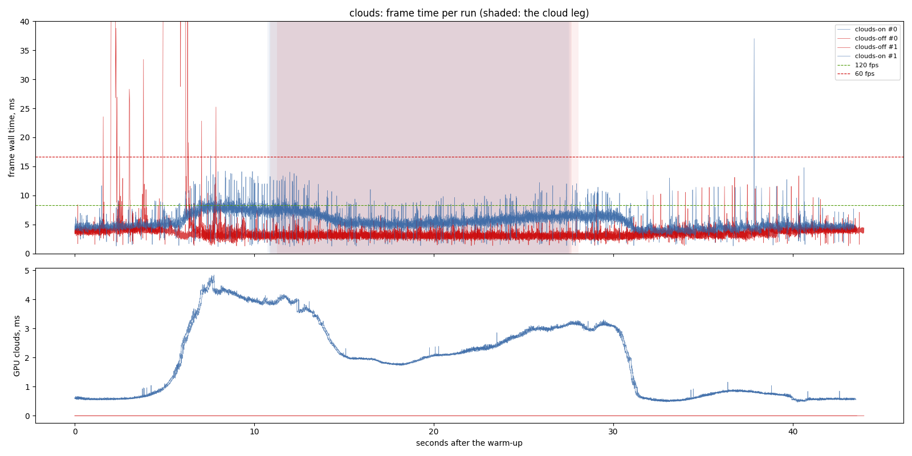
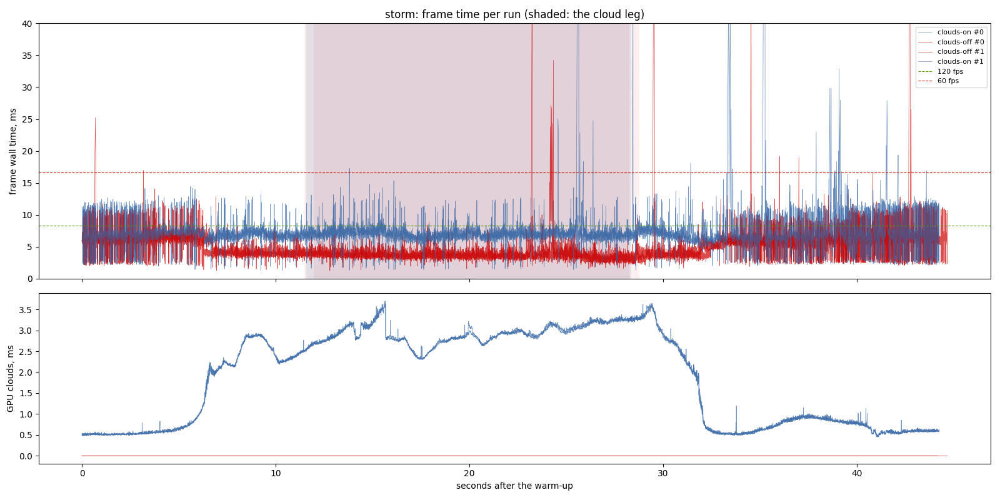
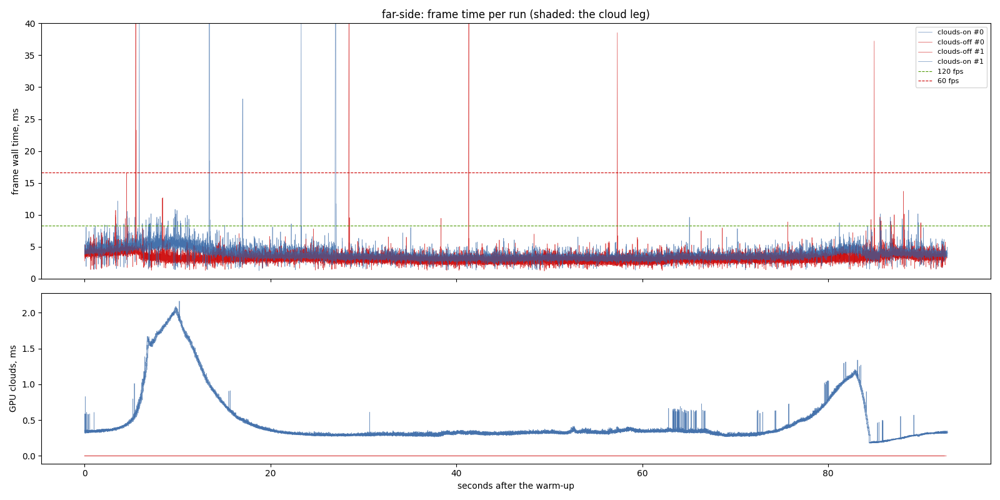
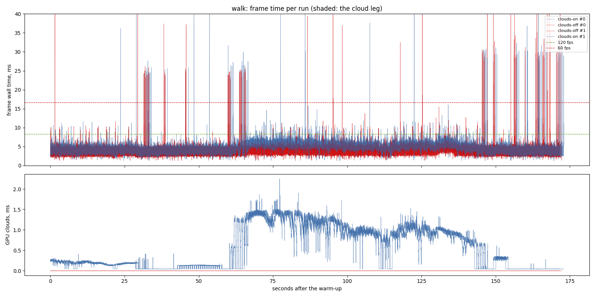

# Baseline: the current build on four scenarios, clouds on and off

The first report of the `perf-rig` suite (`tools/perf_suite.py`,
`openspec/changes/perf-rig`). This is the baseline the next cloud changes are
compared against: rerun the same command after a change, in the same sitting
as a run of this build (keep a copy of this exe), and compare.

```bash
python tools/perf_suite.py --repeats 2 --out output/perf/<date>   --variant "clouds-on" --variant "clouds-off||PBD_NO_CLOUDS=1"
```

## Findings

1. **This build meets 120 fps at p95 everywhere except the storm.** The medians
   are 140 to 265 fps on the reference machine at 1440 x 900. The storm misses
   the 120 fps goal at p95 (10.9 ms over the flight, 8.6 ms on the cloud leg)
   and holds 60 fps at p99 (13.9 ms).
2. **The clouds cost 2 to 3 ms of GPU time where there is cloud**: 2.3 ms at
   the median on the fair-weather cloud leg, 2.9 ms in the storm's deck, 0.2 to
   0.3 ms on the walk and the far-side flight. Turning them off takes the frame
   from 5.8 to 3.0 ms on the cloud leg and 7.1 to 3.6 ms in the storm.
3. **Wall time is well above GPU time** (5.2 ms against 3.0 ms on the clouds
   flight). The rest is the CPU: the simulation, the streaming and the render
   thread's own work. The rig does not split that yet; godot-sandbox's per-system
   timers are the next instrument to copy.
4. **Spikes remain**: single frames of 40 to 100 ms in every scenario, clouds
   or not (worst: 97 ms on the far side, 83 ms in the storm). They are not the
   clouds, since they appear with the clouds off too.
5. **A build running beside the game ruins the numbers.** A walk measured while
   a release build compiled read 37 ms at p50 and 116 ms at p95, against 4.6 and
   6.6 alone. The suite now refuses to start while `cargo` or `rustc` runs.

## Limits

- One machine: RTX 3070 (driver 595.97, Vulkan), i7-9700F; one window size.
  GPU cost grows with pixel count: a maximised 2560 x 1440 window has 2.8 times
  the pixels.
- GPU total covers the passes that record render-diagnostic spans: this
  repository's cull, water, cloud, rain, overlay and lens passes, plus Bevy's
  own instrumented passes. A pass without a span is not in it.
- Two runs per variant. The spread between the two is visible in the graphs;
  a difference smaller than it is not a result.


## The run, 2026-09-25 10:56

- revision: `98b94a1` (uncommitted changes)
- adapter: NVIDIA GeForce RTX 3070 (Vulkan); window 1440 x 900, uncapped (`--no-vsync`)
- clock pinned at 10.0 h; first 10.0 s of each run thrown away; 2 run(s) per variant, interleaved
- budgets: p95 within 8.3 ms (120 fps), p99 within 16.7 ms (60 fps); **over** marks a miss. Each cell is the median over the valid runs.

## clouds

| variant | valid runs | fps | p50 | p95 | p99 | p99.9 | max | GPU total p50 | GPU clouds p50 / p95 |
| --- | ---: | ---: | ---: | ---: | ---: | ---: | ---: | ---: | ---: |
| clouds-on | 2/2 | 183.47 | 5.16 | 7.97 | 9.46 | 13.26 | 37.02 | 3.04 | 1.75 / 4.02 |
| clouds-off | 2/2 | 282.95 | 3.25 | 4.52 | 6.25 | 22.82 | 534.94 | 1.26 | 0.00 / 0.00 |

On the cloud leg only (the stretch the plan flies through cloud):

| variant | fps | p50 | p95 | p99 | max | GPU total p50 / p95 | GPU clouds p50 / p95 |
| --- | ---: | ---: | ---: | ---: | ---: | ---: | ---: |
| clouds-on | 167.35 | 5.82 | 7.93 | 9.50 | 14.02 | 3.53 / 5.18 | 2.29 / 3.92 |
| clouds-off | 322.10 | 3.04 | 3.88 | 4.54 | 6.70 | 1.22 / 1.50 | 0.00 / 0.00 |



## storm

| variant | valid runs | fps | p50 | p95 | p99 | p99.9 | max | GPU total p50 | GPU clouds p50 / p95 |
| --- | ---: | ---: | ---: | ---: | ---: | ---: | ---: | ---: | ---: |
| clouds-on | 2/2 | 138.85 | 6.99 | 10.89 **over** | 13.91 | 32.93 | 82.92 | 4.51 | 2.31 / 3.26 |
| clouds-off | 2/2 | 220.20 | 3.96 | 7.37 | 10.69 | 16.95 | 64.89 | 1.96 | 0.00 / 0.00 |

On the cloud leg only (the stretch the plan flies through cloud):

| variant | fps | p50 | p95 | p99 | max | GPU total p50 / p95 | GPU clouds p50 / p95 |
| --- | ---: | ---: | ---: | ---: | ---: | ---: | ---: |
| clouds-on | 137.90 | 7.08 | 8.63 **over** | 12.27 | 66.49 | 4.58 / 5.25 | 2.92 / 3.28 |
| clouds-off | 268.46 | 3.62 | 4.92 | 6.25 | 48.00 | 1.68 / 2.22 | 0.00 / 0.00 |



## far-side

| variant | valid runs | fps | p50 | p95 | p99 | p99.9 | max | GPU total p50 | GPU clouds p50 / p95 |
| --- | ---: | ---: | ---: | ---: | ---: | ---: | ---: | ---: | ---: |
| clouds-on | 2/2 | 265.14 | 3.57 | 5.38 | 6.30 | 9.07 | 97.14 | 1.62 | 0.33 / 1.16 |
| clouds-off | 2/2 | 314.23 | 3.09 | 4.20 | 4.84 | 7.39 | 66.57 | 1.28 | 0.00 / 0.00 |



## walk

| variant | valid runs | fps | p50 | p95 | p99 | p99.9 | max | GPU total p50 | GPU clouds p50 / p95 |
| --- | ---: | ---: | ---: | ---: | ---: | ---: | ---: | ---: | ---: |
| clouds-on | 2/2 | 213.55 | 4.57 | 6.64 | 7.69 | 25.60 | 52.51 | 2.22 | 0.19 / 1.36 |
| clouds-off | 2/2 | 247.66 | 3.90 | 5.43 | 6.39 | 24.30 | 99.12 | 1.95 | 0.00 / 0.00 |



