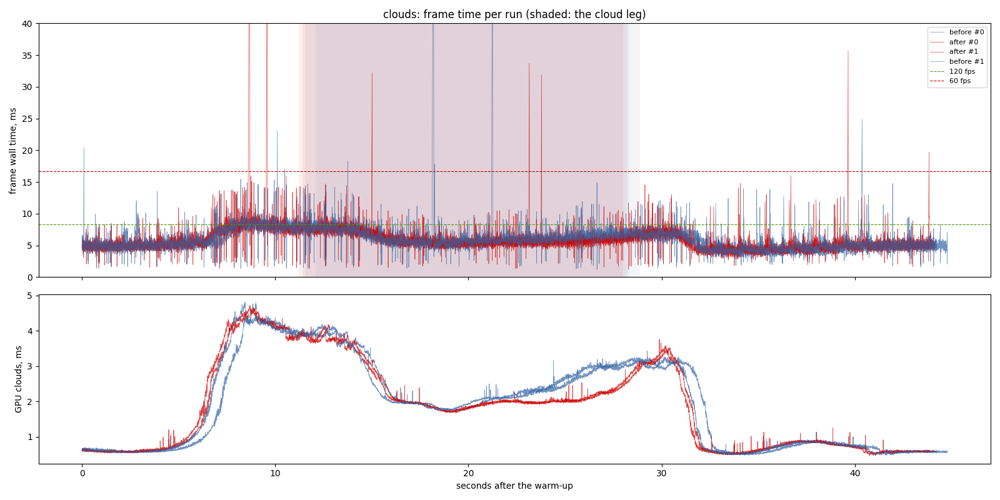
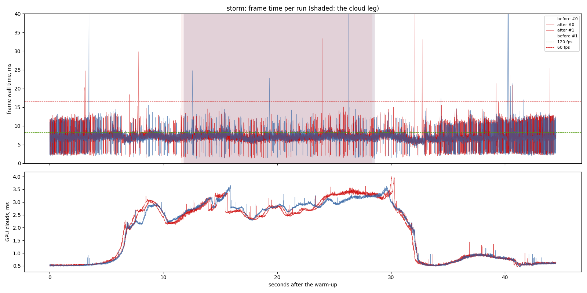
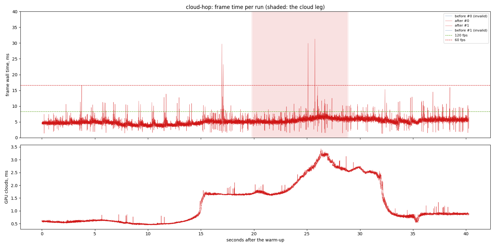

# Cloud close-up: before and after, on the cloud scenarios

The `cloud-close-up` change (`openspec/changes/cloud-close-up`): 3D shape
noise, a history resolve with neighbourhood clipping and disocclusion, the
composite's all-rejected fallback, and haze on the clouds. Measured against
the baseline exe (`output/perf/baseline-exe`, the 2026-09-25 baseline build)
in the same sitting, runs interleaved, each exe with its own shaders and
config (`--variant "before|output/perf/baseline-exe/pbd-app.exe||HEAD"`).

## Findings

1. **The fix costs nothing measurable.** On the fair-weather cloud leg the
   frame is 5.8 ms at the median after against 6.1 before, and the clouds'
   GPU time 2.0 ms against 2.3, the new resolve pass included. The storm is
   unchanged: 7.1 ms at the median both ways, 2.8 against 2.9 ms of cloud GPU.
2. **The storm still misses 120 fps at p95** (8.8 ms on its cloud leg), as it
   did before. Its frame is CPU-bound: the GPU total is 4.5 ms of a 7.1 ms
   frame.
3. **`cloud-hop` has no before.** The baseline exe predates `--route clouds`
   and exits at the flag; both its runs are marked invalid, as the suite
   should. After: 5.5 ms median on the broken-cloud leg, 2.1 ms of cloud GPU.

## Limits

- One machine: RTX 3070 (driver 595.97, Vulkan), i7-9700F; one window size.
- Two runs per variant; differences smaller than the spread between the two
  runs are not results.
- The look is judged on stills and the recording, not by these numbers.

## The run

- revision: `98b94a1` (uncommitted changes)
- adapter: NVIDIA GeForce RTX 3070 (Vulkan); window 1440 x 900, uncapped (`--no-vsync`)
- clock pinned at 10.0 h; first 10.0 s of each run thrown away; 2 run(s) per variant, interleaved
- budgets: p95 within 8.3 ms (120 fps), p99 within 16.7 ms (60 fps); **over** marks a miss. Each cell is the median over the valid runs.

## clouds

| variant | valid runs | fps | p50 | p95 | p99 | p99.9 | max | GPU total p50 | GPU clouds p50 / p95 |
| --- | ---: | ---: | ---: | ---: | ---: | ---: | ---: | ---: | ---: |
| before | 2/2 | 175.37 | 5.44 | 8.31 | 10.05 | 14.92 | 72.44 | 3.11 | 1.31 / 4.01 |
| after | 2/2 | 177.84 | 5.33 | 8.29 | 10.13 | 14.88 | 56.08 | 3.08 | 1.71 / 3.99 |

On the cloud leg only (the stretch the plan flies through cloud):

| variant | fps | p50 | p95 | p99 | max | GPU total p50 / p95 | GPU clouds p50 / p95 |
| --- | ---: | ---: | ---: | ---: | ---: | ---: | ---: |
| before | 158.04 | 6.07 | 8.33 | 10.98 | 72.44 | 3.58 / 5.22 | 2.30 / 3.92 |
| after | 166.15 | 5.77 | 8.28 | 9.53 | 33.68 | 3.32 / 5.14 | 2.01 / 3.77 |

## storm

| variant | valid runs | fps | p50 | p95 | p99 | p99.9 | max | GPU total p50 | GPU clouds p50 / p95 |
| --- | ---: | ---: | ---: | ---: | ---: | ---: | ---: | ---: | ---: |
| before | 2/2 | 141.70 | 6.92 | 10.78 **over** | 12.52 | 17.31 | 48.09 | 4.49 | 2.29 / 3.23 |
| after | 2/2 | 139.92 | 7.06 | 11.25 **over** | 12.71 | 16.32 | 43.74 | 4.50 | 2.32 / 3.35 |

On the cloud leg only (the stretch the plan flies through cloud):

| variant | fps | p50 | p95 | p99 | max | GPU total p50 / p95 | GPU clouds p50 / p95 |
| --- | ---: | ---: | ---: | ---: | ---: | ---: | ---: |
| before | 139.17 | 7.10 | 8.88 **over** | 12.27 | 47.09 | 4.56 / 5.26 | 2.88 / 3.25 |
| after | 139.21 | 7.14 | 8.80 **over** | 12.24 | 33.36 | 4.53 / 5.29 | 2.75 / 3.39 |

## cloud-hop

| variant | valid runs | fps | p50 | p95 | p99 | p99.9 | max | GPU total p50 | GPU clouds p50 / p95 |
| --- | ---: | ---: | ---: | ---: | ---: | ---: | ---: | ---: | ---: |
| before | 0/2 | - | - | - | - | - | - | - | - / - |
| after | 2/2 | 196.63 | 5.00 | 6.62 | 8.33 | 12.74 | 31.30 | 2.83 | 0.86 / 2.70 |

On the cloud leg only (the stretch the plan flies through cloud):

| variant | fps | p50 | p95 | p99 | max | GPU total p50 / p95 | GPU clouds p50 / p95 |
| --- | ---: | ---: | ---: | ---: | ---: | ---: | ---: |
| before | - | - | - | - | - | - / - | - / - |
| after | 177.20 | 5.49 | 7.12 | 8.64 | 31.30 | 3.23 / 4.22 | 2.07 / 3.17 |
- invalid: before run 0: exit code 101; no ROUTE_COMPLETE line; only 0 frames after the warm-up; the scenic route found no cloud
- invalid: before run 1: exit code 101; no ROUTE_COMPLETE line; only 0 frames after the warm-up; the scenic route found no cloud

