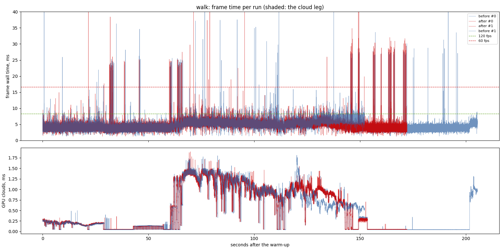
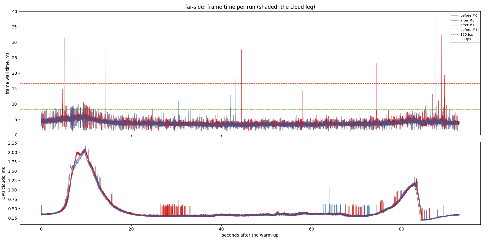

# Detail fade: before and after, walking and to the far side

The `detail-fade` change (`openspec/changes/detail-fade`): trees dither out
toward the edge of their band, and a landing of new ground detail cross-fades
from the old partition to the new. "After" also carries `cloud-close-up`,
which is not yet in the baseline; both are measured against the baseline exe
(`output/perf/baseline-exe`) in the same sitting, runs interleaved, each exe
with its own shaders and config.

## Findings

1. **The fade costs nothing measurable.** Walking 1 km, where about thirty
   landings each cross-fade: 4.5 ms at the median after against 4.7 before,
   and the 95th percentile 6.7 against 7.4. To the far side: 3.7 against
   3.5 ms, inside the spread between the two runs of each (3.5 to 3.7).
2. **Spikes are unchanged.** The worst single frames are 40 to 58 ms before
   and after, the same streaming hitches the baseline report lists.

## Limits

- One machine: RTX 3070 (driver 595.97, Vulkan), i7-9700F; one window size.
- Two runs per variant.
- Whether the pop is gone is judged by eye, on the recording.

## The run

- revision: `98b94a1` (uncommitted changes)
- adapter: NVIDIA GeForce RTX 3070 (Vulkan); window 1440 x 900, uncapped (`--no-vsync`)
- clock pinned at 10.0 h; first 10.0 s of each run thrown away; 2 run(s) per variant, interleaved
- budgets: p95 within 8.3 ms (120 fps), p99 within 16.7 ms (60 fps); **over** marks a miss. Each cell is the median over the valid runs.

## walk

| variant | valid runs | fps | p50 | p95 | p99 | p99.9 | max | GPU total p50 | GPU clouds p50 / p95 |
| --- | ---: | ---: | ---: | ---: | ---: | ---: | ---: | ---: | ---: |
| before | 2/2 | 203.45 | 4.74 | 7.41 | 8.75 | 23.39 | 57.66 | 2.38 | 0.26 / 1.39 |
| after | 2/2 | 214.69 | 4.49 | 6.65 | 7.69 | 23.85 | 49.15 | 2.22 | 0.20 / 1.34 |

## far-side

| variant | valid runs | fps | p50 | p95 | p99 | p99.9 | max | GPU total p50 | GPU clouds p50 / p95 |
| --- | ---: | ---: | ---: | ---: | ---: | ---: | ---: | ---: | ---: |
| before | 2/2 | 270.52 | 3.54 | 5.09 | 5.86 | 8.39 | 41.02 | 1.62 | 0.33 / 1.16 |
| after | 2/2 | 261.66 | 3.66 | 5.30 | 6.19 | 8.80 | 38.48 | 1.67 | 0.34 / 1.15 |

