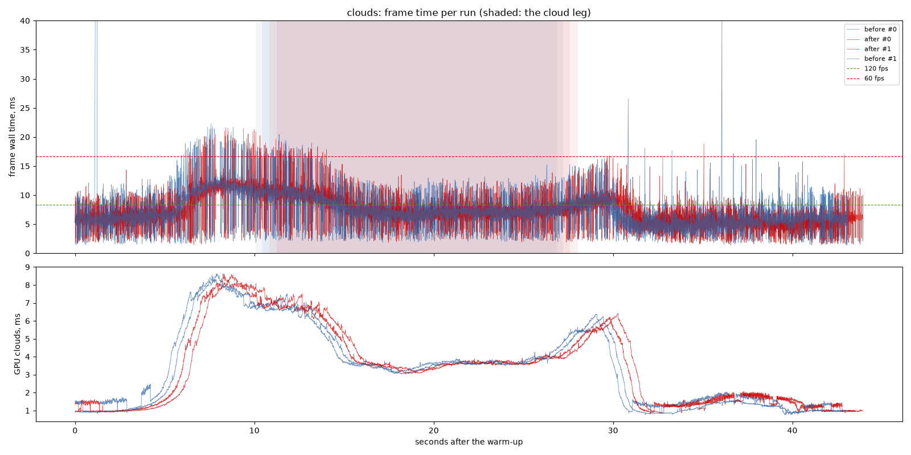
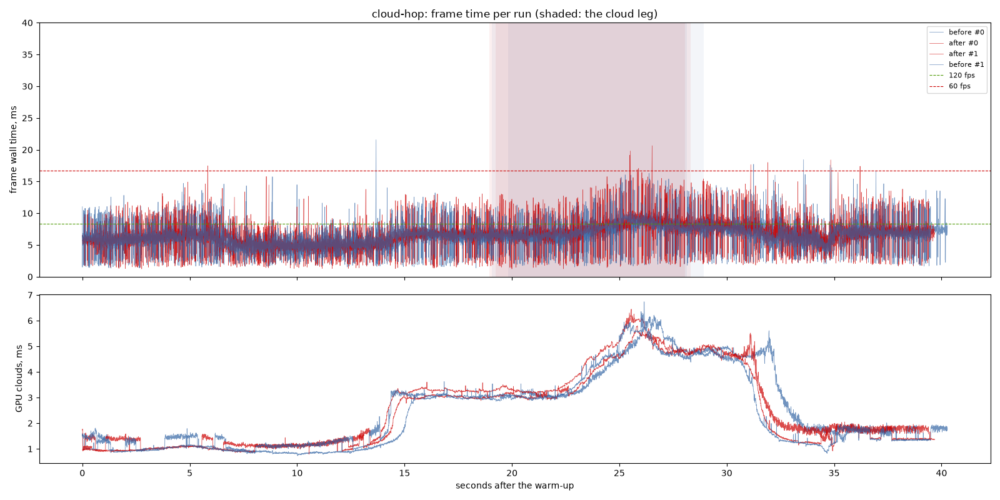

# Fade and cloud edges on top of the history clip: before and after

`detail-fade` section 3 and `cloud-edges`, rebased onto `cloud-history-clip`
(`bef7d58`, the other machine's), against `bef7d58` itself; interleaved in one
sitting. The same changes against `964ddf4` are
`docs/benchmarks/2026-09-25-fade-and-cloud-edges`.

## Findings

1. **No cost the spread can see.** The scenic clouds 6.67 ms at the median
   before against 6.43 after, cloud-hop 6.28 against 6.39; the clouds' GPU
   time on the cloud legs 3.66 against 3.66 and 3.82 against 3.85 ms.
2. **The picture moved where it was meant to.** The limb frame
   (`--route far-side --time 10 --frames 3000`): the clip alone keeps the
   stair-stepped rim on limb clouds, the rebased edges remove it. The
   `cloud-ghosting` turn check: 0.000% of pixels changed turning, 0.003% still.

## Limits

- One machine: NVIDIA GeForce RTX 3060 Laptop GPU (Vulkan), i9-11900H, mains
  power; 1440 x 900, uncapped. Two runs per variant; clouds and cloud-hop only
  (the far side and the walk were measured against `964ddf4`, unchanged here).

---

# Performance suite, 2026-09-25 23:49

- revision: `994078a`
- adapter: NVIDIA GeForce RTX 3060 Laptop GPU (Vulkan); window 1440 x 900, uncapped (`--no-vsync`)
- clock pinned at 10.0 h; first 10.0 s of each run thrown away; 2 run(s) per variant, interleaved
- budgets: p95 within 8.3 ms (120 fps), p99 within 16.7 ms (60 fps); **over** marks a miss. Each cell is the median over the valid runs.

## clouds

| variant | valid runs | fps | p50 | p95 | p99 | p99.9 | max | GPU total p50 | GPU clouds p50 / p95 |
| --- | ---: | ---: | ---: | ---: | ---: | ---: | ---: | ---: | ---: |
| before | 2/2 | 141.60 | 6.67 | 11.61 **over** | 16.85 **over** | 20.89 | 141.20 | 5.55 | 3.08 / 7.00 |
| after | 2/2 | 146.80 | 6.43 | 11.56 **over** | 15.40 | 20.55 | 21.72 | 5.34 | 1.91 / 7.21 |

On the cloud leg only (the stretch the plan flies through cloud):

| variant | fps | p50 | p95 | p99 | max | GPU total p50 / p95 | GPU clouds p50 / p95 |
| --- | ---: | ---: | ---: | ---: | ---: | ---: | ---: |
| before | 130.42 | 7.35 | 11.46 **over** | 16.89 **over** | 20.45 | 5.97 / 9.21 | 3.66 / 6.75 |
| after | 130.36 | 7.35 | 11.50 **over** | 16.34 | 19.72 | 6.01 / 9.28 | 3.66 / 6.86 |

## cloud-hop

| variant | valid runs | fps | p50 | p95 | p99 | p99.9 | max | GPU total p50 | GPU clouds p50 / p95 |
| --- | ---: | ---: | ---: | ---: | ---: | ---: | ---: | ---: | ---: |
| before | 2/2 | 158.67 | 6.28 | 9.56 **over** | 12.46 | 15.75 | 21.57 | 5.36 | 1.69 / 4.93 |
| after | 2/2 | 155.24 | 6.39 | 9.76 **over** | 13.17 | 16.43 | 20.64 | 5.41 | 1.75 / 4.98 |

On the cloud leg only (the stretch the plan flies through cloud):

| variant | fps | p50 | p95 | p99 | max | GPU total p50 / p95 | GPU clouds p50 / p95 |
| --- | ---: | ---: | ---: | ---: | ---: | ---: | ---: |
| before | 138.61 | 7.13 | 10.10 **over** | 13.63 | 16.29 | 6.06 / 8.07 | 3.82 / 5.80 |
| after | 131.17 | 7.50 | 11.52 **over** | 14.66 | 20.64 | 6.06 / 8.22 | 3.85 / 5.98 |

