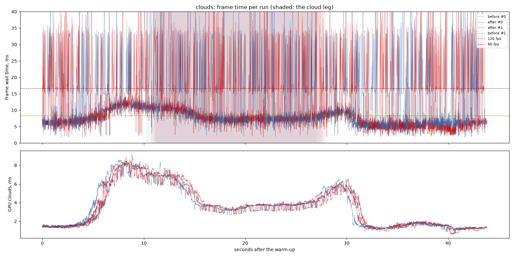
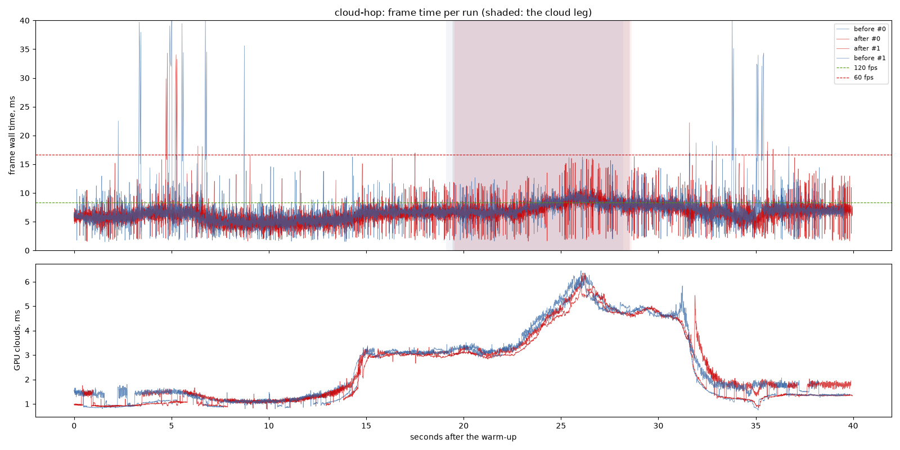
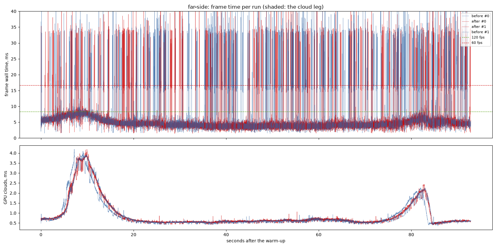
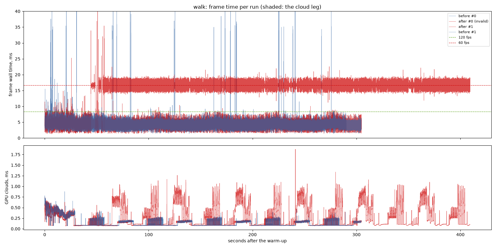

# Fade every landing and cloud edges: before and after

`detail-fade` design section 3 (each fine set's records laid to also cover
the partition it replaces; a tree drawn by both partitions eases its fade
across the landing) and `cloud-edges` (every history texel holding cloud
keeps a distance, so a cloud is hazed to its edge; the history test reads the
cloud's reach, not the ground's; a cloudless texel reads its history at the
history's own distance). "Before" is the release build of `964ddf4` with its
own assets; "after" is the same with both changes. Interleaved in one sitting.

## Findings

1. **No cost that the spread can see.** The medians are unchanged: the
   scenic clouds 7.19 ms before against 7.16 after, cloud-hop 6.48 against
   6.32, the far side 4.24 against 4.23, the walk 4.18 against 4.18. The
   clouds' GPU time on the cloud legs is 3.75 ms either way (cloud-hop 3.94
   against 3.88). The one extra history read `cloud-edges` adds is not
   visible.
2. **The tails moved, but by no more than two runs can vouch for.** The far
   side's 95th percentile fell from 15.56 to 7.71 ms and the walk's 99.9th
   from 32.20 to 8.33 ms. With two runs a side (one valid for the walk's
   "after") these are not claimed as gains: wider records per landing could
   as well have cost a little in a build, and the build is where those spikes
   live.
3. **What the change is for is not in these numbers.** How many landings
   skip their fade, counted off the recordings' logs: cloud-hop 15 of 31
   before, 6 of 28 after; the scenic clouds 10 of 30, 5 of 29 (every remaining
   skip but one a capacity cut, `detail-fade` design section 3). The clouds'
   rim is judged on stills (`cloud-edges` design, "What it measured").

## Limits

- One machine: NVIDIA GeForce RTX 3060 Laptop GPU (Vulkan), i9-11900H, on
  mains power; window 1440 x 900, uncapped (`--no-vsync`).
- Two runs per variant. The walk's first "after" run is invalid: about 70 s
  in, its frames locked to 16.6 ms (60 Hz) with the GPU at 4.5 ms, the
  compositor pacing a covered window, and the walk ran out of time; it is left
  out, and the walk's "after" is one run.
- The scenic clouds miss the 120 fps budget at p95 before and after (24-25
  ms, the cloud leg 31-32 ms); that is this laptop against the baseline's
  RTX 3070, not this change.

---

# Performance suite, 2026-09-25 22:54

- revision: `964ddf4` (uncommitted changes)
- adapter: NVIDIA GeForce RTX 3060 Laptop GPU (Vulkan); window 1440 x 900, uncapped (`--no-vsync`)
- clock pinned at 10.0 h; first 10.0 s of each run thrown away; 2 run(s) per variant, interleaved
- budgets: p95 within 8.3 ms (120 fps), p99 within 16.7 ms (60 fps); **over** marks a miss. Each cell is the median over the valid runs.

## clouds

| variant | valid runs | fps | p50 | p95 | p99 | p99.9 | max | GPU total p50 | GPU clouds p50 / p95 |
| --- | ---: | ---: | ---: | ---: | ---: | ---: | ---: | ---: | ---: |
| before | 2/2 | 108.39 | 7.19 | 24.58 **over** | 35.80 **over** | 51.38 | 86.94 | 5.72 | 3.19 / 7.33 |
| after | 2/2 | 108.56 | 7.16 | 25.27 **over** | 35.48 **over** | 52.31 | 99.29 | 5.63 | 3.13 / 7.22 |

On the cloud leg only (the stretch the plan flies through cloud):

| variant | fps | p50 | p95 | p99 | max | GPU total p50 / p95 | GPU clouds p50 / p95 |
| --- | ---: | ---: | ---: | ---: | ---: | ---: | ---: |
| before | 98.10 | 7.71 | 31.42 **over** | 37.30 **over** | 86.94 | 6.23 / 9.53 | 3.75 / 6.91 |
| after | 97.59 | 7.85 | 32.00 **over** | 35.38 **over** | 67.15 | 6.26 / 9.55 | 3.75 / 6.95 |

## cloud-hop

| variant | valid runs | fps | p50 | p95 | p99 | p99.9 | max | GPU total p50 | GPU clouds p50 / p95 |
| --- | ---: | ---: | ---: | ---: | ---: | ---: | ---: | ---: | ---: |
| before | 2/2 | 152.15 | 6.48 | 9.12 **over** | 11.53 | 35.60 | 48.52 | 5.46 | 1.55 / 4.99 |
| after | 2/2 | 157.45 | 6.32 | 9.08 **over** | 11.95 | 16.96 | 34.33 | 5.29 | 1.68 / 4.91 |

On the cloud leg only (the stretch the plan flies through cloud):

| variant | fps | p50 | p95 | p99 | max | GPU total p50 / p95 | GPU clouds p50 / p95 |
| --- | ---: | ---: | ---: | ---: | ---: | ---: | ---: |
| before | 133.17 | 7.36 | 9.84 **over** | 11.25 | 16.25 | 6.14 / 7.96 | 3.94 / 5.95 |
| after | 132.87 | 7.42 | 10.13 **over** | 13.95 | 16.02 | 6.22 / 7.97 | 3.88 / 5.73 |

## far-side

| variant | valid runs | fps | p50 | p95 | p99 | p99.9 | max | GPU total p50 | GPU clouds p50 / p95 |
| --- | ---: | ---: | ---: | ---: | ---: | ---: | ---: | ---: | ---: |
| before | 2/2 | 179.41 | 4.24 | 15.56 **over** | 34.15 **over** | 49.58 | 62.04 | 3.26 | 0.60 / 2.22 |
| after | 2/2 | 197.68 | 4.23 | 7.71 | 32.87 **over** | 42.71 | 58.24 | 3.27 | 0.61 / 2.12 |

## walk

| variant | valid runs | fps | p50 | p95 | p99 | p99.9 | max | GPU total p50 | GPU clouds p50 / p95 |
| --- | ---: | ---: | ---: | ---: | ---: | ---: | ---: | ---: | ---: |
| before | 2/2 | 230.51 | 4.18 | 6.14 | 6.92 | 32.20 | 51.80 | 3.36 | 0.08 / 0.36 |
| after | 1/2 | 234.65 | 4.18 | 5.91 | 7.06 | 8.33 | 14.86 | 3.13 | 0.08 / 0.30 |
- invalid: after run 0: timed out after 420.0 s; no WALK_DONE line

