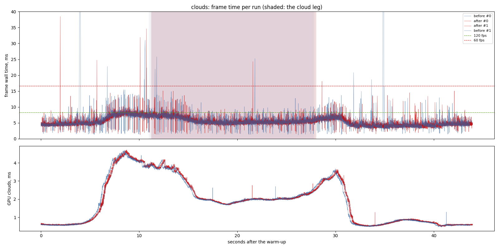
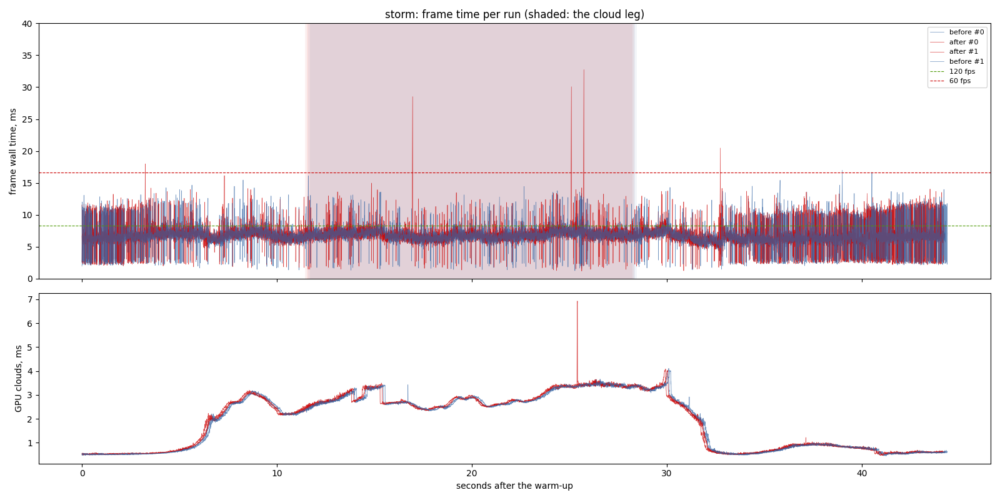
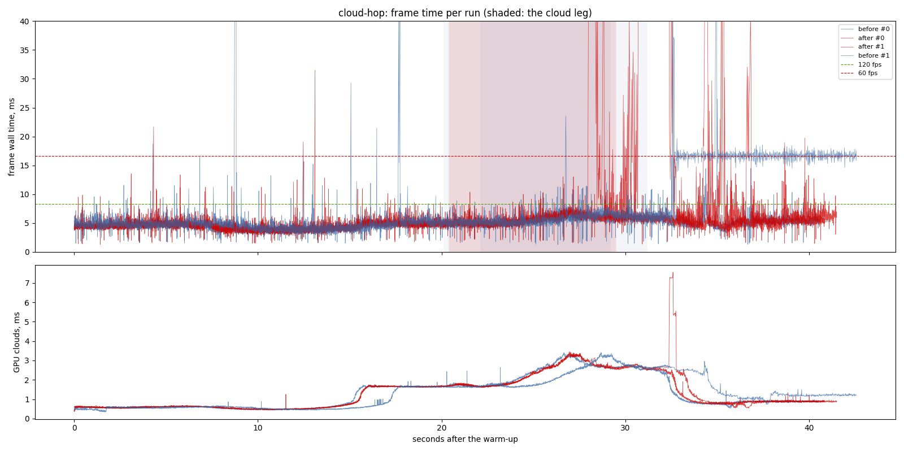

# Cloud history clip: before and after

`openspec/changes/cloud-history-clip`: `cloud-ghosting`'s silhouette test,
then the history clipped to this frame's 3 x 3 neighbourhood, in a resolve
pass. Before: `main` at `964ddf4` on its own assets. Same sitting, interleaved.

## Findings

1. **No measurable cost.** Flight into cloud: 4.98 ms at the median after,
   5.00 before; its cloud leg 5.43 against 5.41. Storm: 6.70 against 6.61,
   inside the spread between its runs (6.61 to 6.70).
2. **`cloud-hop`'s tails are noise:** one run of each build caught a
   streaming hitch (122 ms before, 780 ms after) and one before-run's p95 was
   16.6 ms; the medians agree (4.85 against 4.98). These hitches are the open
   stutter item, not the clouds.

## Limits

- One machine (RTX 3070, Vulkan), one window size, two runs a variant.

## The run

- revision: `964ddf4` (uncommitted changes)
- adapter: NVIDIA GeForce RTX 3070 (Vulkan); window 1440 x 900, uncapped (`--no-vsync`)
- clock pinned at 10.0 h; first 10.0 s of each run thrown away; 2 run(s) per variant, interleaved
- budgets: p95 within 8.3 ms (120 fps), p99 within 16.7 ms (60 fps); **over** marks a miss. Each cell is the median over the valid runs.

## clouds

| variant | valid runs | fps | p50 | p95 | p99 | p99.9 | max | GPU total p50 | GPU clouds p50 / p95 |
| --- | ---: | ---: | ---: | ---: | ---: | ---: | ---: | ---: | ---: |
| before | 2/2 | 188.54 | 5.00 | 7.87 | 9.65 | 21.90 | 122.65 | 3.08 | 1.70 / 4.00 |
| after | 2/2 | 189.07 | 4.98 | 7.88 | 9.06 | 13.49 | 38.47 | 3.08 | 1.70 / 4.01 |

On the cloud leg only (the stretch the plan flies through cloud):

| variant | fps | p50 | p95 | p99 | max | GPU total p50 / p95 | GPU clouds p50 / p95 |
| --- | ---: | ---: | ---: | ---: | ---: | ---: | ---: |
| before | 176.28 | 5.41 | 7.76 | 9.05 | 25.80 | 3.32 / 5.13 | 2.02 / 3.78 |
| after | 176.12 | 5.43 | 7.74 | 8.79 | 24.30 | 3.31 / 5.14 | 2.02 / 3.80 |

## storm

| variant | valid runs | fps | p50 | p95 | p99 | p99.9 | max | GPU total p50 | GPU clouds p50 / p95 |
| --- | ---: | ---: | ---: | ---: | ---: | ---: | ---: | ---: | ---: |
| before | 2/2 | 148.83 | 6.61 | 10.15 **over** | 11.92 | 14.44 | 17.00 | 4.50 | 2.30 / 3.40 |
| after | 2/2 | 147.09 | 6.70 | 10.38 **over** | 12.04 | 14.12 | 32.74 | 4.51 | 2.32 / 3.41 |

On the cloud leg only (the stretch the plan flies through cloud):

| variant | fps | p50 | p95 | p99 | max | GPU total p50 / p95 | GPU clouds p50 / p95 |
| --- | ---: | ---: | ---: | ---: | ---: | ---: | ---: |
| before | 145.41 | 6.81 | 8.33 | 11.55 | 14.44 | 4.64 / 5.33 | 2.80 / 3.46 |
| after | 143.52 | 6.89 | 8.53 **over** | 11.85 | 32.74 | 4.65 / 5.33 | 2.81 / 3.46 |

## cloud-hop

| variant | valid runs | fps | p50 | p95 | p99 | p99.9 | max | GPU total p50 | GPU clouds p50 / p95 |
| --- | ---: | ---: | ---: | ---: | ---: | ---: | ---: | ---: | ---: |
| before | 2/2 | 166.09 | 4.98 | 16.61 **over** | 17.47 **over** | 26.50 | 122.35 | 2.83 | 0.85 / 2.74 |
| after | 2/2 | 180.36 | 4.85 | 7.67 | 16.41 | 55.09 | 779.53 | 2.84 | 0.86 / 2.74 |

On the cloud leg only (the stretch the plan flies through cloud):

| variant | fps | p50 | p95 | p99 | max | GPU total p50 / p95 | GPU clouds p50 / p95 |
| --- | ---: | ---: | ---: | ---: | ---: | ---: | ---: |
| before | 173.71 | 5.66 | 7.21 | 9.01 | 23.54 | 3.29 / 4.39 | 2.08 / 3.19 |
| after | 164.12 | 5.46 | 7.92 | 14.25 | 262.78 | 3.32 / 4.40 | 2.10 / 3.23 |

