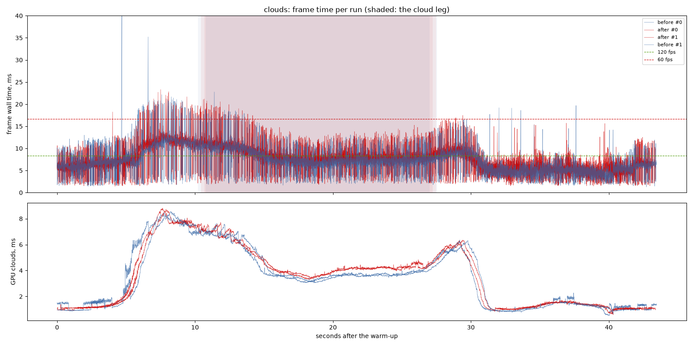
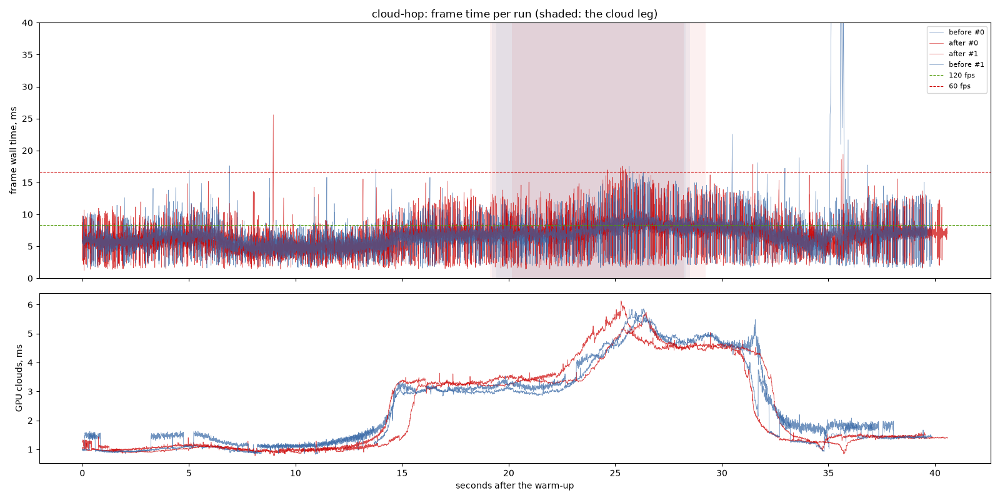
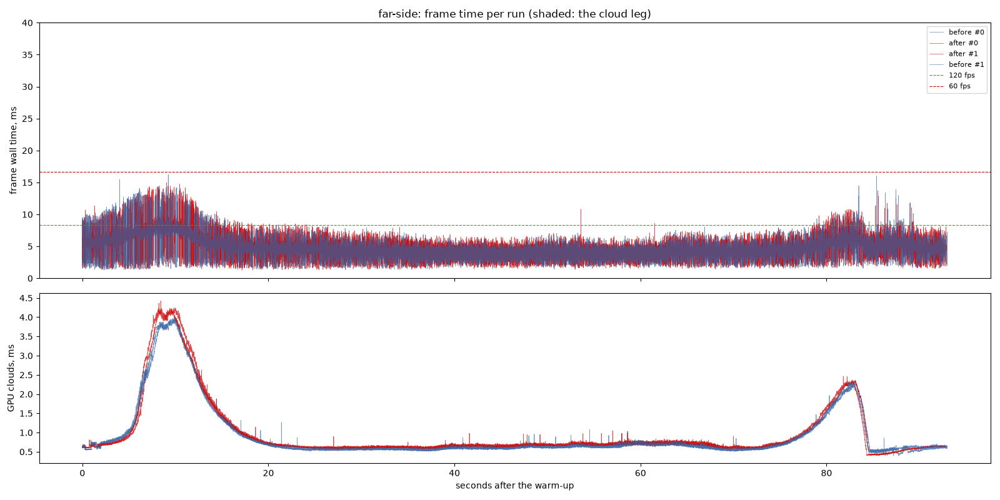

# Cloud entry, lens weather and the per-level fade: before and after

`cloud-entry` (the resolve writes distances, interleaved gradient jitter, the
footprint floor at half a step, the third shape octave faded, the sea's hit
over four corners, the near field as the cloud's own fog), `lens-weather`
(drops half the size, condensation in cloud) and `detail-fade` section 4
(every landing fades; only the ring the records lack switches), against
`4032d3e`, interleaved in one sitting.

## Findings

1. **The clouds cost about half a millisecond more inside the layer.** On
   the cloud legs the clouds' GPU time rose from 3.67 to 4.19 ms (the scenic
   route) and from 3.96 to 4.35 ms (cloud-hop), and the frame's median there
   from 7.39 to 8.14 and 7.42 to 7.90 ms: past the spread between the runs.
   It is the near field: every march texel inside the layer takes two more
   density samples and lights them with the full sun and sky light march (six
   more density samples). That is the price of entering a cloud smoothly;
   the fix, if it is wanted, is to light the near field with fewer steps or
   once per 2x2 texels. Over the whole routes the medians moved +0.43 ms
   (scenic), +0.04 (cloud-hop) and +0.07 (far side).
2. **Outside cloud, nothing moved.** The far side, which spends most of its
   time above the layer, is within the spread.
3. **What it bought** is judged on the recordings (`output/rec3`, on Drive as
   the `fix2` set): the entry fades into fog with no salt, bands or curtain;
   the lens mists in cloud and clears after; the drops are half the size;
   every landing fades.

## Limits

- One machine: NVIDIA GeForce RTX 3060 Laptop GPU (Vulkan), i9-11900H, mains
  power; 1440 x 900, uncapped. Two runs per variant; clouds, cloud-hop and
  the far side.

---

# Performance suite, 2026-09-26 00:17

- revision: `4032d3e` (uncommitted changes)
- adapter: NVIDIA GeForce RTX 3060 Laptop GPU (Vulkan); window 1440 x 900, uncapped (`--no-vsync`)
- clock pinned at 10.0 h; first 10.0 s of each run thrown away; 2 run(s) per variant, interleaved
- budgets: p95 within 8.3 ms (120 fps), p99 within 16.7 ms (60 fps); **over** marks a miss. Each cell is the median over the valid runs.

## clouds

| variant | valid runs | fps | p50 | p95 | p99 | p99.9 | max | GPU total p50 | GPU clouds p50 / p95 |
| --- | ---: | ---: | ---: | ---: | ---: | ---: | ---: | ---: | ---: |
| before | 2/2 | 149.18 | 6.40 | 11.56 **over** | 16.32 | 20.88 | 47.21 | 5.52 | 1.97 / 7.07 |
| after | 2/2 | 140.25 | 6.83 | 12.04 **over** | 16.20 | 20.59 | 23.31 | 5.73 | 1.70 / 7.36 |

On the cloud leg only (the stretch the plan flies through cloud):

| variant | fps | p50 | p95 | p99 | max | GPU total p50 / p95 | GPU clouds p50 / p95 |
| --- | ---: | ---: | ---: | ---: | ---: | ---: | ---: |
| before | 130.66 | 7.39 | 11.49 **over** | 15.45 | 22.77 | 6.00 / 9.31 | 3.67 / 6.87 |
| after | 120.11 | 8.14 | 12.28 **over** | 17.10 **over** | 21.19 | 6.66 / 9.65 | 4.19 / 7.02 |

## cloud-hop

| variant | valid runs | fps | p50 | p95 | p99 | p99.9 | max | GPU total p50 | GPU clouds p50 / p95 |
| --- | ---: | ---: | ---: | ---: | ---: | ---: | ---: | ---: | ---: |
| before | 2/2 | 154.77 | 6.37 | 9.91 **over** | 13.30 | 50.20 | 82.02 | 5.36 | 1.72 / 4.91 |
| after | 2/2 | 155.20 | 6.41 | 9.88 **over** | 13.31 | 16.88 | 25.58 | 5.34 | 1.43 / 4.74 |

On the cloud leg only (the stretch the plan flies through cloud):

| variant | fps | p50 | p95 | p99 | max | GPU total p50 / p95 | GPU clouds p50 / p95 |
| --- | ---: | ---: | ---: | ---: | ---: | ---: | ---: |
| before | 132.38 | 7.42 | 11.49 **over** | 15.12 | 17.50 | 6.16 / 7.85 | 3.96 / 5.55 |
| after | 125.60 | 7.90 | 12.67 **over** | 15.40 | 17.55 | 6.67 / 7.87 | 4.35 / 5.54 |

## far-side

| variant | valid runs | fps | p50 | p95 | p99 | p99.9 | max | GPU total p50 | GPU clouds p50 / p95 |
| --- | ---: | ---: | ---: | ---: | ---: | ---: | ---: | ---: | ---: |
| before | 2/2 | 223.87 | 4.26 | 7.05 | 9.06 | 13.20 | 16.22 | 3.32 | 0.62 / 2.14 |
| after | 2/2 | 219.09 | 4.33 | 7.27 | 8.98 | 13.10 | 14.96 | 3.41 | 0.68 / 2.24 |

