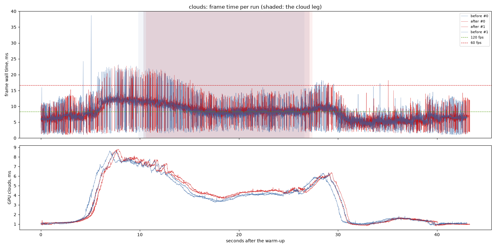
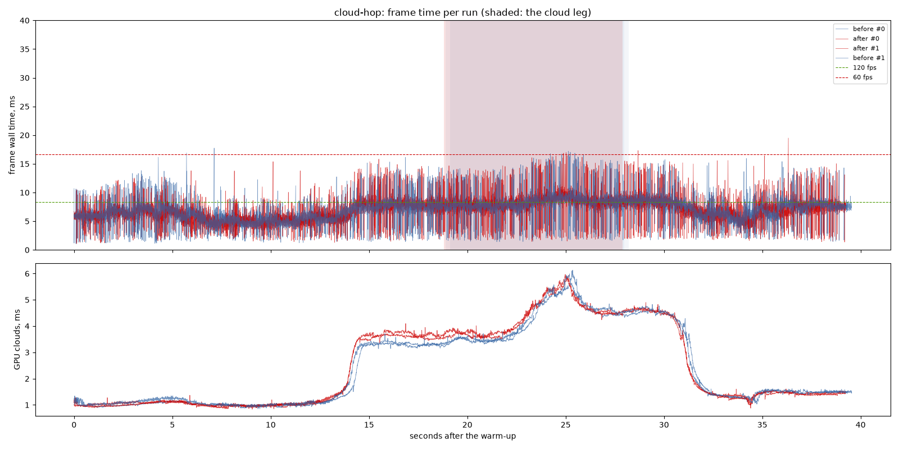
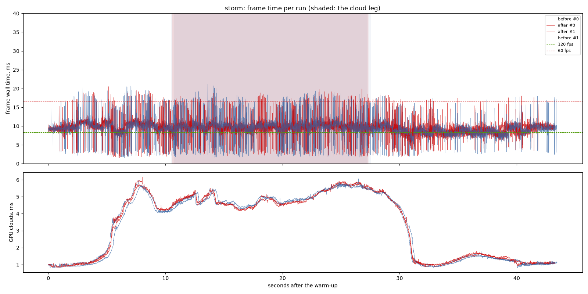

# The march's reach: before and after

`cloud-reach`: past its 48-step budget the cloud march takes up to 16 more
steps, stretched to reach the end of the ray, so from inside the cloud layer
the far deck is drawn above the cloud base's horizon as well as below it (the
owner's "ring"). A shader change only: one release exe, with the assets of
`bf14533` for "before", interleaved.

## Findings

1. **Inside cloud it costs about 0.3 ms of GPU.** On the `clouds` route's
   cloud leg the clouds pass rose from 4.11 to 4.43 ms at the median (mean
   4.48 to 4.77), against a spread of 0.02 ms between repeats. The frame's
   median on that leg rose from 8.45 to 8.73 ms. These are the rays that now
   reach the far deck instead of stopping about 800 m out: the picture being
   drawn, not waste. It is 7% of the pass, against up to 33% for a ray that
   takes all 16 tail steps, and far below the 256-step budget that drew the
   same deck.
2. **Cloud-hop, +0.15 ms** in cloud (clouds pass 4.27 to 4.42 ms at the
   median, spread 0.03-0.05); the whole flight's median frame is unchanged
   (6.71 ms before, 6.66 after, each the mean of two runs' medians).
3. **The storm is unchanged** (4.87/4.82 ms in cloud): in dense cloud a ray
   goes opaque before its budget is spent, and never reaches the tail.
4. **p95 and p99 are unchanged** within the spread in every scenario.

## Limits

- One machine: NVIDIA GeForce RTX 3060 Laptop GPU (Vulkan), i9-11900H, mains
  power; 1440 x 900, uncapped. Two runs per variant.
- The 8-step tail, cheaper, was judged on stills only (it leaves the jitter's
  crosshatch on the far deck) and was not timed.

---

# Performance suite, 2026-09-26 11:07

- revision: `bf14533` (uncommitted changes)
- adapter: NVIDIA GeForce RTX 3060 Laptop GPU (Vulkan); window 1440 x 900, uncapped (`--no-vsync`)
- clock pinned at 10.0 h; first 10.0 s of each run thrown away; 2 run(s) per variant, interleaved
- budgets: p95 within 8.3 ms (120 fps), p99 within 16.7 ms (60 fps); **over** marks a miss. Each cell is the median over the valid runs.

## clouds

| variant | valid runs | fps | p50 | p95 | p99 | p99.9 | max | GPU total p50 | GPU clouds p50 / p95 |
| --- | ---: | ---: | ---: | ---: | ---: | ---: | ---: | ---: | ---: |
| before | 2/2 | 133.37 | 7.14 | 12.29 **over** | 17.52 **over** | 22.34 | 38.71 | 6.53 | 1.93 / 7.33 |
| after | 2/2 | 132.89 | 7.21 | 12.37 **over** | 15.88 | 21.92 | 22.99 | 6.46 | 1.69 / 7.47 |

On the cloud leg only (the stretch the plan flies through cloud):

| variant | fps | p50 | p95 | p99 | max | GPU total p50 / p95 | GPU clouds p50 / p95 |
| --- | ---: | ---: | ---: | ---: | ---: | ---: | ---: |
| before | 114.84 | 8.46 | 12.57 **over** | 18.30 **over** | 21.99 | 7.51 / 10.67 | 4.12 / 7.11 |
| after | 111.52 | 8.74 | 12.60 **over** | 17.38 **over** | 21.64 | 7.75 / 10.68 | 4.43 / 7.13 |

## cloud-hop

| variant | valid runs | fps | p50 | p95 | p99 | p99.9 | max | GPU total p50 | GPU clouds p50 / p95 |
| --- | ---: | ---: | ---: | ---: | ---: | ---: | ---: | ---: | ---: |
| before | 2/2 | 147.23 | 6.79 | 10.05 **over** | 14.31 | 16.21 | 17.75 | 6.11 | 1.46 / 4.79 |
| after | 2/2 | 148.01 | 6.74 | 10.01 **over** | 14.03 | 16.04 | 19.50 | 6.09 | 1.42 / 4.77 |

On the cloud leg only (the stretch the plan flies through cloud):

| variant | fps | p50 | p95 | p99 | max | GPU total p50 / p95 | GPU clouds p50 / p95 |
| --- | ---: | ---: | ---: | ---: | ---: | ---: | ---: |
| before | 121.57 | 8.19 | 12.99 **over** | 15.67 | 17.21 | 7.24 / 8.47 | 4.29 / 5.45 |
| after | 119.59 | 8.42 | 12.84 **over** | 15.18 | 16.97 | 7.44 / 8.66 | 4.44 / 5.58 |

## storm

| variant | valid runs | fps | p50 | p95 | p99 | p99.9 | max | GPU total p50 | GPU clouds p50 / p95 |
| --- | ---: | ---: | ---: | ---: | ---: | ---: | ---: | ---: | ---: |
| before | 2/2 | 105.76 | 9.48 | 12.61 **over** | 17.60 **over** | 19.63 | 21.19 | 8.63 | 4.22 / 5.66 |
| after | 2/2 | 105.28 | 9.52 | 12.33 **over** | 17.21 **over** | 19.00 | 20.50 | 8.69 | 4.27 / 5.68 |

On the cloud leg only (the stretch the plan flies through cloud):

| variant | fps | p50 | p95 | p99 | max | GPU total p50 / p95 | GPU clouds p50 / p95 |
| --- | ---: | ---: | ---: | ---: | ---: | ---: | ---: |
| before | 101.08 | 9.91 | 15.66 **over** | 18.09 **over** | 21.19 | 9.07 / 9.88 | 4.87 / 5.71 |
| after | 102.61 | 9.78 | 14.32 **over** | 17.89 **over** | 19.90 | 8.93 / 9.77 | 4.82 / 5.80 |

