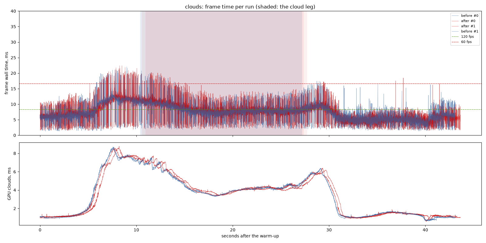
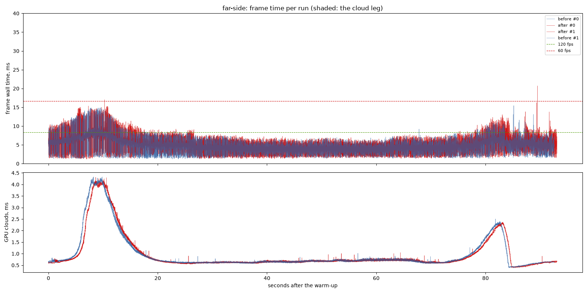
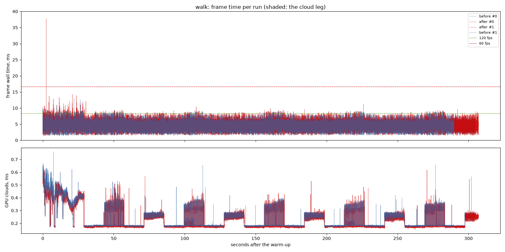

# Distance cross-fade and nested trees: before and after

`distance-lod-fade`: one partition per pixel, the detail levels dissolving
into each other across rings of 0.3 of each band round a centre that follows
the camera (the owner's keijiro/CrossFadingLod reference, Unity's LOD
cross-fade), the water sheet split the same way, and trees nested across the
levels out to level 8. Against `bbd3c5f`, interleaved in one sitting.

## Findings

1. **Walking costs about a quarter of a millisecond more.** The walk's median
   frame 4.32 ms before against 4.59 after, the GPU's 3.22 against 3.64 ms:
   past the spread between the runs (4.28-4.32 before, 4.58-4.59 after). It
   is the rings: across each, both levels' cells are drawn and each keeps its
   share of the pixels, and trees now stand out to 2.4 km. The walk still
   holds the 120 fps budget at p95 (6.62 ms).
2. **Flying, nothing the spread can see.** The scenic clouds 6.72 against
   6.62 ms at the median, the far side 4.33 against 4.39.
3. **What it bought** is judged on the recordings (Drive, the `fix4` set):
   blocks and trees dissolve between levels with distance instead of
   switching at a landing, and trees keep their places.

## Limits

- One machine: NVIDIA GeForce RTX 3060 Laptop GPU (Vulkan), i9-11900H, mains
  power; 1440 x 900, uncapped. Two runs per variant; clouds, the far side,
  the walk.

---

# Performance suite, 2026-09-26 01:28

- revision: `bbd3c5f` (uncommitted changes)
- adapter: NVIDIA GeForce RTX 3060 Laptop GPU (Vulkan); window 1440 x 900, uncapped (`--no-vsync`)
- clock pinned at 10.0 h; first 10.0 s of each run thrown away; 2 run(s) per variant, interleaved
- budgets: p95 within 8.3 ms (120 fps), p99 within 16.7 ms (60 fps); **over** marks a miss. Each cell is the median over the valid runs.

## clouds

| variant | valid runs | fps | p50 | p95 | p99 | p99.9 | max | GPU total p50 | GPU clouds p50 / p95 |
| --- | ---: | ---: | ---: | ---: | ---: | ---: | ---: | ---: | ---: |
| before | 2/2 | 141.15 | 6.72 | 11.84 **over** | 16.31 | 20.28 | 22.05 | 5.67 | 1.74 / 7.24 |
| after | 2/2 | 143.76 | 6.62 | 12.00 **over** | 16.22 | 20.91 | 22.43 | 5.67 | 1.59 / 7.30 |

On the cloud leg only (the stretch the plan flies through cloud):

| variant | fps | p50 | p95 | p99 | max | GPU total p50 / p95 | GPU clouds p50 / p95 |
| --- | ---: | ---: | ---: | ---: | ---: | ---: | ---: |
| before | 122.08 | 8.01 | 12.14 **over** | 16.36 | 20.75 | 6.59 / 9.52 | 4.18 / 6.93 |
| after | 119.95 | 8.10 | 12.62 **over** | 16.52 | 20.25 | 6.91 / 9.87 | 4.22 / 7.09 |

## far-side

| variant | valid runs | fps | p50 | p95 | p99 | p99.9 | max | GPU total p50 | GPU clouds p50 / p95 |
| --- | ---: | ---: | ---: | ---: | ---: | ---: | ---: | ---: | ---: |
| before | 2/2 | 219.55 | 4.33 | 7.35 | 9.26 | 13.93 | 15.44 | 3.40 | 0.67 / 2.24 |
| after | 2/2 | 210.36 | 4.39 | 7.66 | 10.25 | 14.14 | 20.70 | 3.40 | 0.67 / 2.22 |

## walk

| variant | valid runs | fps | p50 | p95 | p99 | p99.9 | max | GPU total p50 | GPU clouds p50 / p95 |
| --- | ---: | ---: | ---: | ---: | ---: | ---: | ---: | ---: | ---: |
| before | 2/2 | 227.57 | 4.32 | 6.32 | 7.47 | 8.73 | 13.02 | 3.22 | 0.18 / 0.41 |
| after | 2/2 | 214.58 | 4.59 | 6.62 | 7.71 | 9.10 | 37.74 | 3.64 | 0.18 / 0.41 |

