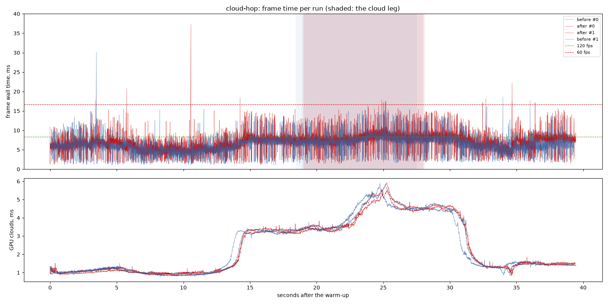
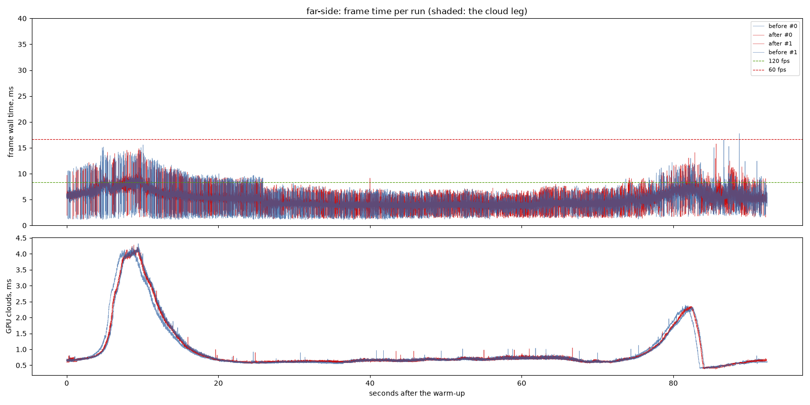
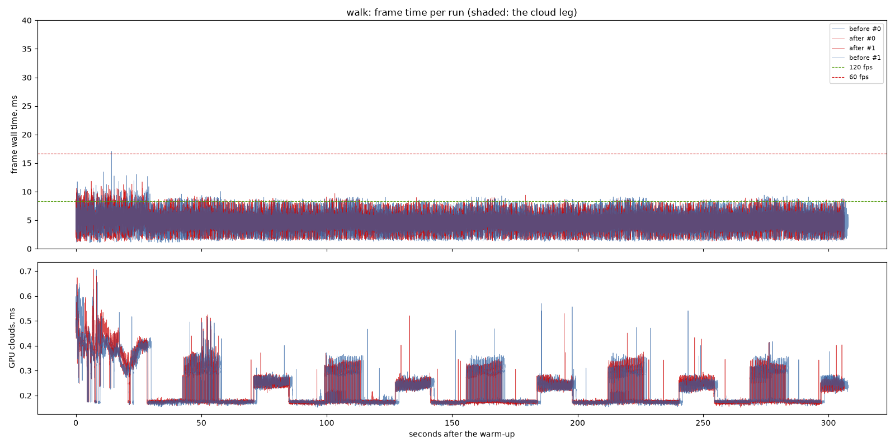

# The fit and the cover capped: before and after

`distance-lod-fade`, "A runaway fit" and "A second loop": each fine set's fit
and cover capped at a level's own margin, and the landing's dissolve at 1 s.
Against `117aba8` (the distance cross-fade as pushed), interleaved.

## Findings

1. **Fine sets build in a third of the time in flight.** On cloud-hop the
   median build fell from 2.8-2.9 s to 1.3-1.4 s (off the runs' own logs),
   and a flight lands 25-26 sets instead of 13-14. The finest level keeps up
   with the camera and is under it when it lands (the owner's "nearest LOD
   doesnt seem to be loading in when landed").
2. **So cloud-hop draws more, and costs more.** Its median frame rose from
   6.21 to 6.87 ms and the GPU's from 5.15 to 5.84 ms, past the spread: with
   the detail no longer lagging hundreds of metres behind, the fine levels
   are drawn under the camera where the coarse ones stood in. That is the
   picture being right, not a new cost; it still holds 60 fps at p99.
3. **The far side and the walk are unchanged** (4.33/4.39 and 4.54/4.54 ms).

## Limits

- One machine: NVIDIA GeForce RTX 3060 Laptop GPU (Vulkan), i9-11900H, mains
  power; 1440 x 900, uncapped. Two runs per variant.

---

# Performance suite, 2026-09-26 08:30

- revision: `117aba8` (uncommitted changes)
- adapter: NVIDIA GeForce RTX 3060 Laptop GPU (Vulkan); window 1440 x 900, uncapped (`--no-vsync`)
- clock pinned at 10.0 h; first 10.0 s of each run thrown away; 2 run(s) per variant, interleaved
- budgets: p95 within 8.3 ms (120 fps), p99 within 16.7 ms (60 fps); **over** marks a miss. Each cell is the median over the valid runs.

## cloud-hop

| variant | valid runs | fps | p50 | p95 | p99 | p99.9 | max | GPU total p50 | GPU clouds p50 / p95 |
| --- | ---: | ---: | ---: | ---: | ---: | ---: | ---: | ---: | ---: |
| before | 2/2 | 159.77 | 6.21 | 9.18 **over** | 12.61 | 15.13 | 30.11 | 5.15 | 1.45 / 4.79 |
| after | 2/2 | 145.43 | 6.87 | 9.86 **over** | 13.99 | 17.21 | 37.28 | 5.84 | 1.45 / 4.76 |

On the cloud leg only (the stretch the plan flies through cloud):

| variant | fps | p50 | p95 | p99 | max | GPU total p50 / p95 | GPU clouds p50 / p95 |
| --- | ---: | ---: | ---: | ---: | ---: | ---: | ---: |
| before | 132.14 | 7.50 | 10.65 **over** | 13.87 | 15.13 | 6.44 / 7.69 | 4.26 / 5.34 |
| after | 121.40 | 8.16 | 11.49 **over** | 15.24 | 17.87 | 6.84 / 8.22 | 4.32 / 5.48 |

## far-side

| variant | valid runs | fps | p50 | p95 | p99 | p99.9 | max | GPU total p50 | GPU clouds p50 / p95 |
| --- | ---: | ---: | ---: | ---: | ---: | ---: | ---: | ---: | ---: |
| before | 2/2 | 212.09 | 4.33 | 7.55 | 9.67 | 13.68 | 17.76 | 3.42 | 0.67 / 2.21 |
| after | 2/2 | 210.96 | 4.39 | 7.44 | 9.07 | 12.47 | 15.76 | 3.42 | 0.67 / 2.23 |

## walk

| variant | valid runs | fps | p50 | p95 | p99 | p99.9 | max | GPU total p50 | GPU clouds p50 / p95 |
| --- | ---: | ---: | ---: | ---: | ---: | ---: | ---: | ---: | ---: |
| before | 2/2 | 215.28 | 4.54 | 6.37 | 7.84 | 9.00 | 17.08 | 3.66 | 0.18 / 0.38 |
| after | 2/2 | 216.15 | 4.54 | 6.32 | 7.48 | 8.85 | 11.85 | 3.59 | 0.18 / 0.39 |

