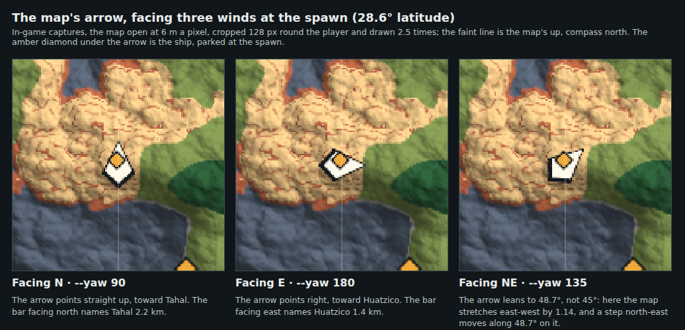

# compass-bar

The owner, 2026-10-08:
- "I think I need an ingame compass or something";
- "not sure if the map's N/S/E/W directions are the same as the planet, we'll
  have to see what it looks like when we add a compass bar like from skyrim".

The write-up is `openspec/changes/compass-bar`.

They were not the same. `geo` called the frame's +Y north, but the planet
turns about -Y: the sun and the winds both agree. So facing that "north", east
was on the left and the sun rose there, and the map was the mirror image of
the planet. North is now the -Y pole for everything a player reads. Facing
north, east is on the right and the sun rises under E. The map is drawn that
way up and is no longer mirrored. Terrain, towns, sites and saves do not
move.

The shots are taken by `tools/capture_compass.sh`:
- in-game, at 1440 x 900, from the fast build, under `xvfb-run`;
- on a new memory-only world at the default spawn;
- with `--rain 0 --weather-at 7200`.

`--yaw 0` faces compass west, because the walker's default heading is
`Y x up`. So `--yaw 90` faces north and `--yaw 180` east. A cloud capture
renders on lavapipe at a fixed step: it shows what things look like, not how
smoothly they run.

| Shot | Flags | What it shows |
| --- | --- | --- |
| `compass-sunrise.png` | `--walk --time 7.6 --yaw 180 --pitch 6` | Facing compass east just after sunrise on day 0. E is in the middle of the bar, and the sun is on the right of it, toward SE. The launch log puts it at compass bearing 113°, east-south-east, as on Earth in a southern summer (day 0 is the +Y hemisphere's summer, and +Y is the compass's south). The diamonds are sites within 3 km. The one in the middle is named: "Huatzico 1.4 km". N is fading at the left end. |
| `compass-noon-north.png` | `--walk --time 12 --yaw 90 --pitch 4` | Facing compass north at noon: N in the middle in its warm colour, with NW and NE either side. The site in the middle is "Tahal 2.2 km". The new map draws Tahal north of the spawn too, where the old map had it south. The bar, the map and the view from orbit agree. |
| `orbit-north-up.png` | `--view column --at 28.64 0 --height 5000 --pitch -84 --yaw 90 --time 12` | The planet from 5 km up over the spawn, compass north at the top of the screen. The spawn's continent, with its grey mountains left of centre, is in the middle. The island with Barberg and Copan is to the upper left, Tahal's islet is to the north, and Ashenstead's land is to the right. The bar has faded out at this height. |
| `map-after.png` | `--walk --time 12 --menu map --map-mpp 12` | The map now: compass north up. It matches the planet seen from orbit: Barberg's island upper left, Tahal north, Ashenstead right. The polar cap of the frame's +Y pole, which a compass calls south, is along the bottom. The readout says 24.12S. |
| `map-before.png` | the same | The map before this change, copied from `cities-in-the-world/game-map-built-spawn.png` (2026-10-01, the same flags). It is the mirror image: Barberg's island lower left, Tahal south, the polar cap at the top, and 24.12N at the same place. Fewer towns were built then. |

## The eight-wind calibration

The owner, 2026-10-08: "When I'm facing East in the world, am I facing East
on the map? Calibrate for all other directions too."

`map_screen::tests::facing_each_wind_the_bar_the_map_arrow_and_a_step_agree`
faces each of the eight winds, through the real systems, at six places: the
equator, the spawn's latitude on either side, 45° on the antimeridian, 60°
and 75°. For each it checks:
- the compass bar reads that wind in its middle;
- a step forward moves the player that way on the map;
- the map's arrow points along that step.

The bar and the cardinals were already right. The diagonals were not: the
arrow sat at the true 45° while the map leans a step east-west by
1 / cos(latitude). It was 3.7° off at the spawn, 18.5° at 60° and 30.5° at
75°. The arrow now turns by `geo::map_heading`, and all eight winds agree
within 0.06° at every place (design decision 7a).

| Shot | Flags | What it shows |
| --- | --- | --- |
| `map-facing-north.png` | `--walk --time 12 --yaw 90 --menu map --map-mpp 6` | Facing north: the arrow points straight up, toward Tahal, which the bar names when facing north. |
| `map-facing-east.png` | `--walk --time 12 --yaw 180 --menu map --map-mpp 6` | Facing east: the arrow points right, toward Huatzico, which the bar names when facing east. |
| `map-facing-northeast.png` | `--walk --time 12 --yaw 135 --menu map --map-mpp 6` | Facing north-east: the arrow leans to 48.7°, where a north-east step goes on the map at this latitude. |
| `map-arrow-calibration.png` | the three above | The arrow cropped from each and drawn 2.5 times. |
