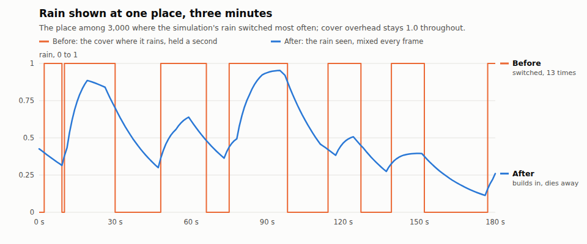

# smooth-weather

The owner, 2026-10-08: "the clouds and weather transitions dont seem smooth
please fix this". The write-up is `openspec/changes/smooth-weather`.

## Rain shown at one place, before and after

`rain-at-one-place.png` (and `.svg`) is drawn by `tools/rain_chart.py` from
`rain-at-one-place.csv`. The data comes from
`PBD_RAIN_CSV=... cargo test -p pbd-app --lib rain_at_one_place -- --ignored`.
It is three minutes of the shipped settled climate at the place, out of
3,000, where the rain switched most often. The cover over it stays 1.0
throughout.

- **Before**: the rain as it was shown, the cover wherever the simulation's
  rain rate was over the threshold and nothing elsewhere, held for each
  one-second state. It switches between nothing and full 13 times in three
  minutes, and every switch lands in one frame. That drives the streaks, the
  lens drops, the ripples, the shafts and the rain volume alike.
- **After**: the rain seen (`Atmosphere::rain_seen`):
  - it builds in over a 5 s time constant and dies away over a 20 s one;
  - it is mixed between the one-second states every frame, so it is drawn
    here as straight lines between the seconds.
  The bursts become a shower that swells and eases.

There are no still captures of rain. A capture steps the weather in place and
shows each state as it is made (design decision 2). A still cannot show a
change over time, which is what this change is about. Smoothness is for a
real-time run on the owner's machine: launch, press P for a storm, and watch
the rain and the cloud edges. The frame cost of the blend pass was not
measured in this cloud session (no GPU).

## The numbers

Measured by `atmosphere::tests::weather_steps` on the shipped settled climate.

| | Before | After |
| --- | ---: | ---: |
| Cover moved in one frame at a normal step: largest, 99th percentile | 0.06-0.27, 0.015 | at most a sixtieth of those a frame |
| Cover moved in one frame when a held step catches up 30 s | 0.69, 0.39 (18% of the sky > 0.05) | spread over 4 s |
| Rain switching at a raining place, 10 min | 8.4 times, each by about 1.0 | crosses 0.05 2.3 times |
| Largest move of the rain seen in one second | 1.00 | 0.18 |
| Mean rain shown over all places | 0.236 | 0.273 |
