# Tenebris reference and the Bevy visual prototype

## Reference captured from the actual application

The reference below is a native Tenebris framebuffer capture, not an illustration or a recreated scene.

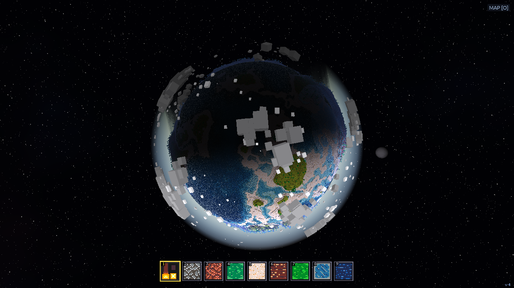

The first capture attempt used the existing release executable at `C:/Users/santi/repos/tenebris/tenebris-rs/target/release/tenebris-client.exe`, dated 2026-06-27. That executable did not contain the `TENEBRIS_DEV_SHOT` or `TENEBRIS_DEV_LODCAM` hooks and produced no PNG. The attempt was stopped, and the existing debug executable dated 2026-07-20 was used instead. No Tenebris build was performed and no source file in that repository was modified. The source checkout inspected during the capture was at `82b562718b9ec3a5365654d6ec0d776f4b744334`; the exact source revision of the prebuilt executable is unknown.

The successful capture used the native `dev_shot.rs` framebuffer path with these inputs:

| Setting | Value |
| --- | --- |
| Executable | Existing `tenebris-rs/target/debug/tenebris-client.exe` |
| Working directory | `C:/Users/santi/repos/tenebris/tenebris-rs` so its own assets resolve |
| Window launch | Hidden background process |
| World | `pbd-reference-20260915-orbit-debug` |
| Camera | `TENEBRIS_DEV_LODCAM=650`, aimed at the planet by the source hook |
| Capture | `TENEBRIS_DEV_SHOT=<workspace>/output/captures/tenebris-orbit-debug/orbit.png` |
| Save isolation | Child-only `APPDATA=<workspace>/output/captures/tenebris-orbit-debug/isolated-user-data` |
| Stable copy | `orbit_reference.png`, 1280 × 720 |
| Committed reference copy | `docs/screenshots/tenebris-orbit.png` |

The LOD hook disables normal SP autosaving in the inspected source. Save isolation additionally keeps the capture's profile/world store separate from the user's existing Tenebris save data. Only the processes started for these captures were stopped. Logs and isolated data remain under their capture directories for review.

A second capture used `TENEBRIS_DEV_DIVE=-12`, `TENEBRIS_DEV_TIME=0.46` and clear weather in another isolated world/store. The deepest-ocean camera is on the dark side at that global time; the script's “noon” preset is not local noon at every longitude. This is a useful wave-detail/night-water reference, not a daylight color reference.

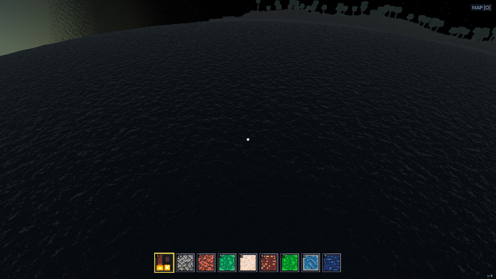

The surface capture shows fine, continuous reflective wave ripples over very dark water, with a blocky forest silhouette beyond the curved shoreline. Its low-light result reinforces that the prototype needs a chosen sunlit landing viewpoint for material review, rather than treating a global clock preset as a camera lighting guarantee.

The two actual native captures are also fixed side by side below as the water
parity **baseline**. This is evidence of the starting mismatch, not an after
image and not a claim that parity has already been achieved.

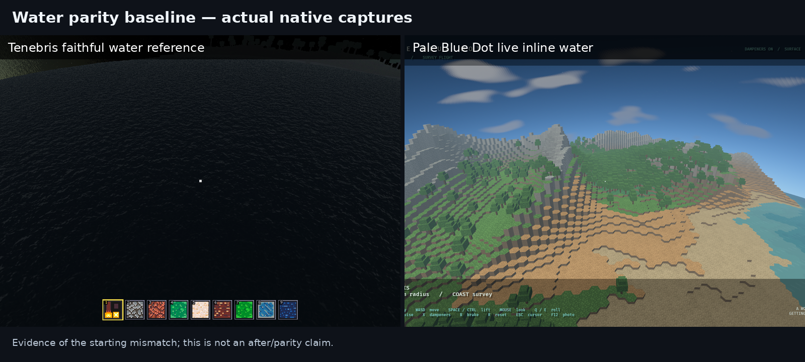

## What the captured reference actually looks like

- Terrain keeps small, high-contrast pixels at the coast: pale sand borders saturated green vegetation and deep blue water. This visible material contrast matters more than continuous physically based roughness.
- The planet is a readable blocky globe. Cloud silhouettes are chunky squared puffs rather than photorealistic volume noise.
- A nearly black space background carries many small white pixel stars, with a small neighboring moon visible to the right.
- The terminator is strong. The night hemisphere is very dark, while the sunward coast and ocean highlights are bright.
- The atmosphere forms a broad, soft pale-blue/white limb. Parts of this capture's limb and water highlights are overexposed; that is observed behavior, not a requirement to reproduce the clipping.

The runtime reference planet in this shot has radius about 300 m according to its log. The new prototype's radius is 4,000 m. Compare silhouette, materials, lighting and atmosphere rather than claiming that the same 650 m camera altitude gives equivalent framing at both scales.

## Integrated sky material

`crates/pbd-app/src/sky.rs` exports `SkyPlugin`, `SkyMaterial`, and shared environment constants. The plugin registers a real Bevy 0.18.1 `MaterialPlugin` and spawns an atmosphere sphere. The application must add `SkyPlugin` to its visual scene; the headless simulation does not acquire rendering implicitly.

| Contract | Current value |
| --- | --- |
| Planet center | Local-world origin |
| Ocean/solid reference radius | 4,000 m |
| Atmosphere shell radius | 4,800 m, 800 m above sea level |
| Cloud layer radius | 4,600 m, 600 m above sea level |
| Exponential density scale height | 176 m; smooth fade over the outer 28% of the shell |
| Sun direction | Normalized `(0.65, 0.75, 0.35)` |
| Shader asset | `assets/shaders/sky_atmosphere.wgsl` |
| Blend/depth | Premultiplied alpha, depth writes off, reverse-Z GreaterEqual |
| Camera contract | Bevy view position and planet center in the same local world frame |

The integrated shader imports Bevy's mesh output and view binding. It takes the default Bevy mesh vertex stage, traces the shell from the current camera, and adapts the standalone Tenebris atmosphere integration to sixteen view/four sun samples. Its fragment math includes soft planetary shadowing, Rayleigh and Mie terms, warm dusk, an altitude-dependent daylight veil that hides stars near the ground, and sparse quantized cloud patches. It renders front faces from orbit and back faces from inside the shell, discarding the other side so the sphere is not blended twice.

The planet renderer owns ocean geometry and its water shader. There is no duplicate transparent sea sphere in `SkyPlugin`. Its water prototype uses ocean-depth coloration, procedural small waves, Fresnel response and sun glints within the planet surface pass. The more detailed standalone `water.wgsl` remains a separate port; this integration does not claim screen-space depth refraction simply because that standalone asset exists.

The new sky is deliberately restrained at the limb, using a thin scale-height density profile over a larger geometric shell. The revised positive terrain elevations are halved before 6 m quantization, with a sampled peak near 426 m; the cloud layer at 600 m and air shell at 800 m clear those observed peaks. Blue scattering ratios, lower Mie strength and reduced radiance target the initial bright-white rim. Terrain edges and pixel colors should stay readable beneath it. Cloud patches are an inexpensive stylized approximation on a spherical layer, not the source's individual cube clouds or a volumetric cloud simulation. The material assumes the planet is at the stated local origin; moving/rebasing the planet requires updating its center uniform and mesh transform together.

## Native prototype capture history

The first release desktop build produced actual `pbd-orbit.png`, `pbd-coast.png` and `pbd-surface.png` screenshots under `output/captures/`. These images were inspected against the Tenebris reference. They demonstrate that GPU column compaction/indirect drawing, the Bevy-composed sky material, textured hex/pentagon surfaces, ocean shading, cosmetic trees and HUD rendered in the application. They used subdivision 7: 163,842 cells and approximately 20 MiB of uploaded column data.

The first orbit view showed a complete textured globe and a blue limb, but mountain tops protruded above the original 4,260 m shell, and the original 4,108 m clouds lay below much of the terrain. Extensive snow/rock materials produced the bright upper hemisphere; it was not all atmospheric glare. The surface view showed textured stepped columns and trees beneath blue sky. The original coast camera was 700 m above local ground and outside most of the dense air, so black space above its horizon was a camera-altitude effect.

The revised source uses subdivision 8: **655,362 columns**, approximately **80 MiB** of column storage, and roughly **19 m** average cell width. Draws above 3,200 m camera altitude use **54 vertices per visible column**; nearer views use **162** to include cosmetic tree cubes. Actual revised orbit, coast, surface, night and pole captures were produced and inspected. They show clearer coastal greens/sand, a shell above the mountain peaks, visible cloud patches and finer surface columns. The original screenshots remain historical evidence for the first build, not measurements of this configuration.

Night-side review found sharply separated diagonal atmosphere bands. These were consistent with too few integration samples and binary shadow rejection, rather than the intended cloud pattern. The integrated WGSL was refined to sixteen midpoint samples and a smooth 36–60 m planetary penumbra; its interfaces and Rust material stayed unchanged. The final native recapture shows a smooth limb with those diagonal wedges removed. All views were rerun after this change. The standalone source-mapped atmosphere shader retains the original eight-view/four-sun march.

## Final native views

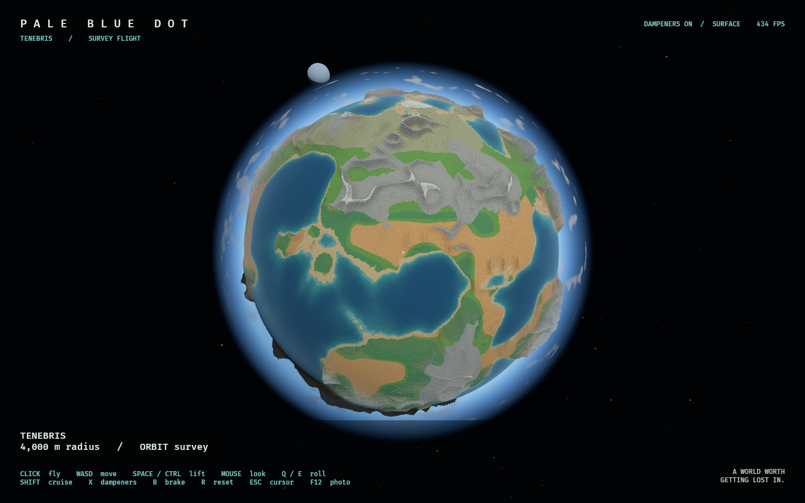

The orbit view preserves the reference's saturated land, dark blue ocean, pixel stars and small moon. The revised air shell clears the mountains, and blue scattering leaves the green and rocky surface legible. Its wispy cloud patches differ visibly from Tenebris's block-shaped clouds; they are a deliberate inexpensive approximation.

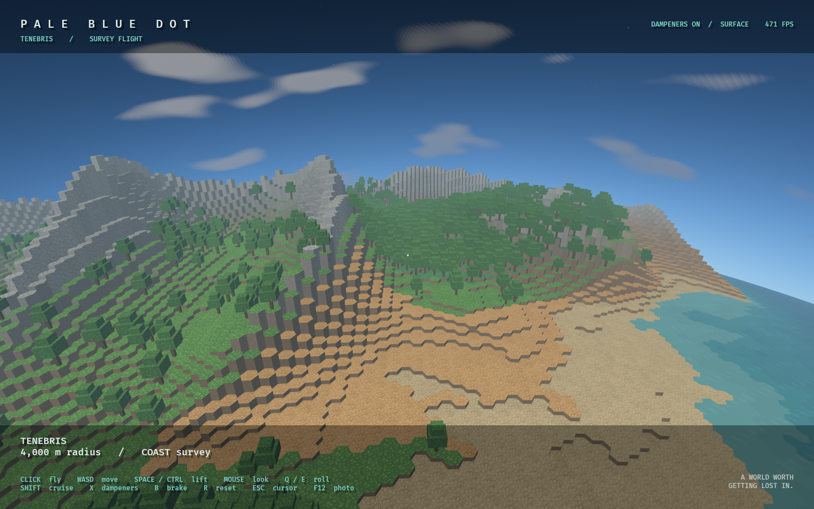

The coast view separates turquoise shallows, pale sand and green inland terraces. The brighter sunlit camera makes the water/material transition easier to assess than the captured Tenebris night-water reference. Water retains warm sun glints, but uses the simpler documented ocean shader rather than the standalone refraction port.

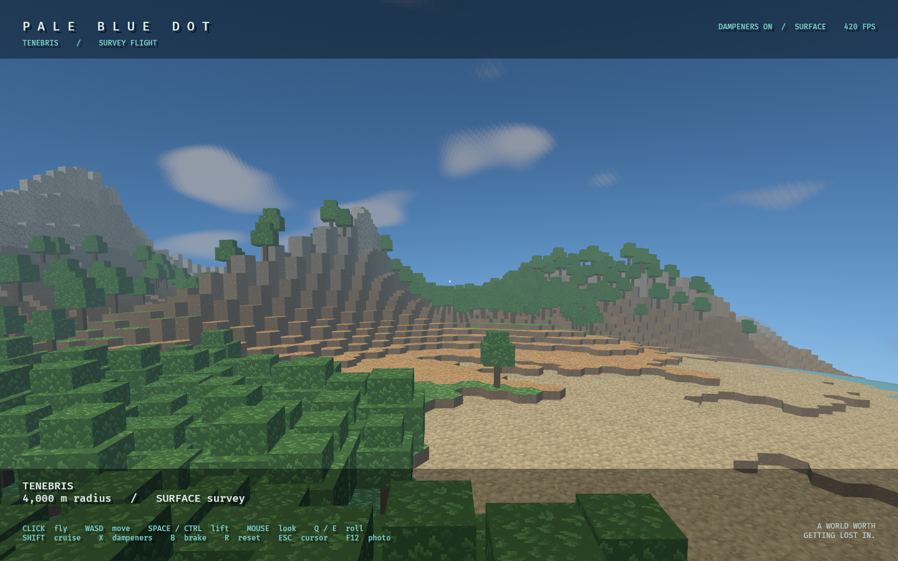

The surface view shows pixel textures, stepped hex columns and block-shaped trees below blue sky and elevated clouds. The approximately 19 m cells remain visibly large; this is a whole-globe surface preview, not the planned metre-scale editable voxel world.

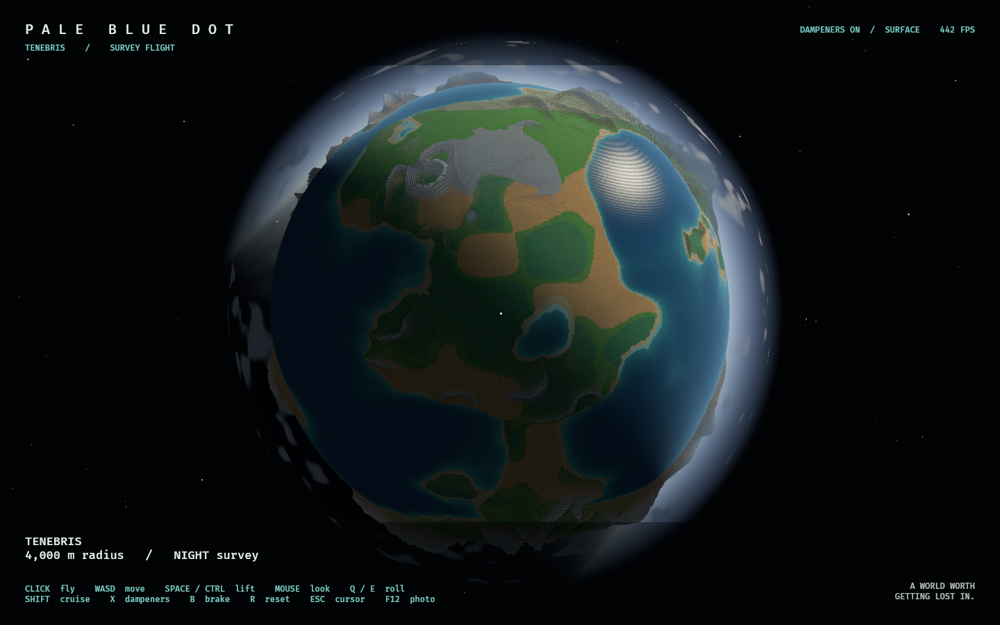

The night view retains a dark hemisphere and a bright twilight rim, with a warm ocean highlight on the lit side. The final atmosphere has a continuous shadow transition after the sampling/penumbra correction. Separate pole and completed survey-tour captures also rendered the closed globe without missing seams in the reviewed views.

The committed orbit and night frames are paired below as the baseline for the
planned night-rim and uniform refactor. Any eventual after capture must use the
same views rather than relying on a differently framed beauty shot.

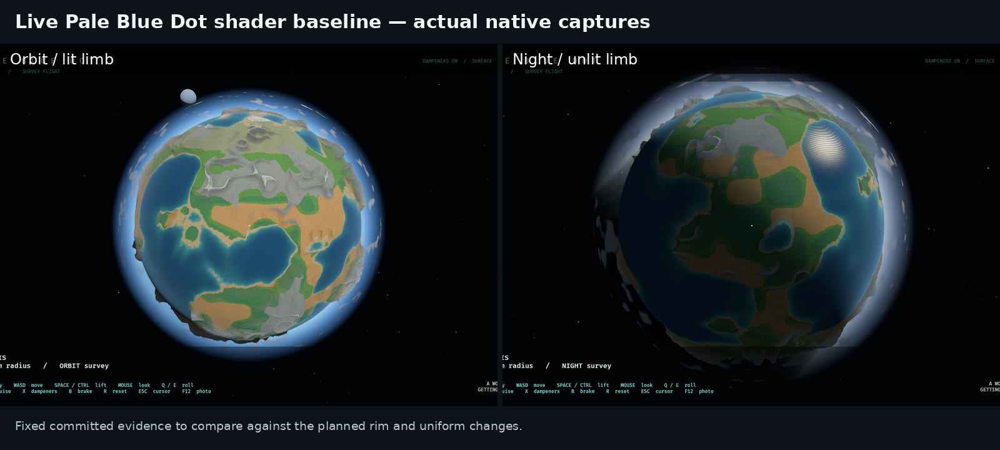

## Measured dimensional comparison

The complaint that started this section was that the camera "feels really short
compared to the hexagons". It was correct, and the reason was not the camera:
the avatar was taken from Tenebris at 1:1 while the world around it was built
about six and a half times larger. **This is now closed**: see "After the
rescale and hexagon LOD" below for the numbers as they stand. The table and the
options that follow are kept as the measurement that decided it.

Every number below is read out of the two source trees. The tile widths are
measured rather than derived: `planet::tile_widths` walks the real
`dual_sphere(8)` and reports the centre-to-centre spacing of every neighbouring
pair, which is the flat-to-flat width of the shared tile. The startup log prints
it, and `measured_tile_width_follows_the_subdivision_law_and_pins_the_shipped_scale`
pins it, so this table cannot quietly drift from the code again.

| Quantity | Tenebris | Pale Blue Dot | Ratio |
| --- | ---: | ---: | ---: |
| Sea-level radius | 300 m | 4,000 m | 13.3x |
| Dual subdivision level | 7 | 8 | +1 |
| Surface cells | 163,842 | 655,362 | 4.0x |
| Tile width, mean | 2.83 m | **18.88 m** | 6.67x |
| Tile width, range | 2.59 - 3.10 m | 17.30 - 20.67 m | 6.67x |
| Vertical quantum | 1.00 m | **6.00 m** | 6.0x |
| Eye height | 1.60 m | 1.60 m | 1.0x |
| Walk / sprint | 8 / 14 m/s | 8 / 14 m/s | 1.0x |
| Jump velocity | 12 m/s | 12 m/s | 1.0x |
| Surface gravity at 1 g | **25.00 m/s^2** | 9.00 m/s^2 | 0.36x |
| Atlas tile across a cap | 2.83 m (one tile per face) | 28 m | 9.9x |
| Atlas tile down a wall | 1.00 m (one tile per face) | 18 m | 18x |
| Texel at the surface | 8.8 cm | 87.5 cm | 9.9x |
| Tree height | about 6 m | 28 - 45 m | about 5.5x |

Sources: `planet.rs::BODIES_INIT` and `subdivisions_for_radius` (which caps at 7
and is what the runtime actually calls, not the level in the body table),
`world.rs::BLOCK_HEIGHT`, `player_ctrl.rs::EYE_HEIGHT`/`WALK_SPEED`/`SPRINT_SPEED`,
`config.rs::jump_velocity_mps` on the Tenebris side; `planet.rs::SUBDIVISIONS`,
`planet_terrain.rs::PLANET_RADIUS`/`ELEVATION_STEP`, `walking.rs::EYE_HEIGHT` and
`WalkConfig` on ours. The atlas figures are the `/28.0` cap divisor and the
`/18.` wall repeat in `planet_surface.wgsl` against Tenebris's one atlas tile per
block face; the texel is that over the 32-pixel tile grid both use.

### What the ratios mean in the frame

Expressing the two world scales in units of the player makes the complaint
arithmetic rather than taste:

| Read in eye heights (1.6 m) | Tenebris | Pale Blue Dot |
| --- | ---: | ---: |
| Width of one hexagon | 1.8 | **11.8** |
| Height of one terrain step | 0.63 | **3.75** |
| Height of one tree | 3.8 | 21 |
| Size of one art pixel | 0.055 | 0.55 |

A hexagon is under two people wide in Tenebris and nearly twelve people wide
here. A terrain step is something you walk up there and a wall well over twice
your height here. That is the whole of the effect: the eye is at a human
1.60 m in both, so the only thing that changed is everything else.

It also changes what the same jump input does, and gravity is the second half
of that. Both worlds fire the player off at 12 m/s, but Tenebris's surface
gravity is **25 m/s^2**, not Earth's: `SURFACE_GRAVITY_MPS2_PER_G` is 25.0,
arcade-scaled on purpose to its ~300 m planets, and the comment there says so.
Ours is 9.0. So the apex is 2.88 m there and 8.00 m here.

Against a 1 m block that clears **2.9 steps**; against a 6 m quantum it clears
**1.3**. Terrain Tenebris lets you hop over is a cliff here. And the fall is
where it is felt most: dropping one step height takes **0.28 s** there and
**1.15 s** here, four times longer, so a walker who can only just clear one step
also floats down from it.

### Against this project's own target

The `voxel-engine-foundation` change's design already specifies the intended
surface: near-player
radial layers 1 m high and a lateral cell area of roughly 1 to 4 square metres,
which it works out as level 12 on a 4 km body, `4*pi*R^2/cells = 1.198 m^2`, or
about 1.18 m across. The prototype runs level 8. So it is **16x coarser
laterally and 6x coarser vertically than the design it is a preview of**, and
the gap is a known one rather than a regression. The doc says so in passing
already ("coarse surface columns, not the one-meter microvoxels specified
below"); what was missing is that a reader could not tell how coarse without
measuring it.

Level 12 is not reachable the way the prototype is built. It is 167,772,162
cells, and at this pipeline's 128-byte topology record that is **21.5 GB** for
one globe, before heights, meshes or collision. The architecture doc's own rule
covers it: the engine must never allocate the whole detailed globe.

### What can actually be done about it

Three options, cheapest first. None of them is a camera change: the eye is
already at a human height, and raising it only turns the walker into a giant
without making a tile smaller.

1. **Shrink the preview body.** Tile width is `1.209 * R / 2^L`, so at level 8
   a radius of **600 m** lands Tenebris's 2.83 m tiles and **250 m** lands the
   architecture doc's 1.18 m. This is one constant, keeps the globe closed and
   eagerly built, and costs nothing per frame. What it costs is the 8 km world:
   flight altitudes, the atmosphere shell at 4,800 m, the cloud layer at
   4,600 m, the 2,300 m foliage range, the 3,200 m draw-budget switch and the
   terrain amplitude all scale with the radius and would have to move together.
2. **Scale the avatar to the world.** For the same tiles-per-second and
   steps-per-jump as Tenebris the walker wants an eye around 10.7 m, walk and
   sprint around 53 and 93 m/s, and a jump velocity near 28 m/s. Cheap and
   self-consistent, and it abandons the premise of a person standing on a
   planet.
3. **Keep level 8 as the far tier and stream a finer near-player grid.** This
   is what the `voxel-engine-foundation` change already plans in its
   chunk/radial-slab section, and it is the only option that gets metre-scale ground on an 8 km
   world. It is also the whole remaining engine.

Option 3 is what was built, with the radius moved to 4,800 m so that the
finest level lands the standard exactly. The section below records the result.

### After the rescale and hexagon LOD

Measured on the shipped build (`planet::tile_widths` and `lod::tile_width_m`,
printed at startup and pinned by tests):

| Quantity | Tenebris | Pale Blue Dot now | Ratio |
| --- | ---: | ---: | ---: |
| Sea-level radius | 300 m | 4,800 m | 16x |
| Level underfoot | 7 | 11 | +4 |
| Tile width underfoot, mean | 2.833 m | **2.833 m** | 1.0x |
| Base level (whole globe) | 7, 163,842 cells | 7, 163,842 cells | 1.0x |
| Fine levels resident | none (whole body at 7) | 8 to 11 in bands of 2,400 / 1,200 / 600 / 300 m | our design |
| Resident records | 163,842 | 163,842 base + ~160,000 fine, 59 MiB at 192 B | |
| Vertical quantum | 1.00 m | **1.00 m** | 1.0x |
| Summit / ocean floor | +40 m / -24 m | +153 m / -87 m | see below |
| Walker step | one block | 1.05 m (one cell plus skin) | 1.0x |
| Tree scatter | per biome out of 256 (jungle 115, swamp 34, fields 13, tundra 2) | **the same table, on the biome in the record** | same rule |
| Tree geometry | hex prisms, wood 0.20 and leaves 0.65-1.00 of the tile | **the same** | same rule |
| Tree height | 5-6 m on fields, 9-10 m for a pine | **the same** | 1.0x |
| Atlas tile across a cap | one tile per face | 1.5 tiles per face | |
| Atlas tile down a wall | one tile per metre | one tile per metre | 1.0x |

The relief is the one number that is deliberately not Tenebris's: the owner
chose ~100-150 m summits over Tenebris's 40 m, and the generator compresses its
raw ranges by 0.17 above the sea and 0.12 below it, keeping the coastline.

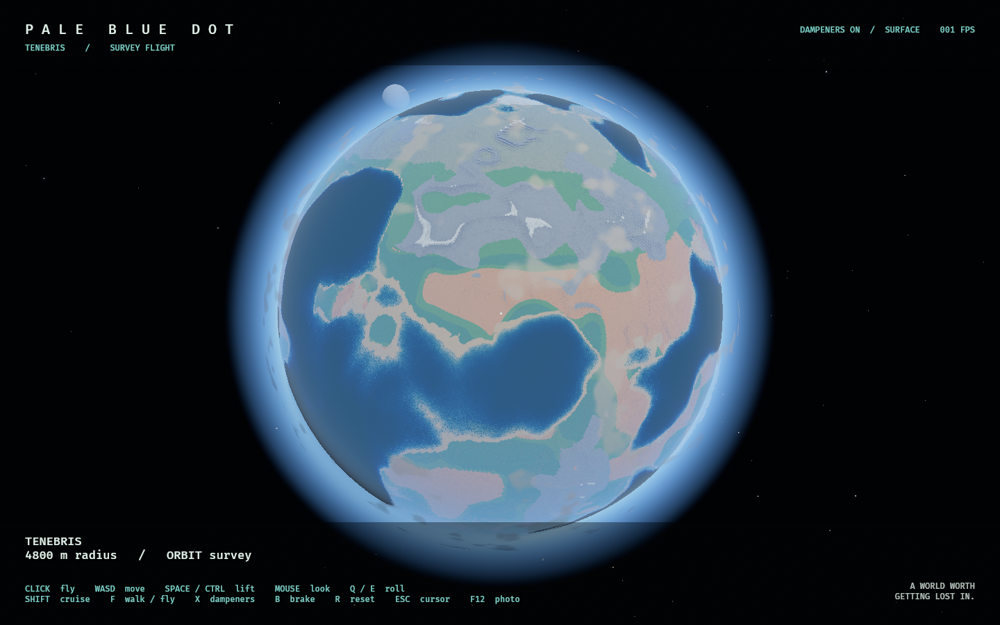

From orbit only the level-7 base draws: the whole globe is hexagons and twelve
pentagons at 45 m, the same closed dual the preview always had, with the sky
shell at the same 1.2 R ratio and the clouds down at 300 m.

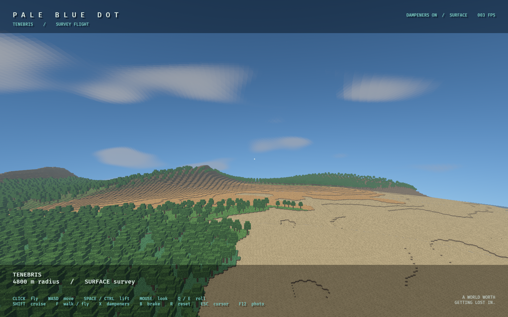

The surface view from 90 m at the spawn looks across all four bands: 2.833 m
tiles with one-metre terraces underfoot, the 45 m base tiles on the far ridge,
and the transitions between them along the way, with the forest scattered at
Tenebris's rates out to the level-9 band.

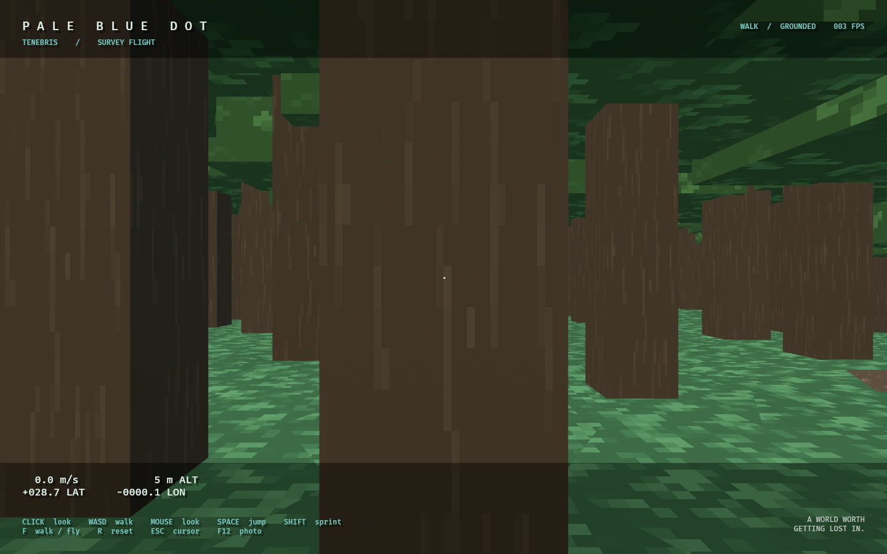

The walker at the spawn, in a forest scattered at Tenebris's rates: 2.833 m
tiles at its feet, a one-metre step at the right edge, trunks about a metre
across and crowns six metres up.

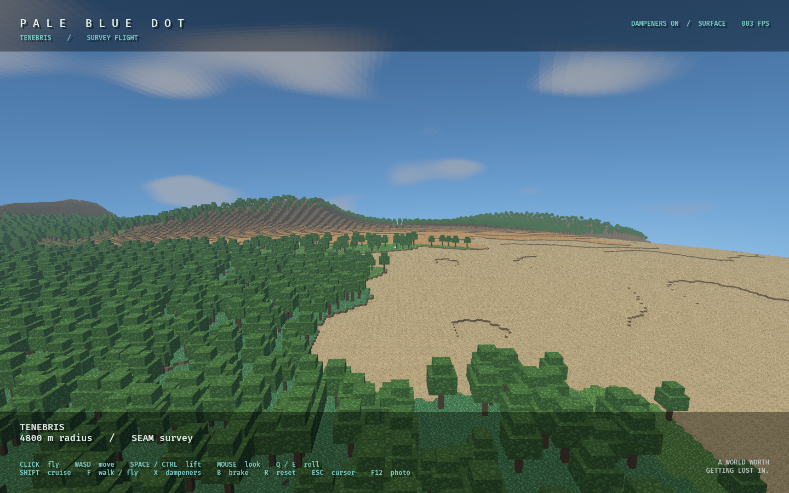

The `seam` capture preset is a 60 m eye at the spawn looking down at about
eleven degrees across the 300 m boundary between level 11 and level 10, which
sits under the crosshair, with the 600 m and 1,200 m boundaries beyond it.
This is the still frame the hexagon-lod change asked for before the tiers were
built, taken as the first frame of the built partition instead, on the owner's
instruction to build. What it shows: the sand's one-metre contours run
through the boundary without a crack, a doubled cap or a line, and the forest
cover is continuous out to the level-9 band. What it cannot show is motion,
which is where a boundary would sweep: that needs the owner's eye in the
running game, walking the band edge, and is the remaining seam requirement in
the `hexagon-lod` change.

Three findings from these captures, each fixed in the same commit:

1. **The seam camera's first frame was a wall of blue.** A 12 m eye at the
   spawn sat among the spawn's own terraces and read as 45 m tiles at arm's
   length. A per-level tint of the surface shader (not committed) showed every
   tile in it was level 11, and a GPU test on the real records
   (`the_partition_lists_each_tile_at_its_bands_level_on_the_real_records`)
   confirmed the partition lists no tile outside its band from that eye, so
   the frame was a framing, and the preset moved up to 60 m.
2. **The forest ended in a straight line at 300 m.** Trees were eligible on
   the finest level only, so the band edge was drawn by what stood on it.
   Trees are eligible on levels 9 to 11 now at the same cover per area
   (`hexagon-lod/design.md`, "Trees on three levels").
3. **A dark line where the sea met the sky** (`shore` view), a few pixels
   tall with the sheet's cells stepping along it. Three wrong theories were
   tested and dropped in turn (a back-facing cap taking the underwater path,
   the seabed showing through, the horizon-strength knob dimming Fresnel;
   the first left a robustness change behind, the sheet deciding above or
   below by camera height rather than winding). The cause was geometric: the
   sheet sits `depth_offset_m` (0.5 m) below sea level, and the sky shader
   treated the full sea-level sphere as solid ground, so between the sheet's
   silhouette and that sphere's tangent the sky drew its ground colour.
   `sky::solid_radius` hands the sky the sheet's radius instead.

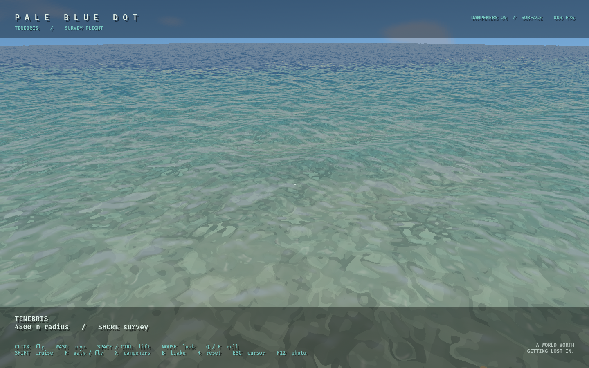

### Swimming, and the two things that were in the way

The owner: *"there's some weirdness with not being able to walk into water.
Need to make parity with tenebris-rs and allow swimming and diving."* The sea
was a wall, and the composite pass that fogs the view underwater, the Snell's
window and the emerge drips were all built and none of them could be reached by
playing.

Two blockers, not one. The obvious one was a clause in the swept ground
resolution that rejected a wet footprint exactly as it rejects a cliff. The
second was underneath it: `SurfaceContact::radius` is computed at
`PLANET_RADIUS + height.max(0)`, so over a water cap the contact plane sits at
**sea level** and a walker would have walked out onto the top of the sea. The
clamp is right for its other callers, assisted flight and rain, so the contact
answers both questions now: `radius` is the surface you fly over, and
`floor_radius` is the solid ground, the seabed under water.

The model is Tenebris's, at its own numbers: three probes up one column at the
feet, the body (+0.50 m) and the eyes (+1.60 m); speed x0.5, gravity x0.30 and
a 3.0 per second drag on the vertical while the body is under; a continuous
20 m/s^2 thrust while the swim control is HELD; a seabed jump weakened to 0.30;
and `grounded` forced false whenever the eyes are under, which is what makes a
swimmer always take gravity and never get a standing jump. Measured, the feel
is the reference's: **rise at about 4.2 m/s while the control is held, sink at
about 2.5 m/s when it is released** (the test measures -2.56 against a
predicted -2.5). There is no buoyancy and nowhere to hover, which is the
reference's design rather than an omission, and there is no breath or drowning
because it has none.

One number is not theirs. Their exit from deep water beside a bank is the
jetpack, unlocked the moment the eyes clear the surface, and this project has
no jetpack; so the thrust is gated on the body rather than the eyes while the
feet are off the bottom, which covers the last metre out.

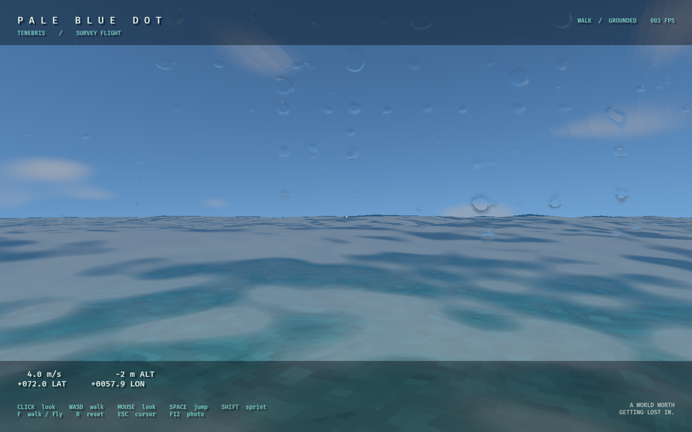

That frame is the walker holding forward off the beach: 4.0 m/s, which is
exactly the halved walk speed, at -2 m with the waterline across the eye. It
is the first time the straddle view has been reached by walking rather than by
a camera preset.

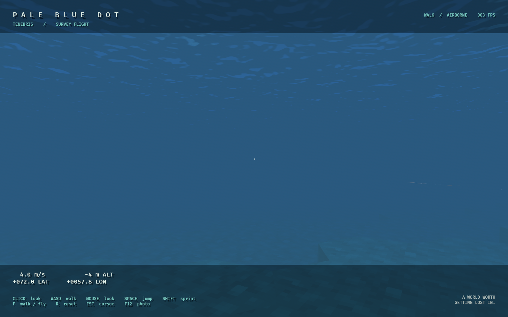

And this one is the same walk a few hundred frames later on the deepened sea:
**-4 m, AIRBORNE**, which is the HUD's word for not grounded and is what a
swimmer is by construction. The surface is overhead with its light on the
underside, the seabed is below, and the absorption takes the colour with
distance. The composite pass's underwater path had been built, tested and
photographed by a camera preset for a day before anything could reach it by
playing.

**And the scripted swim proved the sea had no depth to dive in.** Seven hundred
frames of holding forward left the walker still wading at two metres, because
the rescale had compressed the ocean relief to 0.12 against the land's 0.17 and
left a shelf one to two metres deep for hundreds of metres. That had been
written up as a look problem, the flat pale sea in daylight; it is the same
defect, and a walker who cannot submerge cannot dive, so it stopped being a
question of taste. `OCEAN_RELIEF` is 0.45 now. The land does not move: the
summits are what was asked to be climbable, and nobody walks on the sea floor.

| out from the waterline | was | now |
| ---: | ---: | ---: |
| 45 m | -1 m | **-3 m** |
| 91 m | -2 m | **-5 m** |
| 181 m | -2 m | **-8 m** |
| 725 m | -7 m | **-24 m** |

Wading becomes swimming about forty metres out, which is a beach. The relief
test was re-pinned and renamed with it: it asserts the sea within sight of a
standing player is deeper than their eye, which is the property that matters,
rather than a number somebody chose.

**And it needed a scripted capture, which found two more defects.** A walker
with no input never moves, so `--swim` places one at the shoreline and holds
forward. Scripted keys pressed in `Update` are wiped by the next frame's input
clear before `RunFixedMainLoop` reads them, so the walker stood still; and
pointer capture follows the window's focus, which a headless window never
reports, so the input path zeroed the movement axes every frame. Both are the
same shape as a test that sets the movement axes directly: it passes while the
real input path is broken. The tests drive keys now.

### Night, which is where the reflection really was the culprit

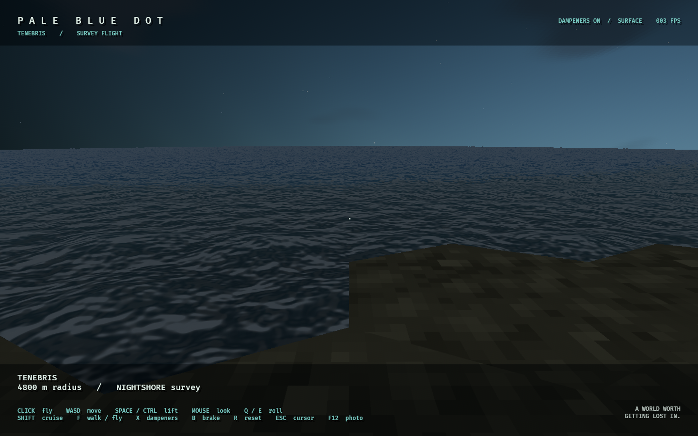

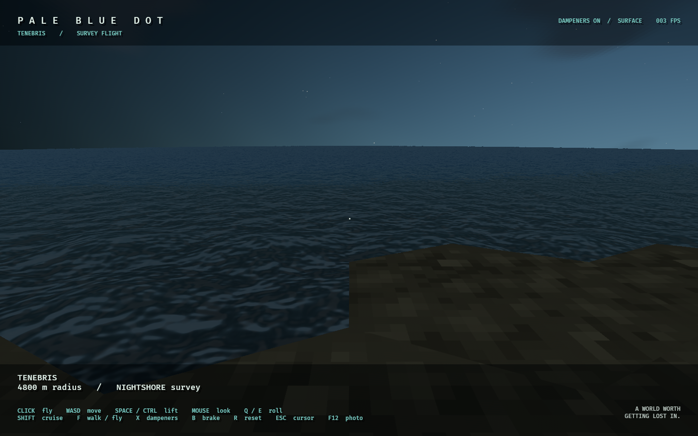

The owner's report was a sea glowing blue under a black starfield. The daytime
diagnosis above does not cover it: in daylight the shine knobs are worth about
2% of the frame, and at night the reflection is most of it. Two structural
faults, both fixed, both measured on the `nightshore` capture preset added for
this:

- **The reflected sky never went out.** It was an authored daytime gradient
  under a flat 0.18 night floor, so the sea mirrored the same blue at midnight
  as at noon. Against terrain at roughly 0.006 linear, the sea sat between 0.03
  and 0.07: five to twelve times brighter than the land beside it.
- **The night floor was applied twice to the reflection**, once as the ambient
  level the water body receives and once to the mirror itself, which then went
  black at the horizon, where a mirror should be closest to the sky it mirrors.

The reflection now ramps to a `night_sky_color` across the same terminator the
fog uses, and the ambient floor applies to the transmitted body and the foam
only. The sea at the horizon moved from 39.6, 52.2, 61.6 to 28.4, 46.2, 57.1,
under both the sky (46.4, 73.1, 90.7) and the land's red (30.9), and the
daytime frame is byte-identical.

**Two lessons, and the second one cost three captures.** The reflected sky
still does not vary with the direction the water looks at, while the sky this
engine draws does, so one authored colour is right toward the terminator and
too bright away from it, which is the direction the owner's screenshot was
taken in. And: the first two attempts at this fix renamed a variable and left
one use behind, so `water.wgsl` failed to compile and the cap did not draw at
all. The frames looked plausible, because what is left is the seabed with its
own submerged tint, and they measured darker, which is the direction the fix
was meant to move them. The pipeline error was on line 10 of every log.
**A shader that fails to compile here does not look broken, it looks like a
slightly different scene.**

### The colour of the sea, against a photograph

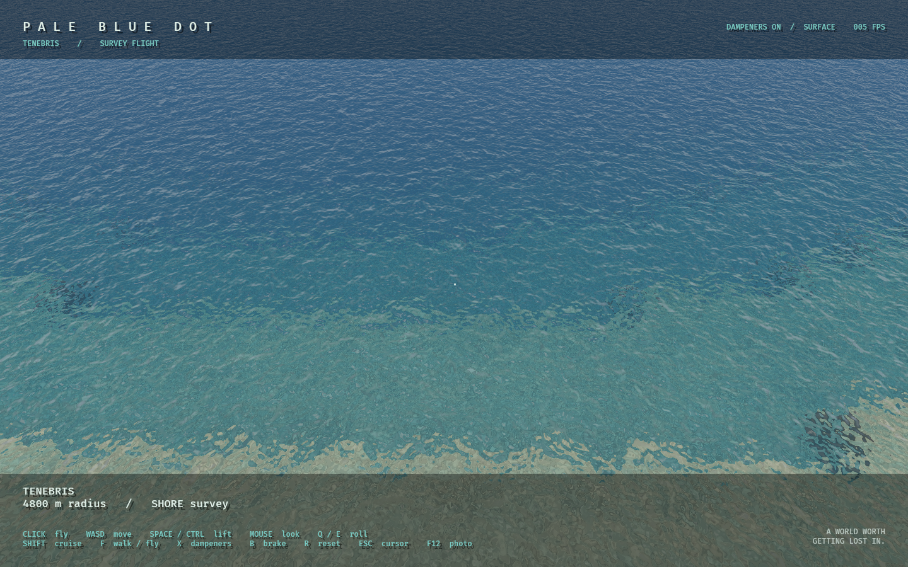

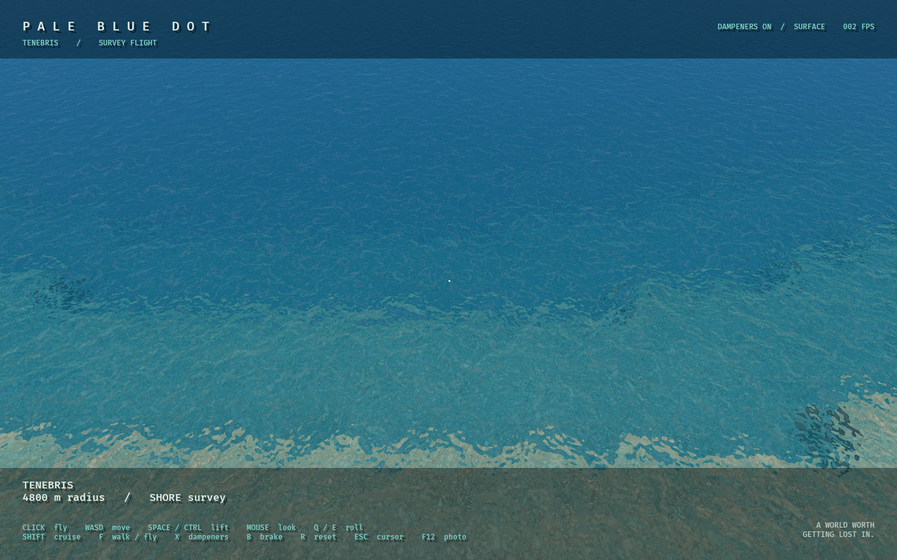

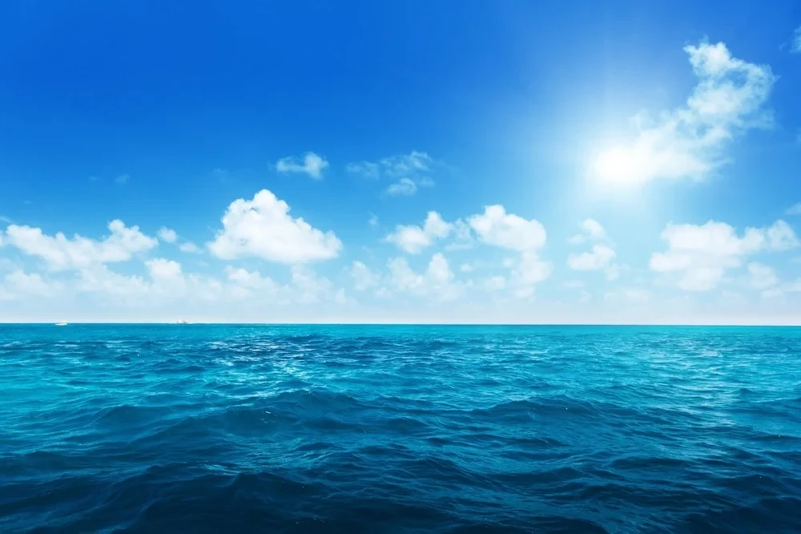

The owner's second report, with a photograph of open ocean beside their own
frame, was that the water was still too shiny and too light. Measured the same
way as everything above, the photograph is not dark: its red channel is under
ten over most of the sea and its blue runs to 209, so its saturation sits
between 87 and 166. The owner's frame was 84, 115, 138 at saturation 55, the
same lightness as the photo's middle band with four times the red. "Too light"
named a symptom, and the number is red.

Two rounds of one-knob-at-a-time ablation at the owner's own view are tabled
in `openspec/changes/water-look/design.md`. The short version: every shine and
sky knob together is worth 31 levels of red and reaches saturation 85 against
the photo's 134; darkening the body colour moves five levels and reads as grey;
what the sea needed was a body colour with **no red in it at all**, and the
shallows needed a harder red absorption, since the sand under a metre of water
is red and only the water in front of it can take that out.

| band (sRGB, saturation) | before | after | photo |
| --- | --- | --- | --- |
| `shore` from 12 m, far sea | 71, 106, 136 (65) | 33, 102, 142 (109) | 9, 100, 143 (134) |
| `shore` from 12 m, near shallows | 84, 131, 133 (49) | 53, 125, 137 (84) | |
| `wade`, the sheet at eye level | 99, 139, 177 (78) | 81, 135, 180 (99) | |
| `wade`, the shallows under the eye | 115, 147, 149 (34) | 73, 135, 142 (69) | |
| `dive`, four metres under | 42, 89, 128 (86) | 15, 96, 139 (124) | |
| `nightshore`, the sea | 27, 42, 50 (23) | 18, 49, 67 (50) | |

The sky bands in every pair are byte-identical, so the whole of the movement
is the water's. The remaining red at the far sea (33 against the photo's 9) is
the tone mapper's floor: `TonyMcMapface` desaturates everything it maps, and
the values that hit the photo's number unmapped land a shade greyer through it.
Tenebris applies no tone mapping, so its 0.02/0.10/0.22 body colour is 38, 89,
130 on its screen; ours is the same lightness with the red taken out.

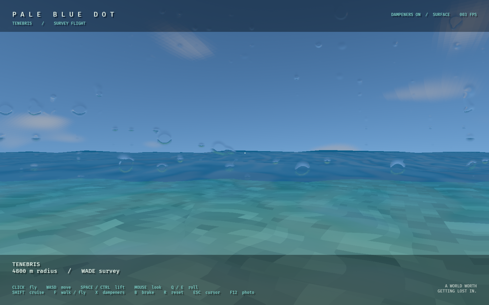

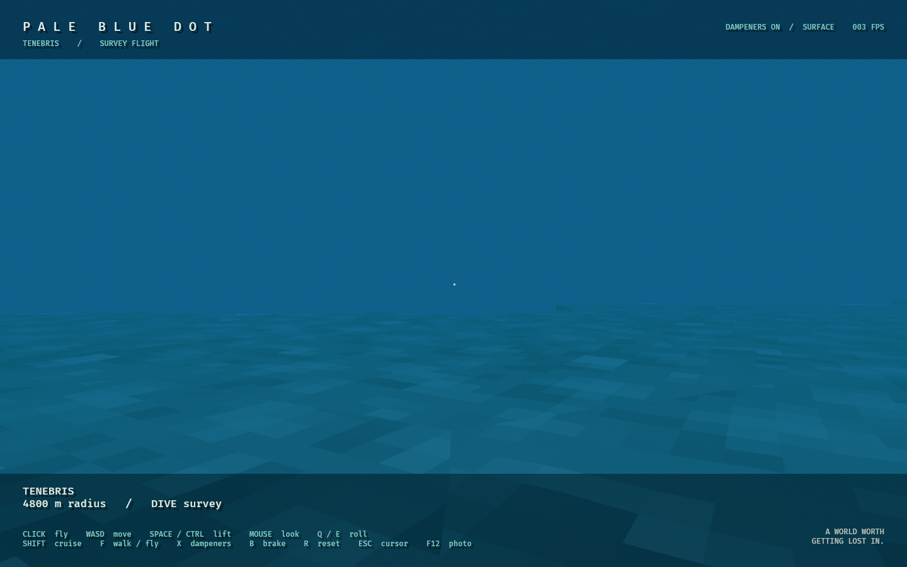

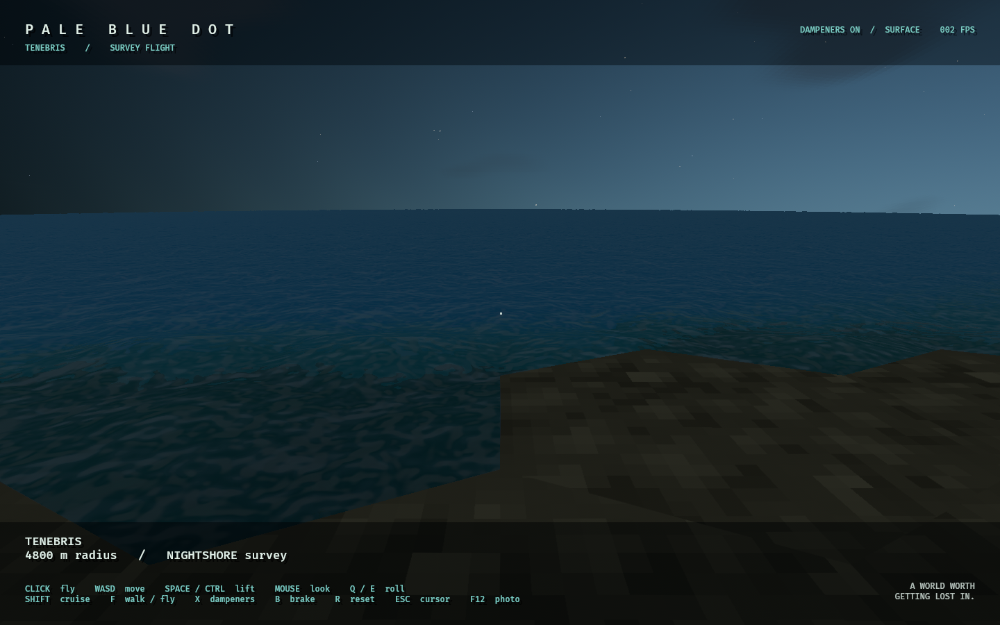

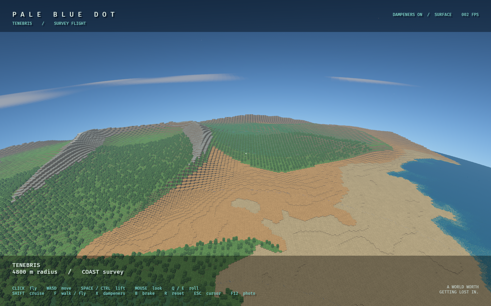

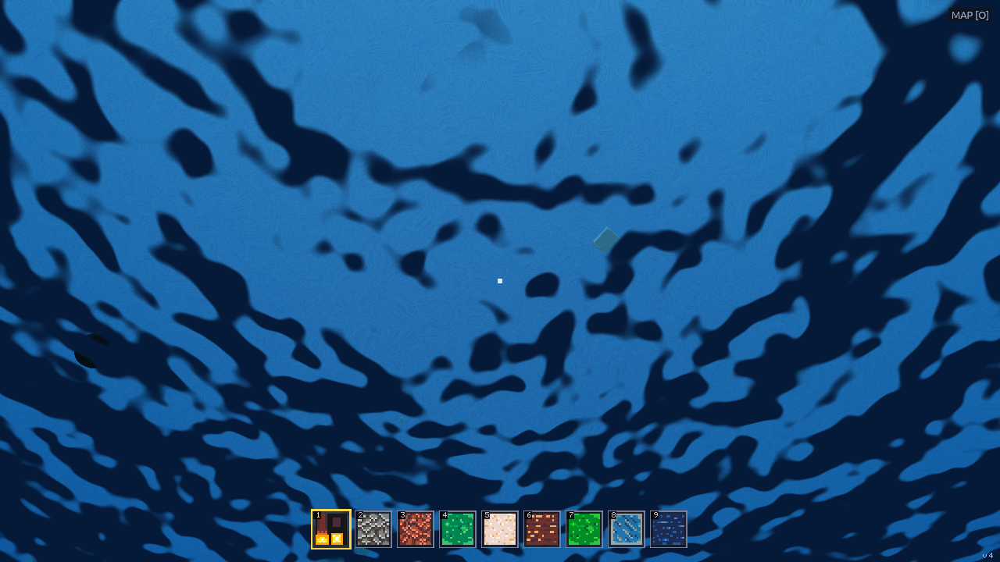

### The night side, and the deep, measured again

Two more reports on the frames above: the sea still reflects too much on the
night side, and the underwater should be a darker blue.

**The night reflection was one colour; the sky it mirrors is not.** Across
the `nightshore` sky alone the drawn night sky runs three to one, 20/36/45
away from the sun to 79/116/138 toward it, because this engine's night sky is
its upper atmosphere lit over the limb. The water mirrored `night_sky_color`
everywhere: brighter than the sky on one side and under it on the other, and
under a black sky a glowing sheet. The reflection now asks the sky's own
question (`sun_visibility`) of the point where the reflected ray leaves the
atmosphere, and is the night colour scaled by how much the ray faces the sun
when lit, nothing when not. Finding on the way: the sun sits 48 degrees
north, so the equator's antisolar longitude, where `nightshore` stands, is
132 degrees from the sun and its sky is lit; the antisolar POINT is at 48 S,
and a `midnight` preset stands there now, where the sky is black in every
direction, which is the frame the owner's night report was taken in.

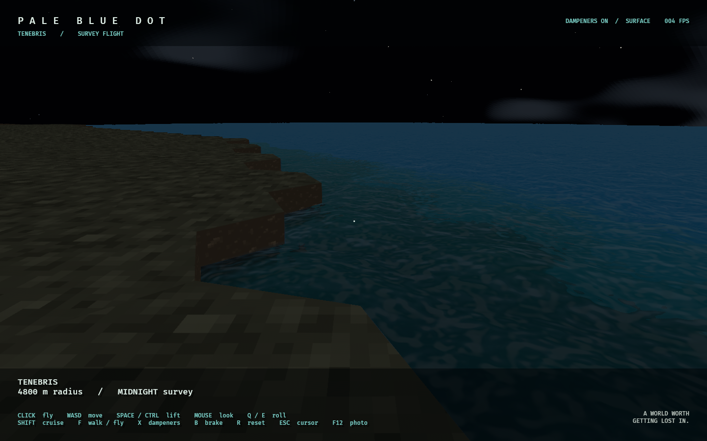

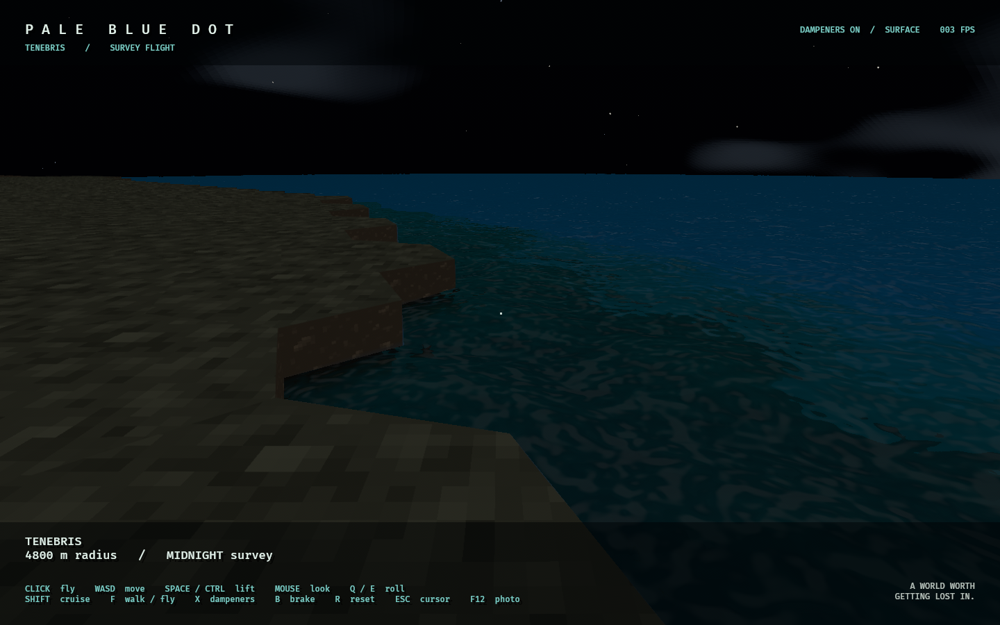

| `midnight` | sky | sea | land |
| --- | --- | --- | --- |
| before | 3.7, 4.5, 7.0 | 15.3, 40.5, 50.9 | 29.4, 30.4, 24.0 |
| after | 3.7, 4.5, 7.0 | **5.2, 32.7, 42.4** | 29.4, 30.4, 24.0 |

What is left of the sea at midnight is its own body under the ambient floor
(`night_floor` 0.18 of the deep colour), which is the same order as the land
beside it. At `nightshore`, where the sky is lit, the sea moved by four levels
on the side away from the sun and not at all toward it, which is the point:
it follows the sky now.

**The murk darkens with the eye's depth and with the night.** Seen from below
and in the composite it was the deep colour exactly, at half a metre and at
eight, at noon and at midnight, while the seabed under it was already darkened
by its water depth. It is `deep * exp(-absorption * eye_depth) * lit` now, one
function both paths call:

| dive | before | after | Tenebris |
| --- | --- | --- | --- |
| 4 m, upper half | 15, 96, 139 | **5, 61, 124** | 29, 93, 149 |
| 4 m, lower half | 15, 96, 129 | **8, 74, 123** | 14, 60, 107 |
| 8 m, upper half | | **1, 37, 108** | |

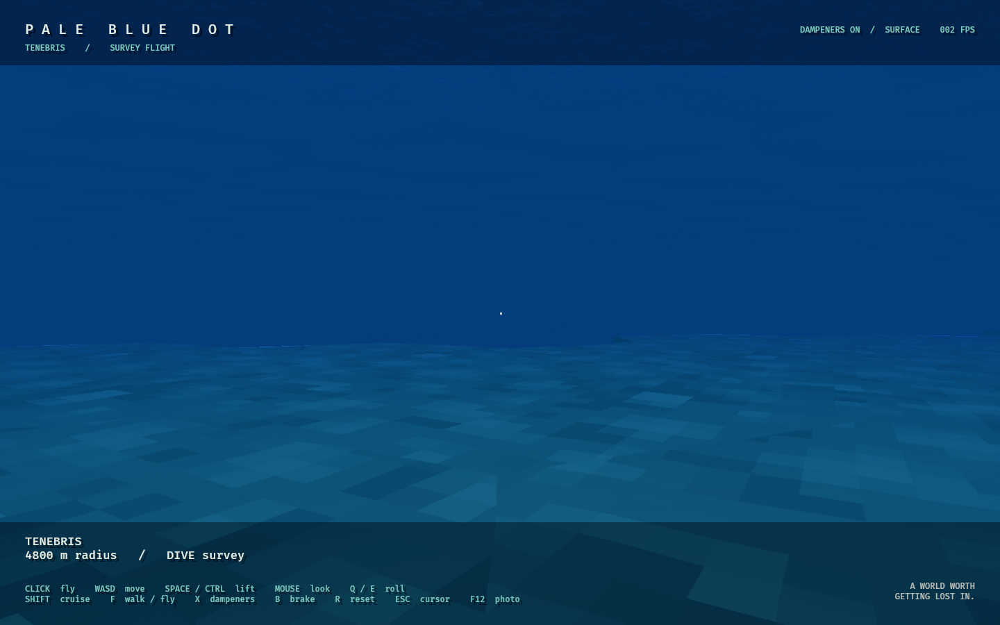

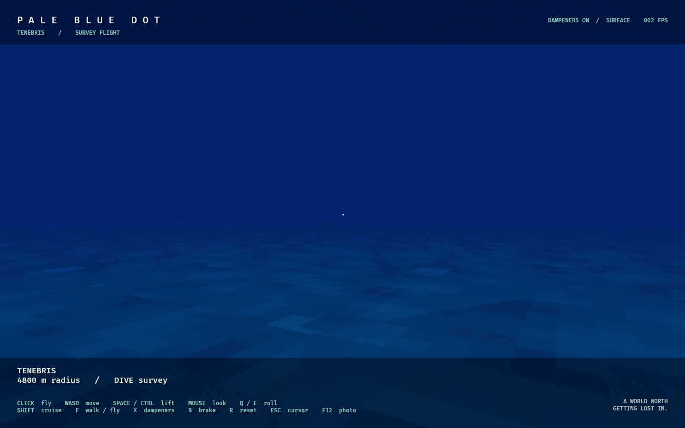

The surface is untouched by construction (the eye depth is zero from above):
the `wade` frame is byte-identical before and after.

**Underwater is the same knob, and it was measured against Tenebris itself.**
The composite saturates to `deep_color` over distance, so the dive frame went
from a grey-blue 42, 89, 128 to a saturated 15, 96, 139 by the same change.
The frame above is `tenebris-client` built from the reference checkout and run
headless on the same software rasteriser with `TENEBRIS_DEV_DIVE=4` and
`TENEBRIS_DEV_SHOT`, its eye four metres under the deepest tile of a fresh
world: it measures 28, 90, 145 (saturation 117) in the upper half and 14, 59,
106 (92) in the lower. Ours was the greyer of the two before this change (86
against 117) and is now the same saturation with the same blue; what Tenebris
has that ours does not is its surface seen from below, the caustic pattern
over the whole frame, which the `dive` preset here looks level and away from.
The look in the running game is still the owner's call.

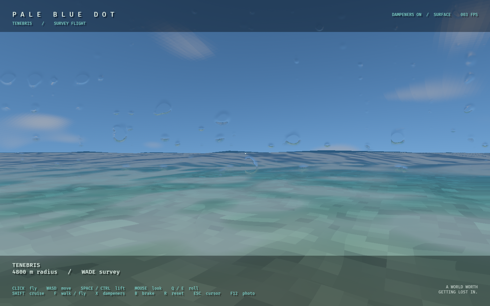

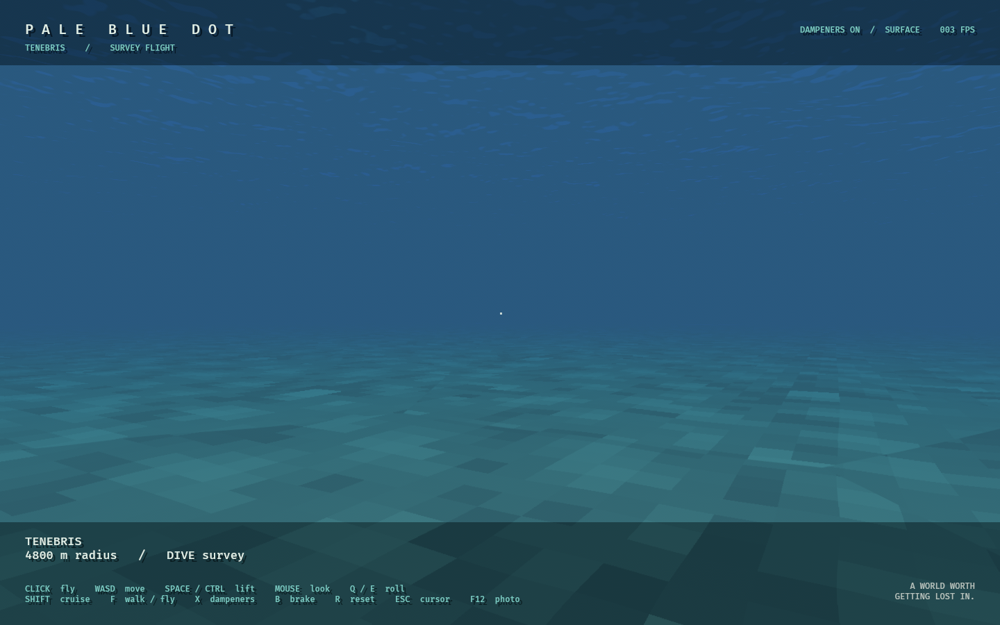

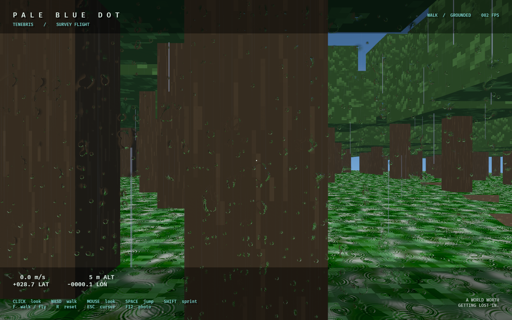

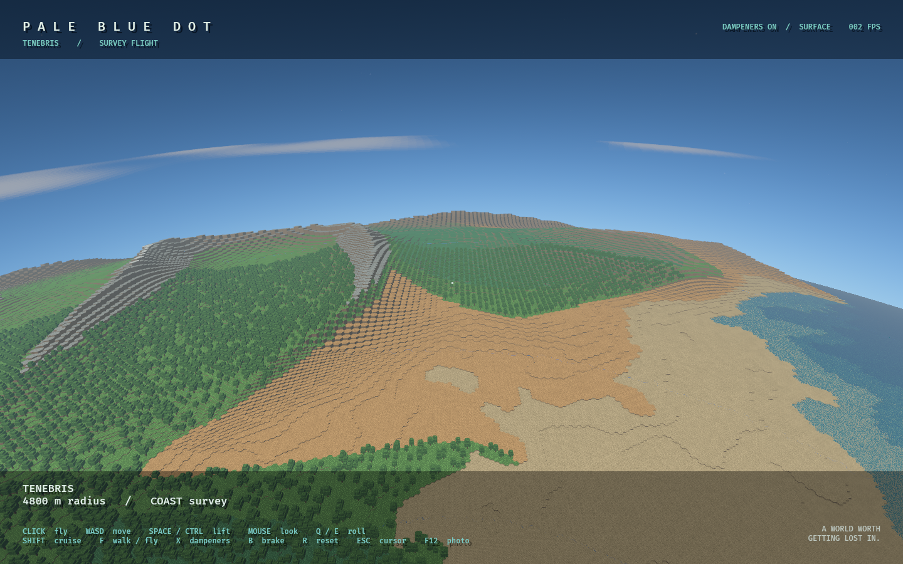

The water systems on the rescaled body: the sheet from the shore, from the
waterline, from under it, in rain, and from the air. A fourth finding came out
of retaking these. **The `dive` preset photographed the inside of a rock.** It
descended a fixed three metres below the first water cell, which was right on
the old body, where one elevation step was six metres and the first wet cell
was already six metres deep. On the rescaled body that cell is **one metre**
deep and the shelf stays under three for hundreds of metres, so the eye sat
two metres inside the seabed and the frame was flat deep-water colour with no
seabed, no surface and no Snell's window in it: a picture that looks like a
shader failure and is a camera standing in the wrong place. The preset walks
out until the floor clears the requested depth now, and `--height` sets that
depth. **A constant that encodes another constant's value breaks silently when
that one moves**, which is this rescale's own lesson from the other side: the
tile width, the foliage range and the walker's step were all derived or moved
in the same commit, and this one was a number nobody had connected to the
elevation step.

What this does not do: the surface is still one height per column, not a
volume, and a fine set is regenerated on the CPU as one 160,000-record job
when the player has walked 40 m (about 1.8 s in a debug build on this
container's four cores, off the main thread). Nothing per tile returns from the
GPU.

## The terrain generator, ported

The owner, off the coast frame: the terrain looks bad beside tenebris-rs.
The reference was photographed from its own built client, and then its
generator was ported term for term (`openspec/changes/tenebris-terrain`,
`pbd_core::planet_gen`), with the owner's two calls: summits near 150 m,
Tenebris's main body only.

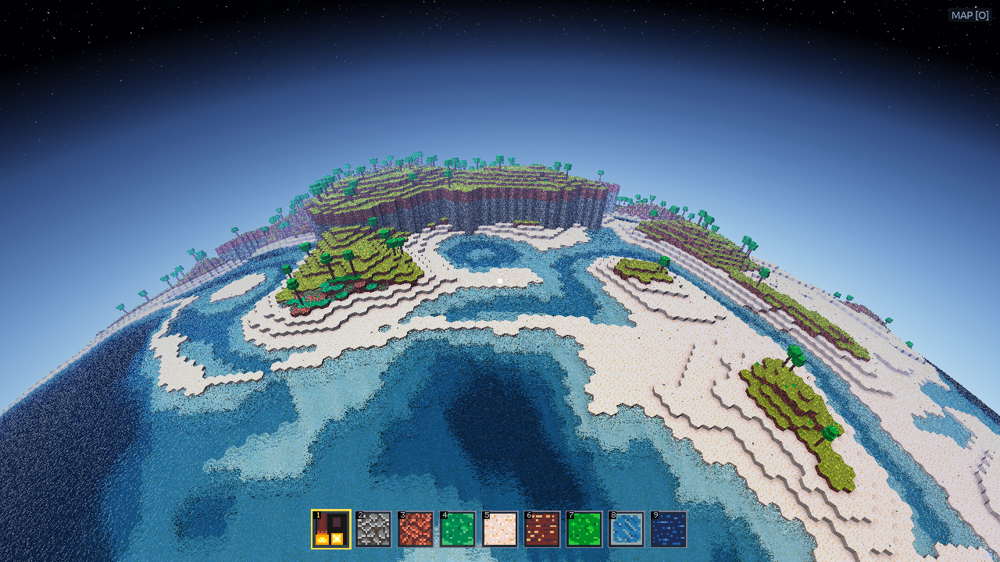

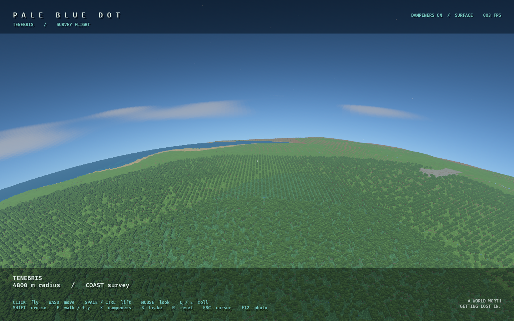

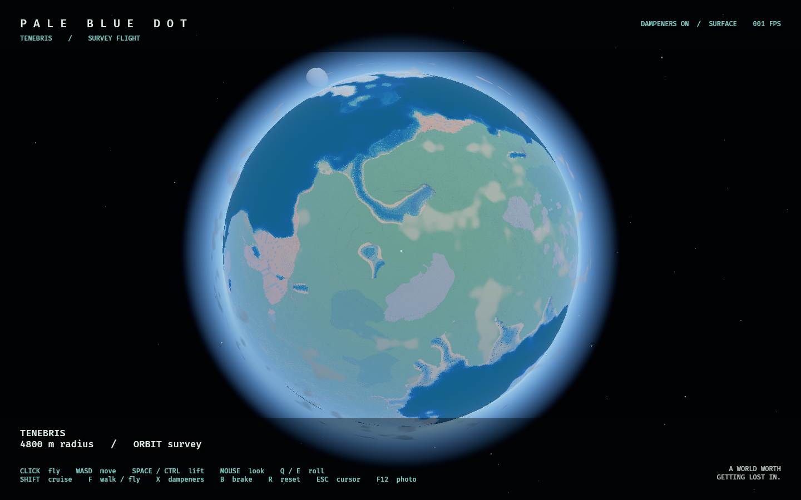

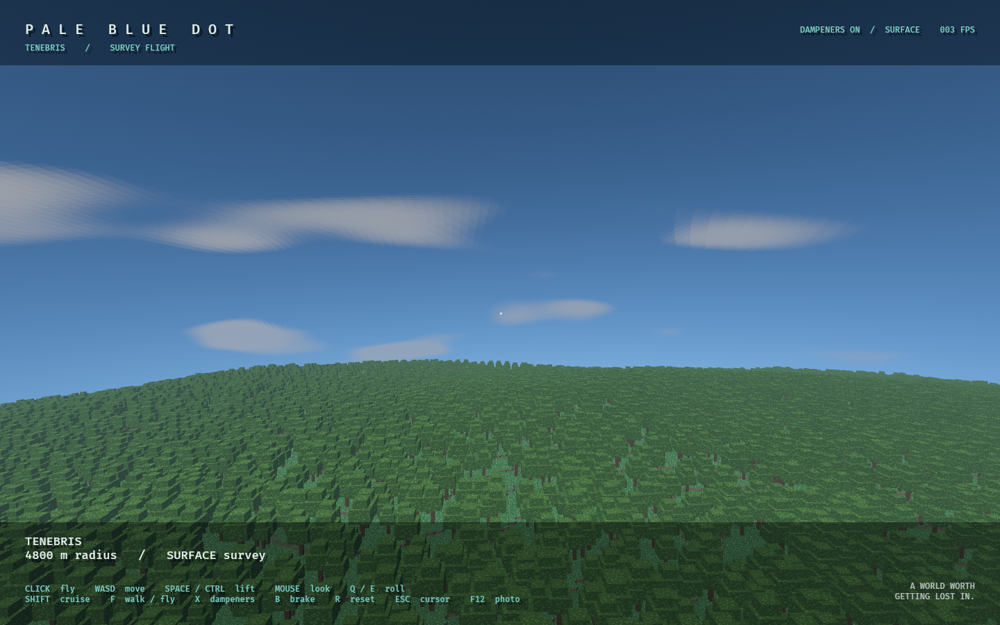

What changed is the shape, and it is the reference's rules rather than a
retune: a six-octave continent with `sign * |n|^0.8` for crisp coasts, ridged
mountains multiplied by the land so ranges stand inland, hills, detail, an
ocean floor on a power curve, then islands lifted out of shallow sea, rivers
pulled to a bed under it on lowland only, shorelines eased over six metres,
and rocky highlands lifting whole regions. The noise primitive is the
reference's gradient noise, pinned bit for bit at four seeds and points. The
biome is one classification (ocean, beach, tundra, mountains, desert, swamp,
jungle, fields) and the top block follows the reference's rule.

**What had to be re-authored, and how it was measured.** Every scale is a
frequency on the unit sphere and carries across unchanged: a continent that
is a quarter of a 300 m body is a quarter of this one. Heights are absolute
metres and do not, and a "max height" knob is not a summit: the fields sum to
well under one, so the reference's 40 m reaches 34 with its uplift. Measured
over 100,000 directions, 210 m per unit of land height gives a 153 m summit,
320 per unit of depth an 87 m floor, and land is 49.5% of the sphere against
the reference's seeded 47.1%. The elevation bands sit at the reached summit's
proportions (Mountains above 105 m, snow above 100 on temperate hills, stone
above 140, a snowcap at 150). The biome shares, against the reference's seeded
world in brackets: Ocean 49.5 (45.4), Beach 4.8 (15.7), Fields 36.0 (27.8),
Desert 3.0 (1.7), Jungle 2.9 (1.0), Swamp 0.1 (0.1), Mountains 0.5 (0.9),
Tundra 3.1 (7.3) percent. The distribution report is an ignored test in the
core, which is the instrument behind every one of those numbers.

**What it costs.** Nothing measurable at generation: the full base plus the
fine set is 2.22 s against 2.11 s before, in a debug build on this
container's four cores.

**What is still not the reference's.** The trees: a Tenebris tree is a column
of hex prisms five metres tall and ours is three boxes eleven metres tall
(`tenebris-tree-geometry`, still a proposal), which is why the forested frames
read as a canopy rather than a wood. The cliff strata in the reference's frame
are its column mesher drawing stone under grass on a steep face; ours draws
one cap material per column. And the shallows: the eased shoreline is a wide
shelf a few metres deep, so the near water at the shore preset is sand seen
through water again (95, 131, 126 at the near band against 53, 125, 137
before), which is the reference's own coast and the honest colour of a metre
of water over sand.

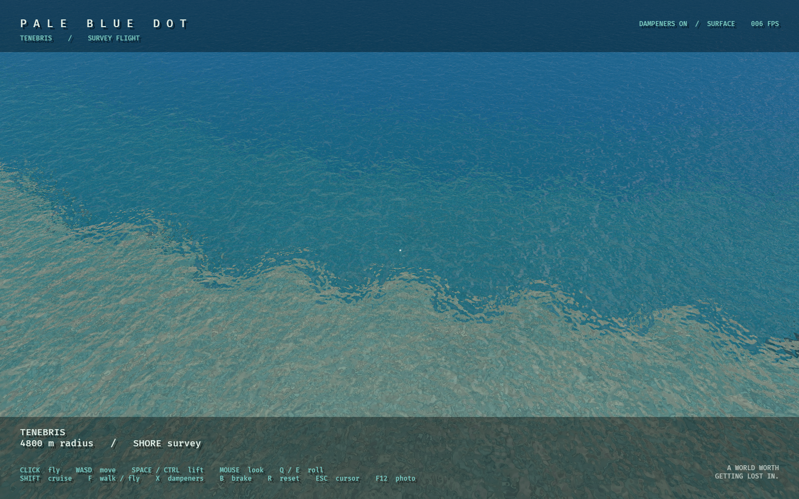

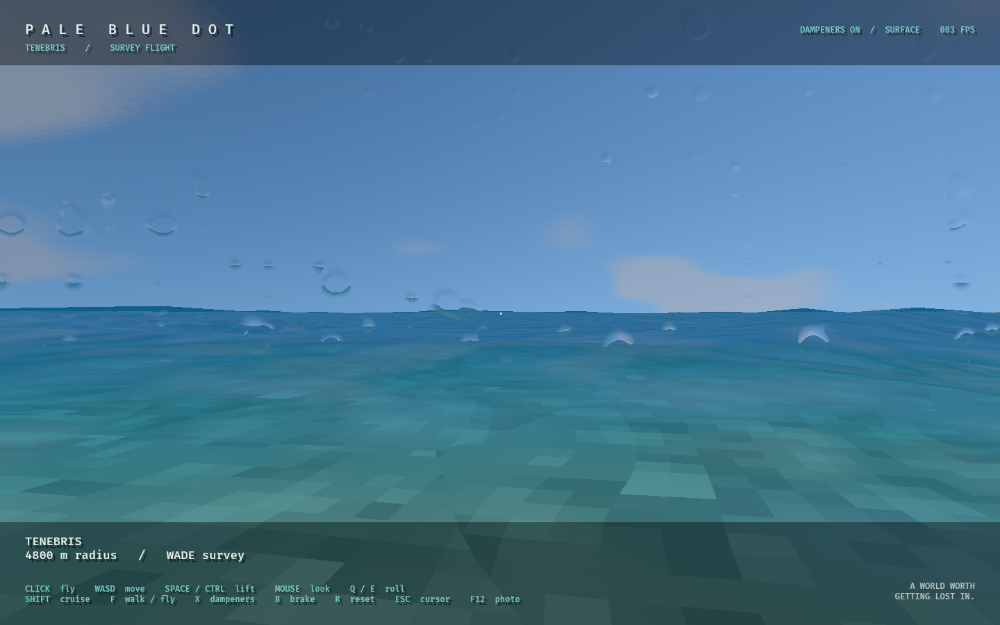

## The world is not smooth any more: planet-scale and land-scale

The owner, after the generator port: *pbd still looks way smoother across
terrain surface, I wish for it to have more noise and height variation, rivers
and every biome in tenebris-rs.* Three complaints, one cause, and it was
arithmetic rather than taste.

Every noise field is sampled on the unit sphere, so a feature's size is an
ANGLE. The body is 4,800 m against the reference's 300, exactly sixteen times,
and the cell stayed 2.833 m. So every feature the generator made was sixteen
times wider in the cells a player walks over. Measured on both generators the
same way, over 40,000 directions of land and their neighbours one cell away:

| | Tenebris | ours, before | ours, now |
| --- | ---: | ---: | ---: |
| adjacent land cells differing by a block or more | 44.0% | **14.2%** | **37.0%** |
| mean step between adjacent cells | 0.56 m | **0.17 m** | **0.59 m** |
| finest continent feature | 11.7 m | 188 m | 188 m |
| finest mountain feature | 11.3 m | 180 m | **64 m** |
| finest hill feature | 15.0 m | 240 m | **15 m** |
| finest detail feature | 12.5 m | 200 m | **12 m** |
| finest river feature | 28.8 m | 462 m | **29 m** |
| finest moisture feature | 23.4 m | 375 m | **24 m** |

Sixteen on every line before, because sixteen is the radius ratio. That one row
was all three complaints: nothing under 180 m meant nothing to walk over, a
river channel is a fraction of its field's finest wavelength so ours was a
462 m estuary, and a biome was a region kilometres across.

**The fix is a distinction the port never made.** Each field is now declared as
one of two kinds, and `TerrainConfig::scale_of` is the whole of it:

- **Planet-scale** carries a unit-sphere frequency. A world has a handful of
  continents whatever its radius, so the continent field and the rocky-region
  field keep the reference's scales and the map keeps the shape it had.
- **Land-scale** carries a size in METRES, and its frequency is derived from
  the body's radius. The same config on a bigger body therefore makes MORE
  hills rather than bigger ones. Hills (60 m), detail (25 m), rivers (231 m)
  and moisture (188 m) are the reference's own metres.

The two land-scale amplitudes moved to metres for the same reason: 6 m of hill
and 2 m of detail, rather than a share of the relief budget. That is what lets
the ground underfoot be as rough as the reference's while the summit stays at
the 150 m the owner fixed - raising one no longer roughens the other.

**Two numbers are deliberately not the reference's, and both are judgement.**
The mountain field is matched by SLOPE rather than wavelength: fully metric it
would put 180 m of ridge across a 120 m gap, which is a wall, so it runs at
686 m for the reference's 0.27. And the moisture field was the one open
question, rendered as three candidates and put to the owner, who chose the
finest: the reference's own 188 m, so a walk crosses biomes rather than staying
inside one.

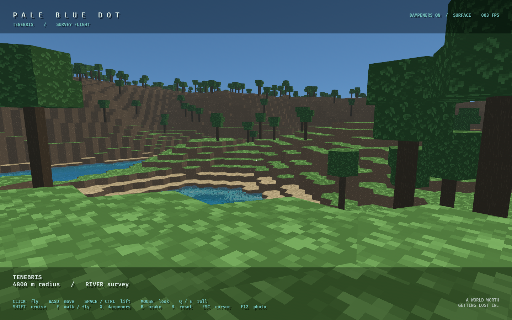

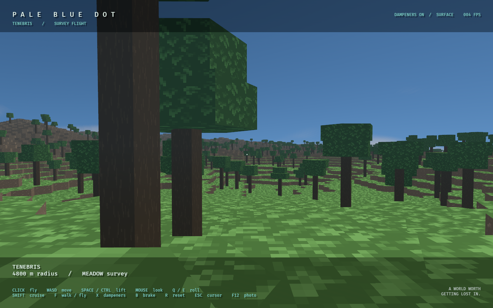

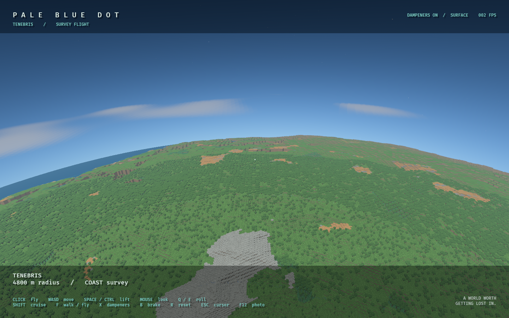

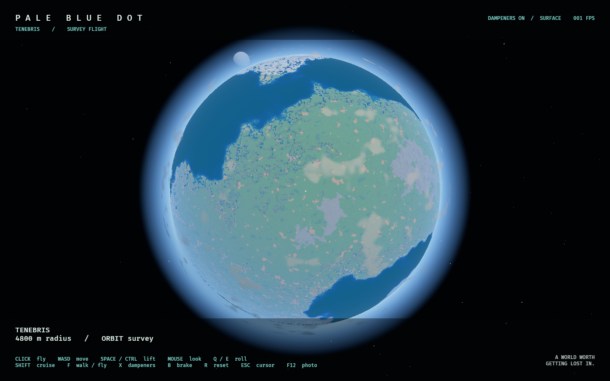

The river frame is the one that could not be taken at all before: `--view
river` searches the sphere for a cell where the generator's OWN carve fires
(`planet_gen::river_channel`, public now precisely so that finding a
watercourse does not mean guessing from heights) with banks standing clear on
both axes. The rivers were always generated; they were four hundred metres wide.

**Two tests changed their assumptions rather than their subject, and both are
worth recording.** The shore profile measured the sea's depth at exactly 100 m
out from the waterline; a coastline with real structure has inlets and islands,
so a single probe can land back on dry ground. It takes the deepest water
within 400 m now, which is what the swim actually needs. And the one-metre-fall
test allowed one tick of error: a six-metre fall at 25 m/s² arrives at 17 m/s,
which is 0.29 m of travel per tick, so contact is caught one tick and resolved
the next. Two ticks is the granularity, not slack - and the landing height,
which is exact to a millimetre in all four cases, is what proves nothing
drifted.

## The trees are Tenebris's trees now

The owner, in four words: *tenebris-rs has hexagon trees*. Ours were three
axis-aligned boxes about eleven metres tall with a six-metre crown, authored
against the old nineteen-metre tile and carried through the rescale by one
multiplier. Tenebris's tree is not a mesh at all, which is the point of the
port: it is **wood and leaf voxels in one column, drawn as ordinary hex prisms
shrunk toward the tile centre**. `block_hex_width` returns 0.20 for wood and
`0.65 + 0.35 * hash(tile, depth)` for a leaf, and `shrink_corner` lerps each
corner toward the centre by that much.

The record already carried what a prism needs - the cell's direction and its
six corner rays - so a tree part is the terrain wall's own construction at a
shrunk corner set.

| | before | after | the reference |
| --- | --- | --- | --- |
| trunk across (flat to flat) | 1.0 m box | **0.57 m** | 0.57 m at 0.20 of the tile |
| crown across | 6.0 m box | **1.84 - 2.83 m**, a roll per layer | the same hash |
| pasture tree | 11 m | **5 - 6 m** | 5 - 6 m |
| jungle tree | 11 m | **7 - 8 m** | 7 - 8 m |
| swamp grove | 11 m | **8 - 9 m** | 8 - 9 m |
| tundra pine | none | **9 - 10 m**, a 1 m bole under a cone | the same |
| vertices per tree | 108 | **198** | n/a, it is voxels there |

**The density is per BIOME now, which needed the biome in the record.** The
rule was keyed on the top material at rates that had drifted from the ones
they were taken from (the forest at the swamp's 34, the scrub at the tundra's
2). The reference keys eligibility on the top BLOCK - any grass, or the one
tree that grows on a non-grass top, the tundra pine standing in snow - and
density on the BIOME: jungle 115 of 256, swamp 34, fields 13, tundra 2, desert
and mountain rock none. The biome rides in the record's surface word beside the
material, which is one fact each in one place, and the GPU regression now pins
that rule structurally: four seeds whose rolls are 0, 28, 60 and 226 straddle
the four rates, so each fixture pair proves one thing - that a biome uses its
own rate, that the pine is the exception on snow, that snow on a PEAK is not a
pine, and that a grass rate over rock grows nothing.

**Every ground preset was photographing the rarest thing in the world.** The
spawn sits at 87 m in jungle, so `surface`, `seam`, `coast` and the walk all
looked at a closed canopy at the jungle's 45%, which is 2.9% of the sphere.
Pasture is 36% of it and nothing could photograph it. `--view meadow` walks
east along the spawn's latitude to the first pasture cell above 8 m and stands
there at eye height.

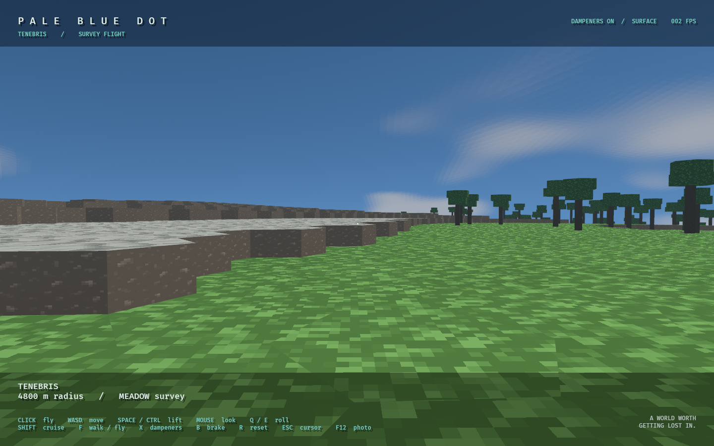

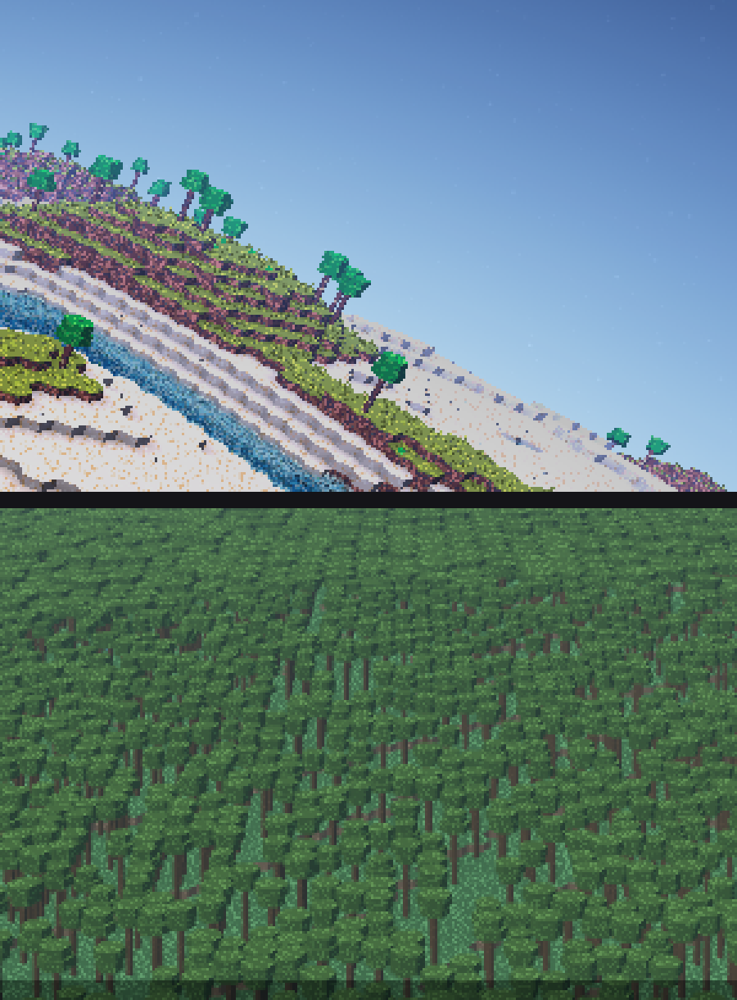

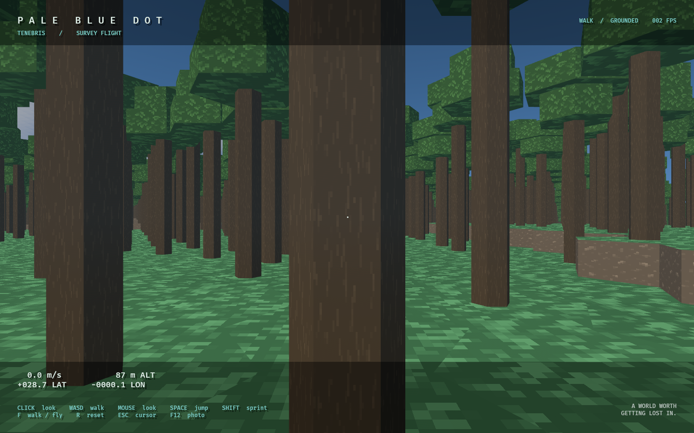

The middle picture is the check that matters: the same tile size, the same
camera height, the same crop, so a tree that reads bigger IS bigger. They are
the same tree now. What still differs is the ground under it, which is the
terrain port's own open item.

**What is deliberately not ported.** The voxel column, because a tree here is
cosmetic geometry on a heightfield rather than something a player can chop;
vines, mushrooms and redwoods, which are Sequoia's roster; and collision, which
our trees have never been in and should stay out of. The pine's crown is eight
or nine one-metre layers in the reference and is the same span in the two the
vertex budget carries, so its taper is two segments rather than nine.

**One limit worth naming.** A cell above the finest level carries four times
the chance, so the cover per area holds at any distance - until the rate
saturates. Jungle's 115 times four is past 256, so a jungle reads as full cover
on the two coarser bands rather than 45%. It was already true of the old rate
at the coarsest band; it is true one band nearer now.

## Measured gravity comparison

Tenebris runs **two gravity fields for two modes**, anchored to one shared
surface constant. Pale Blue Dot runs one field. That is the substantive
difference, and the surface number differs too.

| | Tenebris | Pale Blue Dot |
| --- | --- | --- |
| Surface gravity at 1 g | **25.0 m/s^2** (`SURFACE_GRAVITY_MPS2_PER_G`) | 9.0 m/s^2 (`planet_at_origin`) |
| Fields | two: an anchor field and an orbital field | one |
| Anchor field | full pull to `1.4 R`, linear taper to zero at `1.8 R`, then nothing | n/a |
| Space transition | outside `1.8 R` the query returns no body, which IS `is_in_space` | none |
| Orbital field | sum of true inverse-square from EVERY body, plus a central star | single well |
| Multi-body | strongest pull wins, so a moon beats its parent when you hover over it | one well, no contest to resolve |
| Interior | clamped at `0.5 R` so a query at the centre cannot blow up | linear to zero at the centre, uniform density |
| Exterior falloff | inverse square, uncapped (orbital field) | inverse square, uncapped |

### The surface number, and why it is not Earth's

Tenebris's `SURFACE_GRAVITY_MPS2_PER_G` is **25.0**, not 9.81, and the comment
beside it says why: it is arcade-scaled to that project's ~300 m planets, and
the orbital field anchors to the same value so space and surface physics agree
at the surface. One shared constant, deliberately, rather than two.

Ours is 9.0 on a body thirteen times larger. Combined with the identical 12 m/s
jump both projects use, that is:

| | Tenebris | Pale Blue Dot |
| --- | ---: | ---: |
| Jump apex | 2.88 m | 8.00 m |
| ... in steps of that world's cell height | 2.9 | 1.3 |
| Fall time through one step height | 0.28 s | **1.15 s** |

So the walker here jumps nearly three times higher in metres while clearing
less than half as much terrain, and takes four times as long to come down. The
floatiness is a second defect independent of the tile size: fixing the hex scale
alone would leave it, because 9.0 m/s^2 on a 6 m step is slow whatever the tile
is doing.

### Two fields is the part worth copying

The split is not redundancy, it is two different jobs:

- **`gravity_at`** picks the single anchor body and returns a multiplier that is
  1 inside `1.4 R`, tapers linearly to 0 by `1.8 R`, and is absent beyond. It
  drives the surface basis, the atmosphere shell, the walker's down, and the
  flip into 6DOF flight. A hard edge is exactly what a *mode* boundary wants:
  there is a definite radius where you stop being on a planet.
- **`orbital_gravity_at`** sums true inverse-square pull from every body and the
  star, with no cutoff. It is what makes a prograde burn raise a real transfer
  arc and an unpowered coast fall toward the nearest mass.

A single uncapped inverse-square field, which is what we have, cannot express
the first job. There is no radius at which it says "you are in space now", so
the walker/flight handoff has to be decided somewhere else, by something that
can drift out of step with the field.

Tenebris's tie-break is worth keeping too, and its comment records the bug that
produced it: pick the strongest pull rather than the nearest centre, because
Crag's well overlaps Quartz's and the moon you are hovering over should win even
when the parent planet's centre is closer.

### What is NOT a difference

Both use inverse square outside the body and both guard the centre. The interior
models differ in shape (uniform-density linear here, a `0.5 R` clamp there) but
neither is reachable in normal play, and ours is the more principled of the two.

### Status

This is a measurement, not a decision. Whether Tenebris is the definitive spec
for gravity the way it now is for hex size is the owner's call; see the
`gravity-model` change for what adopting it would mean.

## Measured shader comparison

There are three shader families in play, not two, and knowing which is which is
most of the answer to "why does it not look like Tenebris".

| Job | Tenebris, GLSL 410 | Our standalone port, WGSL | Our live prototype, WGSL |
| --- | --- | --- | --- |
| Terrain | `hex.vs` + `hex.fs`, 76 + 351 lines | `hex_terrain.wgsl` 117, `hex_faces.wgsl` 71, `voxel_light.wgsl` 50 | `planet_surface.wgsl` 194 + `planet_visibility.wgsl` 55 |
| Water | `water.vs` + `water.fs`, 28 + 311, plus `composite.fs` 339, the rain block of `hex.fs`, `weather_fx.rs` and `world_water.rs` | `water.wgsl` 162, the cap pass only | a 16-line branch inside `planet_surface.wgsl` |
| Sky | `atmosphere.vs` + `atmosphere.fs`, 17 + 166 | `atmosphere.wgsl` 102 | `sky_atmosphere.wgsl` 147, a Bevy material |
| Bound to a pipeline | yes | **no** | yes |

`shader-port.md` already records that the standalone ports are unbound and that
the live modules are a simpler prototype rather than the port. What that table
does not say, and what matters when comparing pictures, is that **the faithful
Tenebris port and the shader that actually renders are different shaders**, and
the faithful one is the one that is not running. Everything below follows from
that single fact.

### Terrain, term by term

| Term | Tenebris `hex.fs` | Port `hex_terrain.wgsl` | Live `planet_surface.wgsl` |
| --- | --- | --- | --- |
| Terminator | `smoothstep(lo, hi, dot(radial, sun))`, uniform band | same, uniform band | same shape, band inline as `(-0.13, 0.20)` |
| Ambient | `ambient * max(0.05, mix(night, 1, bright) * sky)` | same, floor is `settings.y` | `(0.16,0.21,0.27) * mix(0.12,1,day) * sky`, **no floor** |
| Direct | `max(dot(n,sun),0) * bright * sky` | same, times `sun.w` | same, sun colour inline as `(1.12,1.03,0.87)` |
| Block / torch light | `torch.rgb * torch.w * v_torch_light` | `rgb * ambient.w`, 4 bits per channel | **absent** |
| Light is sampled | per **vertex**, interpolated | per **face**, flat | per **cell**, flat across a 19 m tile |
| Underwater absorption | `exp(-absorption * depth)`, then mix to water colour | identical | **absent**, surface tint only |
| Cutout foliage | 4x4 Bayer screen door | identical | **absent** |
| Limb rim | `fres^p * (0.25 + 0.75*day) * intensity * (1 - ff^2) * sky` | identical, every term a uniform | `pow(...,4) * day * (1 - air) * 0.55`, **night floor dropped**, every term a literal |
| Distance fog | its own composite pass | not ported | `(1 - exp(-d * 0.00036)) * air * day`, mixed at 0.55 |
| Rain wetness | ripples, rivulets, sheen, glint; about 150 lines driven by `weather.yaml` | not ported | absent |
| Mining cracks | `hex_fs_crack[10]` and a crack texture | not ported | absent |
| Per-planet palette | `lod.yaml`, one section per tileset | uniforms | one planet's palette inline |

Four of those differences are visible in a still frame:

1. **The night limb goes black.** Tenebris keeps a night-side rim floor, and it
   is a designer knob rather than an accident: `lod.yaml` carries
   `distant_rim_floor: 0.25`, which is the `0.25 + 0.75 * day` in `hex.fs`. The
   live rim here is multiplied by `daylight` outright, so the unlit edge falls
   to zero. `hex_terrain.wgsl` has the floor and is not the shader running.
2. **Light is flat across a whole tile.** Tenebris carries sky and torch light
   as vertex attributes and interpolates them, so a wall grades from its lit top
   to its shaded foot. Ours is `@interpolate(flat)` per column, so an 18.9 m
   hexagon is one brightness and every tile edge is a hard step. At Tenebris's
   2.8 m tiles a flat sample is nearly free; at ours it is the single biggest
   reason the ground reads as faceted plates instead of terrain, and it
   compounds the scale problem measured in the section above.
3. **There is no second planet.** Every colour, threshold and falloff in the
   live shader is a numeric literal, so a second tileset means editing WGSL.
   Tenebris answers this with a `lod.yaml` section per tileset (water colour and
   depth, sky-reflection tones, rim colour, fog colour and scale), and the
   standalone port already exposes all of them as uniforms. Our own
   `CLAUDE.md` asks for "tunable values in validated data with units, and one
   source for defaults"; the live shader is where that is not yet true.
4. **The ocean is two different shaders, and Tenebris's is five systems.**
   `water.wgsl` ports the cap pass: screen-space refraction with depth
   reconstruction, absorption over the reconstructed path length, Fresnel
   between horizon and zenith tones, foam, an underwater back-face path and
   distance fog, all as uniforms. The ocean that renders is a depth tint, a
   Fresnel to the fourth, two sines and a specular to the 160th. And the cap
   pass is one of five water systems in Tenebris; the water section below
   inventories all of them.

### Water: five systems in Tenebris, one branch here

**A correction first.** The first version of this section compared one file
against one file: Tenebris's `water.fs.glsl` against `water.wgsl`, and said the
port "matches on every still-ocean term". That was wrong in two ways. Tenebris's
water is not one shader, it is five systems that hand results to each other
across the frame, and the comparison had looked at one of them. And even inside
that one shader the port drops terms the first read marked identical. This
section is the full inventory, checked file by file.

| System | Where it lives in `tenebris-rs` | What it does | Pale Blue Dot |
| --- | --- | --- | --- |
| **Water cap pass** | `water.vs.glsl` + `water.fs.glsl` (28 + 311), `renderer.rs::body_draw_water` | Swell, fbm waves, rain ripples, flow advection, refraction, absorption, Fresnel, foam, specular, torch light, fog | `water.wgsl` ports most of it, **unbound**; the live branch has a depth tint and two sines |
| **Composite pass** | `composite.fs.glsl` (339), `composite.rs`, two modes (compose, lens) | Underwater fog with a dry / straddling / submerged tri-state, screen distortion, per-pixel waterline mask, atmospheric-fog gating, depth blur, rain-on-glass lens droplets, emerge-from-water drips | **nothing**; there is no post-process pass of any kind |
| **Terrain wetness** | the rain block of `hex.fs.glsl` (its `rain_ripple_grad` and rivulet kernels, and the `wet_amt` branch in `main`), `hex_fs_rain[4]`, `hex_fs_water[2]` | Submerged terrain absorbed per tileset; in rain, a rippled wet sheet, impact rings, rivulets down side faces and trunks, wet darkening, sky sheen, sun glint | **nothing** |
| **Precipitation** | `weather_fx.rs` (near shower + distant storm shafts), `core::weather` | World-space rain streaks and snow flakes from cloud deck to surface or water, per-column by biome, suppressed underwater and in caves | **nothing** |
| **Flow simulation** | `world_water.rs` (1,955 lines), `flow_direction`, the F5 arrow overlay | Per-voxel source / falling / level state, a bounded scheduler, flow direction per tile; saved and sent over the wire; feeds the cap pass's flow UVs | **nothing** |

A sixth, the mobile cap (`water_mobile.rs`, a normal-map variant reading
`water_normal.png`), is a simpler sibling of the first and is not counted
against this project.

What the live branch draws was captured at five camera heights above the polar
shore with `--view shore --height N` (the preset walks east from 72 N to the
first water cell, lifts the eye N metres above the last land cell and aims N
metres out to sea, so every frame looks down at about 45 degrees):

| Height | What the live water shows |
| ---: | --- |
| 1.6 m | A flat, opaque teal sheet to a hard horizon line. No surface relief, no reflection of the sky or the coast, no foam or wet band where sea meets land. The only texture is the "wave" term, and it resolves as 3 m **rectangles**, because the wave phase is sampled at `floor(position / 3) * 3`. |
| 10 m | The hexagon mosaic appears **in the water**: the depth tint is per cell, so shallows are a tiling of flat hexagons rather than a gradient. The 3 m rectangles are legible as rectangles. |
| 50 m | The mosaic dominates the frame; each cell is one flat tone, stepped at every edge, the same defect the terrain section records for skylight. |
| 200 m | Reads well at this range: a depth gradient from the sand into deep water, the coast, the snow cap. The cell mosaic is still visible but no longer the subject. |
| 1000 m | **The sky is black.** `ATMOSPHERE_RADIUS` is `PLANET_RADIUS + 800.0` (`sky.rs:22`), so at 1,000 m the camera is outside the sky shell and looks back at a lit limb under stars. The water is a uniform teal with one broad specular. |

The 1,000 m frame is a finding about the sky rather than the water. Tenebris's
main planet sets `radius_mult: 1.24` in `atmosphere.yaml`, which is 72 m of
atmosphere on a 300 m body; ours is 800 m on 4,000 m, or 1.20 R. Proportionally
the two agree within a fifth, and this is one more number that moves with the
rescale rather than a separate defect.

#### 1. The cap pass, term by term

| Term | Tenebris `water.fs.glsl` | Port `water.wgsl` (unbound) | Live branch in `planet_surface.wgsl` |
| --- | --- | --- | --- |
| Geometry | its own water mesh per chunk, `a_pos / a_normal / a_uv / a_sky_light / a_torch_light` | its own vertex stage, expects a water mesh | the **cap of each water cell** at `R + max(height, 0)`, a flat hexagon at `R` |
| Vertex swell | 3 sines, 0.18 / 0.12 / 0.06, x `swell_amplitude` 0.5 m, on **every** vertex | same sines, but gated to upward faces by `smoothstep(0.35, 0.9, dot(face, radial))` | none |
| Sun brightness | per **vertex**, `v_sun_brightness` | per fragment | per fragment |
| Wave field | 3-octave gradient-noise fbm, hash constants 374761393 / 668265263 / 1274126177 / 1103515245, x `time_scale` 0.75 | identical | product of two sines on a 3 m-quantised position |
| **Flow advection** | the noise sample point is moved by `v_flow_uv` along the tangent frame, x `time * 0.35`, so rivers stream | **absent**; samples `body_position * scale` | none |
| **Waterfall scroll** | vertical faces scroll the sample along the radial at `u_flow_speed_falling` (`flow_uv_speed_falling` 1.0) | **absent** | none |
| Ripple scale | `ripple_scale` 1.5 on the sample position | `waves.y` | none |
| Gradient | fbm finite difference x12.5, projected off the **radial** | same, projected off the **face normal** | none |
| **Rain ripples** | Zavie raindrop kernel (3x3, 3 cells/m, strength 6) added into the gradient, gated by `u_rain` (`fs_params[14].y`) | **absent** | none |
| Slope cap | `slope_max` 1.6 on the gradient before it bends the normal | identical, `refraction.z` | none |
| Normal | `normalize(radial - gradient * wave_steepness)`, 0.65 | same, built on the face normal | the **radial**; the wave only nudges the specular dot by `0.008` |
| Depth test | discard where the scene is nearer | identical (reverse-Z) | none |
| Refraction offset | `gradient.xy * refract_amount` 0.04, capped at `refract_max_uv` 0.03 | gradient taken through the clip matrix first, then capped | none |
| Refraction validity | rejected across the sky boundary or in front of the surface | identical | none |
| Depth source | scene depth, linearised with near/far | scene depth, reconstructed through `local_from_clip` | `-height` of the cell, `@interpolate(flat)`, one value per hexagon |
| Absorption | `exp(-absorption * path)`, `[0.60, 0.20, 0.10]` per metre, tinted per tileset from `lod.yaml` | identical form, uniforms | `exp(-depth * 0.028)` mixes two fixed colours |
| Underwater view | back-face path: deep colour by camera distance, Snell's-window edge at 0.55-0.75 | identical | none; the cap is opaque from below |
| Fresnel | Schlick `0.02 + 0.98 (1 - n.v)^5`, floored by `sky_horizon_strength` 0.5 | identical | `(1 - radial.v)^4` against the radial |
| Reflection colour | horizon to zenith by reflected-ray height, per tileset | identical, uniforms | one literal |
| **Foam** | `max(crest * crest_weight 0.55, slope * slope_weight 0.26) * foam_intensity 0.10` | **drops both per-term weights**: `max(crest, slope) * strength` | none |
| **Specular** | `sun_tint [1.35, 1.25, 1.10] * pow(n.h, 140) * 0.30` | **drops `sun_tint`**: a white `pow(n.h, power) * intensity` | `pow(radial.h, 160)`, one literal colour |
| Day / night | `mix(night_floor, 1, sun_brightness * sky_light)` | identical, `absorption.w` | `mix(0.18, 1, daylight)` |
| Torch light | `torch.rgb * torch.w * v_torch_light * (fresnel + foam)` | `baked_rgb_sky.rgb * gain * (fresnel + foam)` | none |
| Distance fog | inline, ceiling `fog_max` 0.82, applied because the pass draws after the composite | identical, `limits.x` | the terrain's haze, after the branch |
| Configuration | `water.yaml`: 36 look knobs + 12 flow knobs, per tileset overrides in `lod.yaml` | one `WaterView` uniform of 16 vec4 | about 20 literals inline |

So the port carries the optics (refraction, absorption, Fresnel, the underwater
window, the fog ceiling) and the wave field, and is missing **five** things
from this pass alone: rain ripples, flow advection, the waterfall scroll, the
two foam weights, and the specular sun tint. Three of the five need an input
this project does not have (rain intensity, a flow field); two are one-line
omissions in the port itself. `shader-port.md` already listed flow, rain and
caustics as not implemented; the earlier version of this section did not carry
that forward.

#### 2. The composite pass, which has no counterpart here

`composite.fs.glsl` runs twice: a **compose** pass (fog and blur into an
intermediate target, which the water pass then draws over) and a **lens** pass
(droplets only, sampling the post-water image into the swapchain, so the drops
refract the real water). Every term below is absent in Pale Blue Dot, which has
no post-process pass at all: the only render-graph node is the planet's compute
pass.

| Term | What it does | Knob |
| --- | --- | --- |
| Submersion tri-state | `fx_params.z` is 0 dry, 0.5 straddling, 1 under, decided on the CPU from the camera's **voxel** (`Block::Water`) and a wave-height band at the eye, so a cave below sea level stays dry | `partial_band_m` 0.8 |
| Underwater fog | per pixel, `mix(deep, scene, exp(-absorption * travel))`; travel is the view distance to geometry, and for sky pixels the analytic exit distance `gap / d_up` off the mean sea sphere, saturating for rays that never surface | `deep_color`, `absorption`, per tileset |
| Waterline mask | geometry pixels are wet only below the mean sea radius, smoothed over a band, so the seabed just under the line gets its murk and the sky above stays clear | `partial_band_m` |
| Screen distortion | a sin/cos UV wobble on wet pixels | `underwater_distortion` 0.0015 |
| Atmospheric-fog gating | where water fog owns a pixel the air fog backs off, so the two never stack | `fog_params` |
| Depth blur | a 17-tap two-ring blur on the distant background while rain or a just-surfaced camera is active | `wet_blur` 0.02 |
| Rain-on-glass | Martijn Steinrucken's "Heartfelt" droplets: static drops, two falling layers with trails, refraction only, masked to above the waterline by ray direction | `rain_lens_density / refract / speed / size` |
| Emerge drips | the same droplets running down and drying off for 2.6 s after surfacing, re-armed while straddling | `DRY_SECONDS` in `renderer.rs` |

#### 3. Terrain wetness, inside the terrain shader

`hex.fs.glsl` carries two water blocks. Submerged terrain is absorbed with the
cap's own `absorption` and `deep_color`, per tileset, so a seabed tints the way
its sea does. In rain, gated by sky light (caves stay dry) and by being above
the waterline (no rings on the seabed), an up-face gets a continuous rippled wet
sheet plus raindrop impact rings, a side face and a tree trunk get the Heartfelt
drop layer mapped in the block's own texture UV so water trickles down as
rivulets, and both get a wet darkening, a sky-driven sheen and a sun glint.
Thirteen knobs in `weather.yaml` (`rain_ripple_*`, `rain_flow_*`,
`rain_wave_*`, `rain_wet_darken`, `rain_sky_sheen`, `rain_glint_*`). The
terrain section above already records this as "not ported"; it is listed here
because it is half of what makes rain read as water on the ground.

#### 4. Precipitation

`weather_fx.rs` draws the rain itself: a dense near shower on a tangent disk
around the player and translucent storm shafts under every raining cloud cell
across the visible hemisphere, so a storm reads from orbit. It is stateless
(animated off the world clock, no stored particles), voxel-aware (every streak
falls from the cloud deck to the surface or the water surface, never below the
waterline or into terrain), suppressed underwater and under a roof, and chooses
snow or rain per column by biome. `weather.yaml` has 66 knobs, 39 of them
prefixed `rain_` and 3 `snow_`: fall speed, streak length, density, colour, near and far alpha, an LOD
altitude and impostor tint, and the lens droplet set.

#### 5. The flow simulation

`world_water.rs` is a per-voxel fluid state (source, falling, a 3-bit level up to `WATER_LEVEL_MAX` 7, cappable from YAML) with a
bounded ring-buffer scheduler running the flow rule from the C tree's
`water.md`, round-tripped through saves and the `WATER_STATE_DIFF` wire message.
`flow_direction` derives a per-tile flow vector that the mesher writes into the
water mesh's UVs, which is the `v_flow_uv` the cap pass advects its noise by.
Twelve `flow_*` knobs in `water.yaml`, and an F5 arrow overlay to see it. This
is Core (SP and MP share it) and it is what makes a river a river rather than a
blue floor.

#### What follows

1. **Nothing in the live Pale Blue Dot ocean is Tenebris's.** It has a
   per-cell depth tint, a Fresnel to the fourth against the radial, two sines
   and a specular. None of the five systems above exists here in any form, and
   the two captures that look acceptable (200 m and 1,000 m) do so because
   distance hides everything the sheet lacks.
2. **Binding `water.wgsl` gives the cap pass back, less five terms.** It is
   still the right first step and `preview-scale-and-shader-parity` says so.
   But "bind the port" was being read as "restore the water", and it is not:
   with the port bound and nothing else, the sea still has no underwater view
   from inside it (the composite owns that), no rain, no rivers, and no wet
   ground. The two one-line omissions (foam weights, sun tint) should be fixed
   in the port before it is bound, since it is the reference.
3. **Parity is a systems list, not a shader.** In dependency order: the
   composite pass (needs scene colour and depth, which binding the port needs
   anyway); a weather field with a rain intensity (unblocks rain ripples on the
   cap, the lens droplets, terrain wetness and precipitation together); the
   flow simulation (unblocks flow advection and waterfalls). Each of those is
   its own change and none is written up yet.
4. **The mosaic in the water is the terrain's flat-tile defect, not a water
   bug.** The live branch reads depth off the cell's own height, flat per
   hexagon by construction; Tenebris and the port read scene depth per
   fragment. No tuning of the live branch removes it.

The captures live under the session scratchpad and are not committed; the
command that reproduces each one is the height column above.

#### Status after implementation

Everything above was measured before the build. What is built now, on the
same branch, against the five systems:

| System | Built | Not built |
| --- | --- | --- |
| Cap pass | `water.wgsl` bound through `planet_water.rs`, cap pulled from the `Cell` record, foam weights and `sun_tint` restored, rain ripples, flow advection and falling-face scroll (zero field), fog from the terrain's constants | `shoreline_fade_m`, the mobile horizon fade, torch light (no source) |
| Composite | compose (tri-state submersion, waterline mask, analytic sky murk, distortion, depth blur), cap, lens (Heartfelt droplets, emerge drips at 2.6 s) | the atmospheric-fog gate (this project's air fog lives in the terrain shader, so there is nothing to gate) |
| Terrain wetness | submerged absorption per the cap's constants; the `hex.fs` rain block: wet sheet, impact rings, rivulets, darkening, sky sheen, sun glint, gated by sky light and the waterline | per-tileset water colours (one body) |
| Precipitation | the near shower: up to 1,700 streaks on an 18 m disk, hashed and stateless, landing on `terrain_radius`, suppressed under water and under ground, from `--rain` or the P key | snow, and the distant storm shafts, which need a cloud field |
| Flow simulation | the shader hook and a zero buffer | the simulation, blocked on `voxel-engine-foundation` and a river generator |

Every knob is `assets/config/water.ron` and `weather.ron`, Tenebris's names and
values, loaded through serde with missing fields inheriting the code defaults
and a test holding the shipped files to them.

Captured on lavapipe with the same `--view shore --height N` series, plus
`--view dive`, `--view wade` and `--rain 1`:

- **At eye height** the sheet has relief, a wavy horizon, Fresnel reflection of
  the sky, the seabed refracted through it, and in rain a field of expanding
  rings and droplets on the lens. The 3 m rectangles are gone.
- **Diving** puts the camera in the composite's murk: the seabed tints to the
  deep colour with distance and the surface reads from below through Snell's
  window. **Wading** shows the straddle: sky pixels clear above the line, the
  sheet's back faces below it, and drips on the lens from the emerge window.
- **In rain on land** the grass carries impact rings and a sky sheen, the
  trunks run with rivulets, and the lens beads.

Three things the first captures showed, and what the owner said and what
changed. Recorded here because each was a look change and the owner made the
call:

1. **The sheet was bright at grazing angles** ("way too shiny"). Schlick at
   an eye 1.6 m up put most of the visible sea near total reflection of
   `sky_horizon_color` (0.85, 0.92, 0.98), and under Bevy's tone mapping that
   reads whiter than the same numbers do in Tenebris's untonemapped GL
   swapchain. The terms are Tenebris's; the values were data and are
   re-authored in `water.ron`: horizon (0.46, 0.60, 0.74), zenith
   (0.18, 0.34, 0.62), horizon strength 0.35, specular 0.12.
2. **Above about 20 m the sheet sparkled.** The fbm normal has no level of
   detail, so past the height where its 15 cm features fall under a pixel the
   Fresnel and specular aliased into white speckle across the whole sea.
   `detail_fade` now scales the height and gradient by the per-pixel
   footprint of the noise coordinate; at 50 m and 200 m the sea reads as a
   sea. This is a term Tenebris does not have, and zero restores it exactly.
3. **The sheet self-overlapped** ("super glitchy where it overlaps"). Drawn
   with no depth of its own, a far trough could paint over a near crest in
   whatever order the cells came. The sheet now has a private single-sample
   depth buffer, which is Tenebris's own self-sort by another route.
4. **The shower did not draw at all, and the width was never the reason.**
   The globe's transparent-phase item was queued at `distance: f32::MAX`,
   meant as "farthest, draw first". Bevy sorts that phase ascending with
   values increasing toward the camera, so it drew LAST and painted over
   every transparent mesh in front of it: the streaks, and a diagnostic cube
   spawned in front of the eye. At `f32::MIN` the globe goes first and the
   shower reads as rain at Tenebris's own 12 mm width. The same bug would
   have hidden any alpha-blended mesh this project ever added.

### Structural differences that are not defects

These are deliberate and worth keeping straight from the list above.

- **Vertex pulling instead of vertex buffers.** Tenebris uploads a CPU-built
  mesh per chunk carrying position, normal, UV, sky light, torch light and a
  wetness flag. We upload a 128-byte `Cell` per column and reconstruct caps,
  walls and trees in the vertex shader with no vertex buffer at all. That is
  what makes a 655,362-column globe cost 80 MiB, and it is also exactly why
  nothing can vary *inside* a tile: there are no vertices to carry it.
- **Texture addressing.** Both sample nearest. Tenebris uses a texture array
  with a nearest sampler; `pixel_tile` here uses `textureLoad` with an explicit
  floor to the 32-pixel tile grid and a 0.025/0.95 inset to dodge the sheet's
  soft seams. Ours is the more defensive of the two.
- **Language and interface.** Tenebris is desktop GL 4.1 with hand-indexed
  `uniform vec4 name[N]` arrays, by its own standing rule. Ours is WGSL under
  Bevy 0.18.1 and wgpu 27, with named structs. No parity is owed here.

### The cheap part of closing the gap

Ranked by what it costs against what it shows, and none of it is started:

1. **Restore the night-side rim floor** in `planet_surface.wgsl`: one
   `0.25 + 0.75 * daylight` in place of the bare `daylight`, matching both
   Tenebris and our own unbound port. One line, and it is the difference
   between a visible planet edge at night and none.
2. **Lift the live shader's literals into the existing params uniform.**
   `Params.settings` already carries radius, cell count, time and the vertex
   budget; rim colour, rim power, rim intensity, fog height, fog density,
   terminator band and ambient/sun tint are the ones Tenebris keeps per
   tileset. This is the step that makes a second planet possible at all.
3. **Interpolate skylight instead of flattening it**, which needs a per-corner
   value rather than a per-cell one, so it is real work on the upload side.
4. **Bind `water.wgsl`**, which needs its scene colour and depth inputs and its
   own pipeline. `shader-port.md` already lists that as outstanding.

Steps 1 and 2 are the ones that pay immediately, and neither changes the
topology or the upload. They are recorded here rather than applied: both change
what every capture in this document looks like, and a look change wants the
owner's eye on a before and after rather than a green test.

## The ground has grass on it now: Tenebris's scatter as a fourth draw

The owner looked at the meadow frames and said there was no grass, no rocks and
no sticks on the ground, which was right: between the trees this world was flat
painted hexagons.

**Tenebris has twelve kinds of decorative scatter** in
`hex_mesher.rs::build_scatter`, each gated on the surface block and the biome
and placed by a deterministic per-tile hash. Five of them are ported here:
grass tufts, flowers, pebbles, leafy bushes and the dead shrubs that are the
desert's and the tundra's only ground cover. The eight left behind - cactus,
fern, reed, kelp, seaweed, vine - are each their own vertex budget and are named
in `openspec/changes/tenebris-ground-clutter/tasks.md` rather than forgotten.

**The rules port and the geometry does not, which is the whole of the design.**
The reference bakes its scatter into a CPU chunk mesh, so thousands of pieces
ride one per-chunk draw; this project has no chunk mesh at all. So what came
across is the per-cell hash, the densities, the sizes and the gates, onto a
FOURTH indirect draw that builds every blade in the vertex shader from the
record's own corner rays - exactly as the tree port took `block_hex_width` and
`shrink_corner` and left the mesher behind.

**The densities are the reference's, unchanged, and that is the gold standard
paying off.** The cell is 2.833 m flat-to-flat on both sides, so a chance per
tile and a size in metres mean the same thing in both worlds:
`assets/config/scatter.ron` is `scatter.yaml` field for field.

**What is ours is the REACH.** Tenebris meshes scatter over the whole of a 300 m
planet; this body is 4,800 m, and its finest LOD band alone is 300 m. Two
measurements decide the number from opposite directions:

| clutter radius | grassy cells inside it | vertices |
| ---: | ---: | ---: |
| 40 m | 564 | 0.08 M |
| **60 m** | **1,269** | **0.18 M** |
| 80 m | 2,256 | 0.33 M |
| 300 m (the whole finest band) | 31,729 | 4.57 M |

against a frame that is about 19.6 M terrain vertices and 0.32 M of foliage. And
at the capture's field of view one pixel subtends 0.00128 m per metre of range,
so a 0.17 m blade covers 26.5 px at 5 m, 3.3 at 40, **2.2 at 60**, 1.1 at 120
and 0.44 at 300. Past about 60 m a blade is sub-pixel shimmer that still costs a
vertex. The tier is short because grass stops being visible, and it is cheap
because it is short. The last 15 m fade the pieces into the ground rather than
popping them, which is one multiplier on the height and no vertices at all.

**Measured cost**, three runs each on one binary at the worst case - the meadow
preset with the eye 0.45 m off the ground, where the blade count on screen is
highest - 1440x900, lavapipe, `--frames 70`:

| | p50 frame, ms |
| --- | --- |
| `clutter_radius_m: 0` | 283.8, 287.0, 297.3 |
| `clutter_radius_m: 60` | 304.0, 307.7, 309.4 |

Medians 287.0 against 307.7: **+20.7 ms, or 7.2%**, and the two ranges do not
overlap, so it is a real difference rather than noise. On a software rasteriser
this is fill cost, not vertex cost, and it is not a GPU number.

**Two things came out of building it that are worth keeping.** A blade has to be
visible from both sides, and the reference pays for that by emitting both
windings of every quad; here the vertex shader knows where the camera is, so the
quad is wound TOWARD it instead - one pipeline, half the vertices, the same
picture. And the validator refused `clutter_radius_m: 0`, because the fade was
longer than the reach - an off switch a config could not reach, caught only by
trying to measure against it.

**It is faithful, which the reference's own frame is what proves.** Rendering
`TENEBRIS_DEV_GRASS` on the reference build shows the same thing ours does: not
a lawn, but spaced tufts of broad tapering blades standing proud of a sod that
is still visible between them. The instinct on first seeing ours was that the
grass was too sparse; the reference says it is not.

## Acceptance and comparison boundaries

The original five standalone shaders and the two integrated planet pipeline modules (`planet_surface.wgsl`, `planet_visibility.wgsl`) have explicit contracts in the dedicated Naga validation tool. `sky_atmosphere.wgsl` is explicitly deferred by name because it includes Bevy imports and material substitutions; it must be validated through Bevy's shader composer and the running visual application rather than treated as standalone WGSL. Unknown shader names are still errors, so adding a new module cannot silently skip validation.

The seven-module Naga 27.0.3 validation run passed, including the planet pipelines' semantic, binding, entry-point and storage-layout checks. Separately, the final native desktop runs compiled and rendered the Bevy sky material and the full 655,362-column globe without reported GPU pipeline errors in orbit, coast, surface, night, pole and survey-tour views. The final Rust verification run passed 35 tests, and the two scripted circumnavigation checks completed with zero protection events. These checks validate the tested prototype paths; they do not establish full parity with Tenebris or universal hardware performance.

The reviewed coast and surface views show textured grass/sand/stone, stepped hex columns, block trees, blue sky and elevated cloud patches. Orbit/pole views retain a closed globe and surrounding air layer; the ocean uses the documented simplified reflection/glint model. Future render changes should repeat these views and inspect logs for pipeline errors. Measured frame timing with hardware/configuration details is performance evidence; an illustration, HUD counter or shader parser pass cannot substitute for a benchmark.
