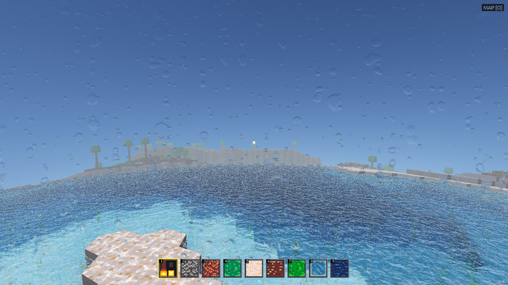
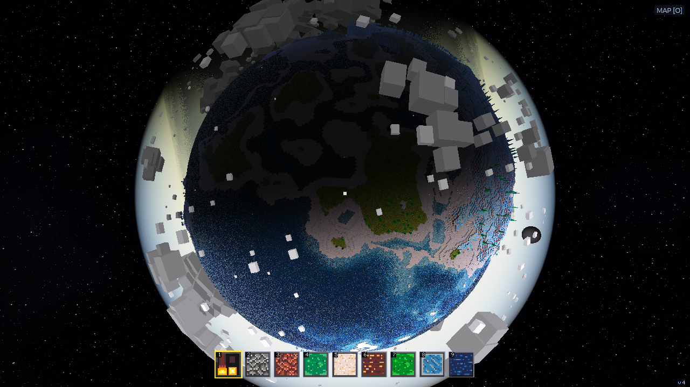

# Proposal: the terrain is Tenebris's terrain, not a warped blob

## Why

**The owner, off a screenshot: "terrain gen algorithm looks kinda bad here.
Can we get it to look more interesting like tenebris-rs?"** The frame was the
coast survey: flat pastel plateaus stepped like a wedding cake, biome patches
as soft blobs with no relation to the ground under them, one ridge line where
the noise happened to fold, and a beach that is a straight band of sand.

What this project generates is one function, `surface_height` in
`planet_terrain.rs`: a three-octave value-noise continent under a domain warp,
a single ridge term times a mask, two octaves of detail, and a relief multiplier
that cuts the result to a walker's scale. Its biome is a second function of
latitude, height and one moisture octave. Everything a Tenebris world has that
this one does not is missing from those two functions, and none of it is
rendering.

## The reference, photographed

`tenebris-client` was built from the reference checkout and run headless on
this container, a fresh seeded world, three frames (`docs/screenshots/`):

What is in the first frame and not in ours: sand shelves that follow the
coast at every scale, from a bay to a spit, and read as one material meeting
another rather than a band; islands in a lagoon, each with its own shelf;
cliffs with strata, stone under grass under trees, where a slope is too steep
to hold soil; a plateau with a real edge; and a shallow sea whose floor is
visible and shaped. Every one of those is a term in the table below.

## What a Tenebris world actually is

Measured off `tenebris-rs/crates/tenebris-core/src/planet_gen.rs` (1,261
lines, of which the altitude and biome are about 400) on its main body:

**The altitude is six terms, in order, and the order is the shape:**

| term | what it is | scale on the unit sphere | weight |
| --- | --- | ---: | ---: |
| continent | 6-octave gradient fBm, plus a land bias, then `sign * |n|^0.8` | 0.8 | 0.70 |
| mountains | 4-octave RIDGED noise (`(1-|n|)^2` per octave), times the continent where it is land | 2.5 | 0.80 |
| hills | 3-octave fBm, damped to 0.3 where there is no land | 5.0 | 0.15 |
| detail | 2-octave fBm | 12.0 | 0.05 |
| ocean floor | the negative side raised to a power (1.3, or 1.1 seeded) so the sea deepens fast past the beach | | 24 m |
| land height | the positive side times the peak height | | 40 m |

The `|n|^0.8` is the single most visible line: it pushes the continent field
toward its extremes so the land/ocean mask has **crisp coasts** instead of a
gradient of shallows. Ridged noise, not folded value noise, is what makes a
range read as a range: every octave contributes a crease, so the crests
connect. And the mountains are **multiplied by the continent**, so they stand
on the interior of a landmass and never at a coast.

**Then, on a seeded world, four things the C generator never had**, each a
separate seeded field with a salt:

- **Islands**: a low-frequency field (scale 4.0, threshold 0.68) lifts land 10 m
  out of shallow sea, smoothstepped, so open water carries an archipelago.
- **Rivers**: a ridged iso-line of a mid-frequency field (scale 1.3, threshold
  0.86) is pulled down to a bed 3 m under the sea, on lowland under 14 m only,
  so channels wind through the plains and never climb the peaks.
- **Gentle shorelines**: within 6 m of the waterline the slope is halved and
  eased back, so a beach wades in instead of stepping off.
- **Rocky highlands**: a low-frequency rockiness field (scale 2.0, above 0.72)
  lifts whole regions by 22 m, smoothstepped, so the Mountains biome has actual
  country under it rather than a recoloured hill.

**And the biome is a classification, not a tint**, in this order: Ocean below
the sea, Beach within 2 m of it, Tundra above |lat| 0.875, Mountains above
24 m, then by a moisture field (scale 1.6): Desert under 0.36, Swamp or Jungle
over 0.64 (Swamp if under 5 m), Fields otherwise. The top block then follows
the biome and the height: sand at the beach and on shallow seabed, stone on
deep seabed, stone on Mountains with snow above 40 m, a stone tree-line band
above the snow line for temperate hills, snow on Tundra above its line and at
the poles. The trees, the scatter and the fauna all read that one biome, which
is why a Tenebris jungle is a jungle in every layer.

## What ours has instead

| Tenebris | ours |
| --- | --- |
| gradient noise, seeded per octave | value noise, one fixed seed |
| 6-octave continent with `|n|^0.8` | 3 octaves under a warp, no sharpening |
| ridged mountains times land | one `(1-|n|)^4` fold times a second noise |
| hills as a term | none |
| ocean power curve | a flat relief multiplier |
| islands, rivers, shore easing, rocky uplift | none |
| moisture biomes over latitude and height | latitude, height, one moisture octave |
| top block by biome and height, with a tree line | biome index only |

The relief multiplier is the one thing ours has that the reference does not,
and it is a symptom: the raw field reaches ~860 m and is cut to a fifth. With
the heights authored in metres against a budget, as Tenebris does, it goes.

## What changes

`pbd-core` gains a `terrain` module that is Tenebris's `surface_altitude`,
`biome` and the top-block rule, ported term for term at Tenebris's unit-sphere
scales and with heights re-authored for this body's budget (see the design).
`planet_terrain::surface_height` and `biome` become calls into it. The
generator version is part of the world ID, as the rules already require, so
this is a new world, not a changed one.

## What does not change

The lattice, the cell size, the LOD, the water, the sky. A cell is still
2.833 m by 1 m; the sea is still where `depth_offset_m` puts it. The scripted
shore walk and the capture presets find their coastline by searching, so they
survive a new coastline.

## What it is not

Not a port of the seeded-world *gates*. Tenebris keeps every extension behind
`biomes_active` so its default seed stays byte-exact for C-parity pins. This
project has no C to be parity with; the extensions are simply the generator.
