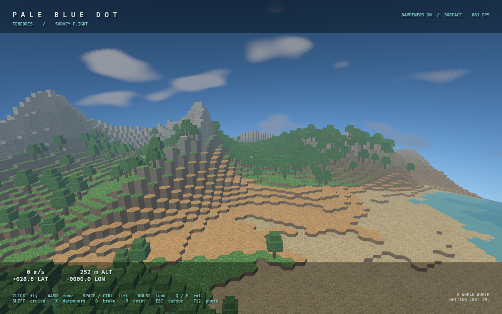

# Pale Blue Dot

A playable planet-exploration prototype in Rust, Bevy 0.18.1 and Avian 0.6.1.
Explore an **8 km diameter spherical hex world**, from its coastlines to space,
with pixel materials, forests, ocean highlights, atmosphere, clouds and an
on-rails moon. Start on foot with responsive first-person mouse look, or switch
to bounded Newtonian flight with hover and rotational assistance. Ships do not
use rocket orbital mechanics.



## Run

On Windows, double-click [run.bat](run.bat). It builds the release executable,
opens the explorer and preserves the console afterward. Rust and the native
C/C++ linker tools must be installed. The first graphics release build took
23 minutes on the validation machine; unchanged launches reuse that build.

**The game starts walking on dry land.** Click the window to capture the mouse;
use WASD to walk, Shift to sprint, and Space to jump. Mouse look is immediate
and unsmoothed. Press **F to switch between walking and flight**, R to reset the
active mode, Esc to release the cursor, and F12 to save a screenshot.

In flight, WASD and Space/Ctrl thrust relative to the view, Q/E rolls, and Shift
selects cruise. X toggles inertial dampeners/hover assistance and B brakes. See
[walking and flight controls](docs/flight-controls.md) for tuning and limits.

```bat
run.bat
run.bat --walk
run.bat --fly
run.bat --tour
run.bat --tour --view pole
run.bat --verify-flight
run.bat --verify-flight --view pole
run.bat --capture output/captures/walk.png --walk --frames 180
run.bat --capture output/captures/orbit.png --view orbit --frames 180
run.bat --headless 600
```

Equivalent Cargo launch: `cargo run --release --locked -p pbd-app --` followed
by the same options. `--walk` explicitly selects the default ground spawn;
`--fly` starts manual flight. Static capture views are `orbit`, `coast`,
`surface`, `night`, and `pole`; `--capture --walk` captures the walking spawn,
and `--capture --fly` captures the manual flight spawn. Captures use the actual
game renderer. Headless flight verification uses the same Avian physics and
controller as the visible survey tour.

## Current implementation

The closed dual-icosphere contains 655,362 cells: 655,350 hexagons and twelve
pentagons. CPU code owns canonical terrain heights and topology. Persistent GPU
buffers hold that input; compute compacts visible cells and builds indirect draw
arguments. Vertex shaders reconstruct surface caps, cliffs and stylized trees.
Expanded terrain vertices never make a per-frame CPU-to-GPU trip.

This is a coarse surface exploration slice: roughly 19 m cell spacing and 6 m
height steps, with approximately 80 MiB of fixed cell data. Walking uses 8 m/s
movement, 14 m/s sprint, and a 12 m/s jump. Ground contact queries the rendered
cell caps across the capsule footprint and uses custom swept radial contact
with Avian integration. Large terraces require jumping or flight; water blocks
walking entry until swimming
is implemented. F changes creative movement mode and retains the ship entity;
returning to walking places the player on dry ground below or nearby. Physical
boarding is a later milestone.

Flight can cross every longitude, the poles and the planetary horizon, with a
swept radial safety field maintaining 1.6 m clearance in manual flight and 45 m
in automated tours. Detailed terrain/tree
colliders, mining, caves, construction, persistence and multiplayer remain
future work.

The live renderer uses pixel materials from the generated fields atlas with
climate tinting, reflective ocean shading, approximate baked neighbor skylight,
and an integrated atmospheric material. Pixel assets use explicit nearest/point
filtering, with integer texel loads for terrain. The more detailed standalone water,
RGB voxel-light propagation and volumetric face shaders remain available for
future chunk integration; they are not silently claimed as the current render
path. The full art pack has [14 biome source atlases](docs/biome-atlas.html),
224 named material studies and [exact imagegen prompts](assets/tilesets/prompts.json).

The preview flight budget is 80 m/s², with 120 m/s surface and 600 m/s cruise
limits. This differs from the original design's 20 m/s² tuning candidate and
makes the fast circumnavigation demonstration feasible. Contact/safety impulses
remain distinct from bounded commanded acceleration.

## Design and verification

- [Requirements](openspec/specs/): what the engine does today, one capability
  per directory, every requirement pinned by a passing test.
- [Changes in flight](openspec/changes/): what is designed but not built,
  including the [volumetric voxel engine](openspec/changes/voxel-engine-foundation/design.md)
  (target streaming, ECS, precision, physics and GPU geometry) and the
  [scale and shader parity](openspec/changes/preview-scale-and-shader-parity/proposal.md)
  findings.
- [Comprehensive game design](docs/game-design.md): the full multi-planet game.
- [Tenebris comparison](docs/tenebris-comparison.md): actual reference captures
  and visual differences.
- [Shader ports](docs/shader-port.md): original port contracts and approximations.
- [Source migration](docs/source-migration.md): pinned upstream sources and
  initial implementation ledger.
- [Validation record](docs/validation.md): tested behavior and remaining limits.
- [Performance results](docs/performance.md): measured release frame times and
  memory, with a repeatable [benchmark harness](docs/performance-harness.md).
- [CLAUDE.md](CLAUDE.md): contributor instructions, and the only copy of them.
  `AGENTS.md` is a pointer to it.

```sh
cargo test --release --locked --workspace
cargo fmt --all -- --check
cargo clippy --locked --workspace --all-targets -- -D warnings
openspec validate --all          # npm install -g @fission-ai/openspec
cargo run --manifest-path tools/validate_shaders/Cargo.toml --locked
python tools/build_art_catalog.py
```

For core-only builds, use `cargo run -p pbd-app --no-default-features -- --headless 600`.
Desktop rendering is the default feature; that option keeps window/GPU features
out of a dedicated simulation build.

## References

Based on engineering and visual ideas from [Tenebris](https://github.com/RubenTipparach/tenebris)
and [swarm-demo](https://github.com/RubenTipparach/swarm-demo). Ignored `.reference/`
checkouts are research inputs; runtime code and assets are self-contained.
